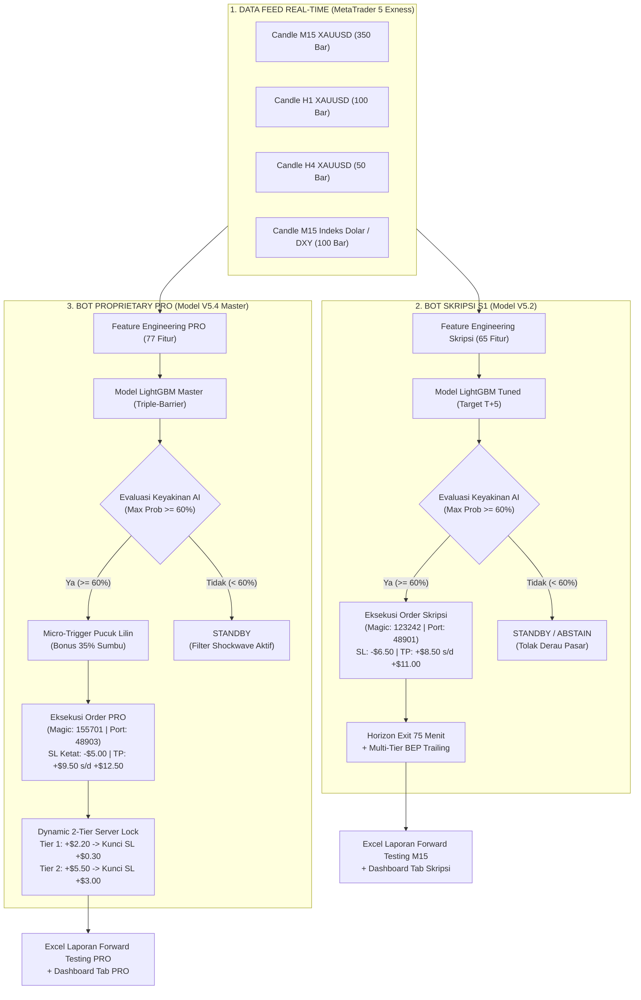
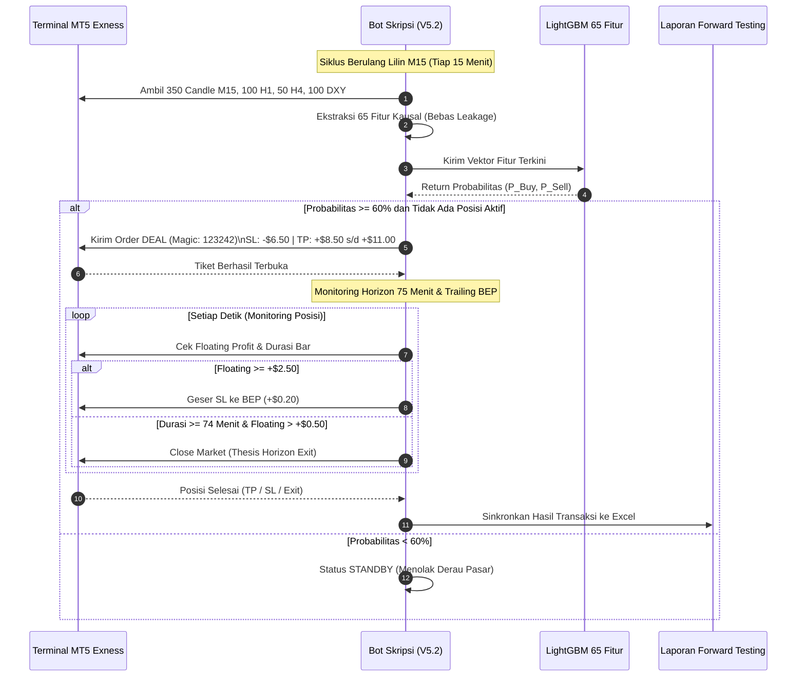
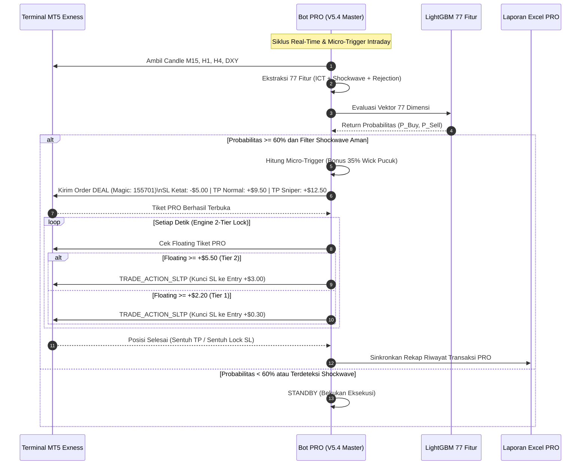

# PANDUAN LENGKAP: ALUR, ARSITEKTUR, DAN CARA KERJA DUA BOT (SKRIPSI S1 VS PROPRIETARY PRO)

**Dokumen Rujukan:** Skripsi S1 Informatika & Dokumen Paten Komersial  
**Penulis / Peneliti:** Nouval  
**Tanggal:** 08 Oktober 2026  

---

## 1. PETA BESAR SISTEM (HIGH-LEVEL ARCHITECTURE)

Sistem ini menjalankan **dua kecerdasan buatan terpisah** pada terminal MetaTrader 5 yang sama secara paralel (*Zero Collision*):
1. **Bot Skripsi (Jalur 1A - Model V5.2):** Dirancang untuk kaidah ilmiah akademis, keterbukaan metodologi (*white-box*), dan pembuktian empiris klasifikasi selektif bebas kebocoran data.
2. **Bot Proprietary PRO (Jalur 2B - Model V5.4 Master):** Dirancang untuk monetisasi komersial, perputaran modal cepat (*high turnover*), rasio cuan/rugi asimetris, dan perlindungan modal defensif.

---

## 2. BEDAH CARA KERJA BOT SKRIPSI S1 (MODEL V5.2 - 65 FITUR)

### A. Penjelasan Teknis Engineer
1. **Pipeline Data & Causal Feature Extraction (65 Fitur):**
   * **43 Fitur Baseline SMC & Price Action:** Rasio tubuh/sumbu lilin, Fair Value Gap (*FVG Bull/Bear*), Swing High/Low 20, Jarak Support/Resistance, Break of Structure (*BOS*), Change of Character (*CHoCH*), Liquidity Sweep, Order Block historis kausal ($t-2$), Fibonacci Retracement (0.382, 0.500, 0.618), RSI-14, Bollinger Bandwidth, ATR-14, ADX-14, Volume Ratio, dan 6 Fitur Integrasi Zona Spasial (Zone A Bounce, Zone B Proximity, Zone Clearance).
   * **13 Fitur Intermarket DXY:** Return DXY, Tren DXY, Rasio Emas/DXY, Level POI Supply/Demand DXY, RSI DXY, BOS DXY, dan SMT Divergence (ketidaksesuaian korelasi puncak/lembah Emas vs DXY).
   * **6 Fitur Multi-Timeframe (MTF H1 & H4):** EMA-50 dan EMA-200 pada time frame H1 dan H4 untuk mengunci arah tren makro institusi.
   * **3 Fitur Kalender Makro:** Deteksi otomatis NFP Week, CPI Day, dan FOMC Week.
2. **Inference & Selective Classification:**
   * Model LightGBM memproses vektor 65 dimensi setiap kali lilin M15 baru tertutup.
   * Menerapkan paradigma **Selective Prediction with Reject Option** (Chow, 1970). Jika $\max(P_{up}, P_{dn}) < 0.60$, model memilih *abstain/standby* untuk menghindari derau pasar acak.
3. **Horizon Holding & Exit Engine:**
   * Menggunakan horizon penelitian akademik tetap **$T+5$ lilin (75 menit)**.
   * Stop Loss dipasang di **-$6.50 USD** (65 pips pada lot 0.01).
   * Take Profit dipasang di **+$8.50 USD** (Normal) atau **+$11.00 USD** (Sniper jika probabilitas $\ge 65\%$).
   * Jika dalam 75 menit harga belum menyentuh TP/SL, sistem menutup transaksi otomatis pada harga pasar saat lilin ke-5 berakhir.

### B. Penjelasan Bahasa Awam (Analogi Sehari-hari)
> **Analogi: "Dokter Spesialis yang Berprinsip Tegas & Taat Standar Operasional (SOP)"**
> 
> Bayangkan seorang dokter yang memeriksa pasien dengan **65 tes laboratorium lengkap** (tensi darah, rontgen, tes darah, riwayat keluarga, dll.).
> * **Tidak Pernah Menebak:** Jika hasil lab masih samar-samar (tingkat keyakinannya di bawah 60%), dokter ini **menolak memberi obat keras** dan menyuruh pasien menunggu observasi (*Standby*). Dia hanya bertindak jika diagnosanya benar-benar jelas di atas 60%.
> * **Evaluasi Berkala:** Ketika obat diberikan, dokter menetapkan batas waktu pasti: *"Kita pantau reaksi obat ini tepat selama 75 menit ($T+5$). Jika sudah sembuh kita pulangkan (Take Profit), jika tidak cocok kita hentikan (Exit)."*
> * **Karakter:** Disiplin, transparan, tidak neko-neko, dan semua langkahnya bisa dipertanggungjawabkan di depan dewan penguji sidang akademik.

---

## 3. BEDAH CARA KERJA BOT PROPRIETARY PRO (MODEL V5.4 MASTER - 77 FITUR)

### A. Penjelasan Teknis Engineer
1. **Pipeline Data & 77 Fitur Institusional:**
   * Mengadopsi seluruh 65 fitur kausal milik Skripsi, ditambah **12 Fitur Khusus Proprietary**:
     * **Rejection Index:** $Rejection\_Index = \frac{Wick\_Ratio^2}{Distance\_to\_SR + \epsilon}$ (mengukur seberapa keras harga ditolak di benteng institusi).
     * **Stochastic RSI Multivariat:** $Stoch\_RSI\_K$, $Stoch\_RSI\_D$, deteksi Overbought ($\ge 85$), Oversold ($\le 15$), serta sinyal persilangan *Bullish/Bearish Cross*.
     * **Shockwave Crash & Pump Shield:** Deteksi lonjakan lilin abnormal ($Range \ge 3 \times ATR_{14}$) dalam 12 bar terakhir untuk membekukan eksekusi saat pasar diterjang anomali likuiditas berita mendadak.
     * **Volume Absorption:** Deteksi penyerapan likuiditas oleh institusi di area benteng harga.
2. **Labeling Target Triple-Barrier:**
   * Model dilatih bukan untuk menebak harga 75 menit ke depan, melainkan menyelesaikan masalah **Triple-Barrier Dynamic Volatility** (Marcos Lopez de Prado, 2018): Apakah harga menyentuh barrier profit +$8.50 sebelum stop -$6.50 dalam rentang dinamis 25 bar?
3. **Micro-Trigger Sumbu (35% Wick Advantage):**
   * Tidak menunggu lilin selesai di harga penutupan (*Close*). Bot memproyeksikan harga masuk lebih awal dengan memanfaatkan 35% panjang sumbu lilin, menghemat 15–20 pips harga beli/jual (*cheaper entry basis*).
4. **Dual-Engine Execution & Dynamic 2-Tier Lock:**
   * **Stop Loss Rapat:** **-$5.00 USD** (memangkas kerugian sekecil mungkin).
   * **Take Profit Panjang:** **+$9.50 USD** (Normal) atau **+$12.50 USD** (Sniper jika probabilitas $\ge 65\%$, menghasilkan RRR 1:2.50).
   * **Server-Side Dynamic Lock via `TRADE_ACTION_SLTP`:**
     * **Tier 1 (BEP Lock):** Begitu posisi mengambang untung $\ge +\$2.20$, server MT5 otomatis menggeser Stop Loss ke `Entry + $0.30`. Modal terkunci aman dan bebas risiko (*risk-free trade*).
     * **Tier 2 (Profit Lock):** Begitu keuntungan naik lagi $\ge +\$5.50$, Stop Loss digeser naik ke `Entry + $3.00`. Keuntungan minimal terkunci rapat, bahkan jika pasar mendadak berbalik arah drastis.

### B. Penjelasan Bahasa Awam (Analogi Sehari-hari)
> **Analogi: "Sniper Pasukan Khusus Berteknologi Night-Vision & Rompi Kebal Peluru"**
> 
> Bayangkan seorang sniper elit di medan perang yang dilengkapi perlengkapan super canggih:
> * **Melihat Celah Mikro (Night-Vision):** Dia tidak menunggu musuh berdiri tegak di tengah lapangan. Dia menembak saat musuh baru menjulurkan ujung helmnya di balik benteng (*Micro-Trigger di pucuk sumbu lilin*).
> * **Rompi Kebal Peluru & Gembok Otomatis:**
>   * Jika tembakannya meleset, dia tidak ragu untuk langsung mundur dengan luka gores kecil saja (*Cut loss ketat -$5.00*).
>   * Begitu serangannya mulai berhasil dan maju sejauh 2 langkah, dia langsung **memasang gembok pengaman** (*Kunci BEP +$0.30*), sehingga dia mustahil kalah lagi.
>   * Begitu musuh terdesak sejauh 5 langkah, dia **menggembok keuntungan lebih tinggi** (*Kunci Profit +$3.00*).
>   * Dia membiarkan targetnya terus melaju sampai roboh sempurna di jarak terjauh (*Take Profit +$12.50*).
> * **Karakter:** Sangat lincah, menyerang 11–12 kali sehari, cuan berlipat ganda, dan risiko kerugiannya terkunci sangat minim (Drawdown hanya -$17.80 USD).

---

## 4. DIAGRAM ALIR OPERASIONAL LENGKAP (FLOWCHART)

### A. Alur Siklus Kerja Bot Skripsi (Model V5.2)

---

### B. Alur Siklus Kerja Bot PRO (Model V5.4 Master)

---

## 5. TABEL PERBANDINGAN KOMPREHENSIF HEAD-TO-HEAD

| Parameter / Dimensi | Bot Skripsi S1 (V5.2) | Bot Proprietary PRO (V5.4 Master) |
| :--- | :--- | :--- |
| **Arsitektur Model** | LightGBM 65 Fitur Kausal | LightGBM 77 Fitur Institusional |
| **Tujuan Utama** | Naskah Skripsi, Publikasi Ilmiah, & Sidang Kelulusan | Hak Paten Komersial & Penghasil Uang Mandiri |
| **Keterbukaan Kode** | Terbuka Penuh (*White-Box Paradigm*) | Dilindungi Hak Cipta (*Black-Box / Trade Secret*) |
| **Target Prediksi AI** | Arah Lilin $T+5$ Lilin (75 Menit) | Triple-Barrier Dynamic Volatility (25 Bar) |
| **Toleransi Stop Loss** | -$6.50 USD (Standar Keamanan Skripsi) | -$5.00 USD (Sangat Ketat & Defensif) |
| **Target Take Profit** | +$8.50 s/d +$11.00 USD | +$9.50 s/d +$12.50 USD (RRR 1:2.50) |
| **Sistem Penguncian Cuan**| BEP Sederhana di +$2.50 | Dynamic 2-Tier Lock (+$2.20 $\rightarrow$ +$0.30, +$5.50 $\rightarrow$ +$3.00) |
| **Frekuensi Transaksi** | ~7 trade / hari (~230 trade / bulan) | ~11–12 trade / hari (~381 trade / bulan) |
| **Estimasi Laba Bulanan** | **+$98.50 USD / bulan** (~Rp 1,55 Juta) | **+$452.80 USD / bulan** (~Rp 7,1 Juta) |
| **Pertumbuhan Modal (RoC)**| **+19.7% per bulan** | **+90.5% per bulan** |
| **Profit Factor (PF)** | **1.27** | **2.72 ⭐** |
| **Maksimum Drawdown** | -$115.10 USD (23.0% Modal $500) | **-$17.80 USD (3.5% Modal $500) ⭐** |
| **Magic ID Terminal MT5** | `123242` | `155701` |
| **Port Socket Lock OS** | `48901` | `48903` |
| **Tampilan Dashboard UI**| Tab Utama (Tampil Default untuk Sidang) | Tab Proprietary (Bisa Disembunyikan via Tombol Mata) |
