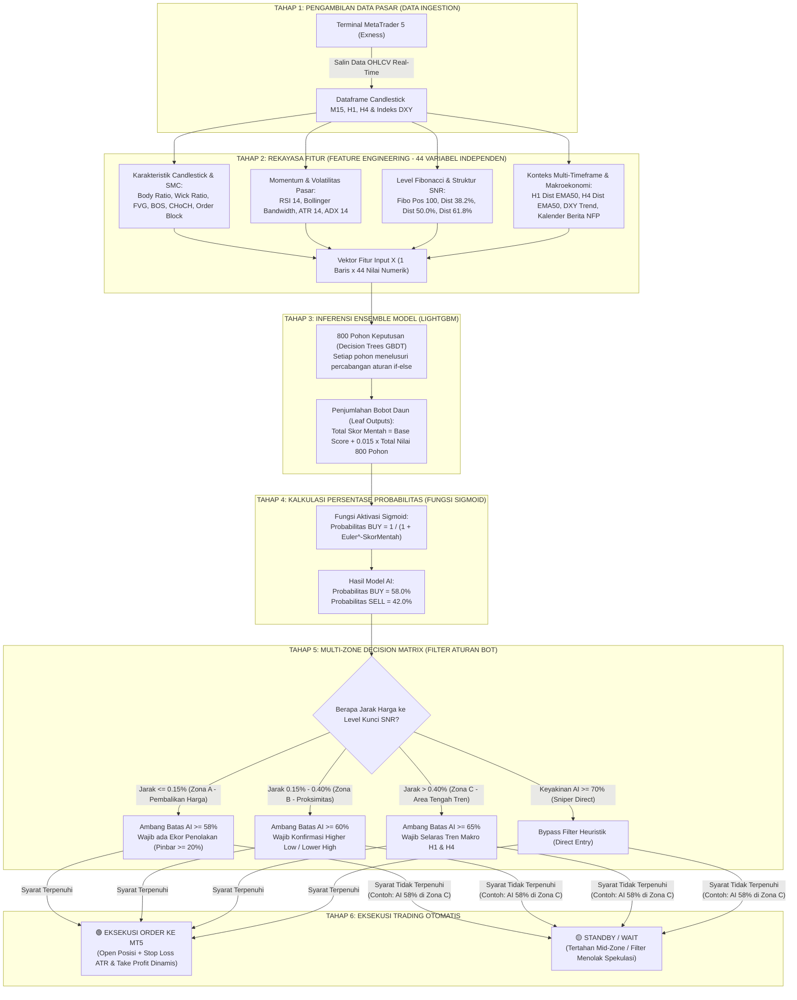

# DOKUMEN TEKNIS & AKADEMIK MASTER
# ALUR KERJA SISTEM, REKAYASA FITUR (SMC/ICT/MAKRO), DAN PERHITUNGAN PREDIKSI MODEL AI LIGHTGBM

Dokumen ini disusun sebagai **buku panduan komprehensif dan materi pertanggungjawaban ilmiah** dalam proses bimbingan serta **Sidang Skripsi Program Studi Informatika**. 

Dokumen ini merangkum seluruh aspek sistem secara terpadu:
1. Diagram Alir Sistem (*Flowchart Mermaid*) dari MetaTrader 5 hingga eksekusi trading.
2. Penegasan akademis perbedaan **Variabel vs Parameter** (Klarifikasi status 44 fitur).
3. Landasan ilmiah mengapa konsep **SMC (*Smart Money Concepts*) & ICT (*Inner Circle Trader*)** dijadikan acuan dan diformulasikan secara matematis.
4. Urgensi penyertaan faktor **Makroekonomi & Intermarket (DXY, Kalender NFP, CPI, FOMC)**.
5. Bedah teknis mendalam seluruh **44 Variabel Fitur Input Pasar** ke dalam 6 kelompok fungsional.
6. Perhitungan matematis persentase probabilitas LightGBM (*Raw Log-Odds & Fungsi Sigmoid*) yang ditulis dalam bahasa Indonesia dan aritmatika standar tanpa simbol kode rumit.
7. Spesifikasi teknis hyperparameter model terlatih (`model_lightgbm_xauusd.pkl`).
8. Peringkat bobot kontribusi 10 fitur teratas (*Feature Importance Ranking*).
9. Arsitektur Dua Tahap (*Two-Stage Architecture*): Memisahkan prediksi arah AI dan matriks manajemen risiko *Multi-Zone SMC*.
10. Panduan skrip tanya-jawab lisan (*Defense Script*) menghadapi pertanyaan kritis dosen penguji.

---

## 1. DIAGRAM ALUR SISTEM (FLOWCHART MERMAID)



---

## 2. PERBEDAAN VARIABEL DAN PARAMETER DALAM PENELITIAN INI

Dalam sidang skripsi bidang Informatika dan Pembelajaran Mesin (*Machine Learning*), dosen penguji sangat sering menguji pemahaman mahasiswa terkait istilah **Variabel** dan **Parameter**. 

### A. Jawaban Tegas:
> **"Ke-44 fitur yang diekstraksi dari pasar berstatus sebagai VARIABEL INDEPENDEN (Variabel Bebas / Input Features), BUKAN Parameter!"**

### B. Matriks Klasifikasi Variabel vs Parameter:

| Kategori Komponen | Definisi Ilmiah | Komponen Nyata dalam Skripsi Anda |
| :--- | :--- | :--- |
| **Variabel Independen (Variabel Bebas / $X$)** | Karakteristik atau atribut data yang **nilainya berubah-ubah (bervariasi)** dari satu observasi lilin (*candle*) ke lilin berikutnya, dan menjadi masukan (*input*) bagi model. | **44 Fitur Pasar** (misalnya nilai RSI 14, jarak harga ke EMA, level Fibonacci, status FVG, ADX, dan perubahan harga DXY). Disebut variabel karena angkanya selalu berganti setiap 15 menit. |
| **Variabel Dependen (Variabel Terikat / $Y$)** | Variabel target luaran yang **nilainya ingin diprediksi atau dipengaruhi** oleh variabel-variabel independen. | **Arah Pergerakan Harga Horizon 75 Menit ($T+5$)**:<br>• **Label 1 (Bullish)**: Jika harga penutupan candle ke-5 lebih tinggi dari harga saat ini ($Close_{t+5} > Close_t$).<br>• **Label 0 (Bearish)**: Jika harga penutupan candle ke-5 lebih rendah dari harga saat ini ($Close_{t+5} < Close_t$). |
| **Parameter Model (*Learned Parameters*)** | Nilai bobot internal matematika yang **dihitung dan dipelajari sendiri oleh algoritma LightGBM** secara otomatis selama proses pelatihan (*training*) dari puluhan ribu data historis. | Nilai bobot daun (*leaf values*) dan titik potong percabangan (*split thresholds*) pada 800 pohon keputusan. Nilai-nilai ini tersimpan di dalam file model `.pkl`. |
| **Hyperparameter Model (*Architecture Settings*)** | Nilai setelan arsitektur algoritma yang **dikonfigurasi secara manual oleh peneliti** sebelum proses pelatihan model dijalankan. | • Jumlah Pohon (`n_estimators`) = `800 Trees`<br>• Laju Pembelajaran (`learning_rate`) = `0.015`<br>• Kedalaman Maksimal (`max_depth`) = `5`<br>• Jumlah Daun (`num_leaves`) = `24`<br>• Regularisasi L1 (`reg_alpha`) = `0.1`<br>• Regularisasi L2 (`reg_lambda`) = `1.0`. |
| **Parameter Sistem Bot (*Heuristic Trading Rules*)** | Aturan batasan operasional dan manajemen risiko yang ditanamkan pada skrip bot eksekusi (*non-AI rules*). | • Ambang batas AI: Zona A $\ge 58\%$, Zona B $\ge 60\%$, Zona C $\ge 65\%$, Sniper $\ge 70\%$.<br>• Ukuran Lot = `0.01`<br>• Target Take Profit = `$6.50`<br>• Batas Stop Loss = `$8.50`<br>• Jarak Lock BEP = `+$0.20`. |

---

## 3. MENGAPA KONSEP SMC & ICT DIJADIKAN ACUAN DAN DIFORMULASIKAN SECARA MATEMATIS?

### A. Landasan Mengapa Harus Konsep SMC / ICT?
1. **Dinamika Likuiditas Institusi Besar**:
   Pasar emas (*XAUUSD*) memiliki nilai perputaran harian mencapai triliunan Dolar AS. Pasar ini tidak digerakkan oleh trader ritel, melainkan oleh Bank Sentral dunia, Bank Investasi raksasa (*Tier-1 Banks*), dan pengelola dana lindung nilai (*Hedge Funds*).
2. **Kelemahan Indikator Klasik Ritel**:
   Indikator teknikal konvensional (seperti *Moving Average Cross* atau *Stochastic* standar) bersifat **tertinggal (*lagging*)**. Institusi keuangan sering memanfaatkan indikator ritel tersebut untuk menciptakan jebakan harga (*liquidity traps*), memancing trader ritel membuka posisi sebelum institusi membalikkan harga ke arah yang sebenarnya.
3. **Keunggulan SMC (*Smart Money Concepts*) & ICT (*Inner Circle Trader*)**:
   Metodologi ini memetakan jejak likuiditas institusi secara langsung:
   * Di mana letak tumpukan Stop Loss trader ritel yang diburu oleh institusi (*Liquidity Sweep*).
   * Di mana terjadi lonjakan transaksi searah yang meninggalkan celah harga (*Fair Value Gap / FVG*).
   * Kapan perpindahan struktur kepemilikan pasar terjadi secara sah (*Break of Structure / BOS* dan *Change of Character / CHoCH*).

### B. Nilai Kebaruan (*Novelty*) Informatika: Kuantifikasi Matematis
* **Kendala Utama SMC**: Di dunia trading manusia, SMC sering dikritik karena **bersifat subjektif**. Dua analis manusia bisa menarik garis Order Block atau menentukan FVG secara berbeda pada grafik yang sama.
* **Solusi Informatika Skripsi Anda**: Komputer dan model Machine Learning tidak memiliki imajinasi visual atau perasaan subjektif. Komputer hanya dapat memproses **vektor numerik diskrit dan kontinu**.
* Anda memecahkan kendala ini dengan **memformulasikan konsep SMC ke dalam aturan matematika biner (0 atau 1) dan rasio geometris yang presisi**:

1. **Formulasi Matematis Fair Value Gap (FVG)**:
   ```
   FVG Bullish = 1, jika Low(t) > High(t - 2); sebaliknya 0
   FVG Bearish = 1, jika High(t) < Low(t - 2); sebaliknya 0
   ```
   *Makna*: Menguji apakah lilin saat ini meninggalkan celah kosong terhadap lilin 2 periode sebelumnya akibat dorongan beli/jual institusional yang sangat agresif.

2. **Formulasi Matematis Liquidity Sweep (Stop-Hunt Wick)**:
   ```
   Sweep High = 1, jika High(t) > Puncak_Tertinggi(20) DAN Close(t) < Puncak_Tertinggi(20); sebaliknya 0
   Sweep Low  = 1, jika Low(t) < Lembah_Terendah(20) DAN Close(t) > Lembah_Terendah(20); sebaliknya 0
   ```
   *Makna*: Menguji apakah ekor lilin sempat menusuk menembus level penting untuk memicu Stop Loss ritel, namun tubuh lilin ditutup kembali di dalam rentang normal (bukti nyata manipulasi perburuan likuiditas).

3. **Formulasi Matematis Break of Structure (BOS)**:
   ```
   BOS Bullish = 1, jika Close(t) > Puncak_Tertinggi(20); sebaliknya 0
   BOS Bearish = 1, jika Close(t) < Lembah_Terendah(20); sebaliknya 0
   ```
   *Makna*: Menguji apakah tubuh lilin berhasil ditutup mutlak melampaui puncak/lembah sebelumnya sebagai konfirmasi kelanjutan tren.

4. **Formulasi Matematis Proksimitas Order Block (OB)**:
   ```
   Order Block Bullish = 1, jika Lilin(t) adalah Bearish DAN (Close(t+2) - Close(t)) > (1.5 x Range Lilin(t)); sebaliknya 0
   ```
   *Makna*: Menandai lilin berlawanan arah terakhir sebelum terjadi lonjakan momentum harga institusional minimal sebesar 1.5 kali rata-rata pergerakan harga.

---

## 4. MENGAPA FAKTOR MAKROEKONOMI (DXY, NFP, CPI, FOMC) HARUS DISERTAKAN?

Komoditas Emas (**XAU/USD**) diperdagangkan secara berpasangan terhadap mata uang **Dolar Amerika Serikat (USD)**. Mengabaikan faktor Dolar AS dalam memprediksi emas adalah kesalahan fatal dalam analisis kuantitatif keuangan:

### A. Korelasi Terbalik Intermarket (DXY vs XAUUSD)
* Secara hukum ekonomi global, Emas dan Dolar AS memiliki **korelasi negatif (*inverse correlation*)** yang sangat kuat. Ketika indeks Dolar AS (DXY) mengalami penguatan signifikan karena aliran modal global, harga emas dunia hampir selalu mengalami tekanan penurunan.
* Model yang hanya menganalisis grafik teknikal emas akan "buta" terhadap kekuatan mata uang lawannya.
* Dengan menyertakan variabel `DXY_Return_1`, `DXY_Return_3`, `DXY_Trend`, dan `XAU_DXY_Ratio_Return`, model LightGBM dapat mendeteksi apakah kenaikan emas didukung oleh pelemahan Dolar AS riil atau sekadar fluktuasi semu.

### B. Rezim Volatilitas Berita Berdampak Tinggi (*High-Impact Economic Calendar*)
* Rilis data ekonomi makro Amerika Serikat seperti data ketenagakerjaan (**NFP / Non-Farm Payrolls**), inflasi (**CPI / Consumer Price Index**), dan keputusan suku bunga bank sentral (**FOMC**) secara reguler menciptakan lonjakan volume dan volatilitas ekstrem.
* Pada hari atau minggu rilis berita tersebut, pola-pola teknikal murni sering kali ditembus secara acak (*noise breakout*).
* Dengan menyertakan variabel biner `Is_NFP_Week`, `Is_CPI_Day`, dan `Is_FOMC_Week`, pohon keputusan LightGBM secara cerdas mengenali bahwa kondisi pasar saat itu berada di luar rezim normal, sehingga model dapat menaikkan standar kehati-hatian atau menyesuaikan bobot probabilitasnya.

---

## 5. BEDAH MENYELURUH 44 VARIABEL FITUR INPUT PASAR

Seluruh 44 variabel independen yang diekstraksi dari setiap lilin M15 dikelompokkan ke dalam **6 Klaster Fungsional**:

```
[44 VARIABEL INDEPENDEN INPUT PASAR]
 ├── KLASTER 1: Anatomi Candlestick M15 (3 Fitur)       -> Mengukur kekuatan dorongan & penolakan harga
 ├── KLASTER 2: Smart Money Concepts & Struktur (8 Fitur) -> Melacak manipulasi & ketidakseimbangan likuiditas
 ├── KLASTER 3: Geometri Fibonacci Retracement (4 Fitur) -> Menghitung level diskon, wajar, dan premium
 ├── KLASTER 4: Momentum & Volatilitas Pasar (8 Fitur)   -> Mengukur kecepatan, tenaga tren, dan volume
 ├── KLASTER 5: Return Multiskala (7 Fitur)              -> Mengukur laju akselerasi perubahan harga multi-periode
 └── KLASTER 6: Makroekonomi & Multi-Timeframe (14 Fitur)-> Menyelaraskan arah tren besar H1/H4 dan Dolar AS
```

---

### Rincian Pemeriksaan Tiap Klaster Fitur:

#### Klaster 1: Anatomi Candlestick M15 (3 Fitur)
1. **`Body_Ratio`**: Rasio ukuran tubuh lilin terhadap total panjang lilin dari High ke Low. Mengecek apakah lilin didominasi pergerakan searah yang tegas atau didominasi keraguan (*doji*).
2. **`Lower_Wick_Ratio`**: Rasio panjang ekor bawah terhadap total lilin. Mengecek adanya penolakan penurunan harga (*buying rejection / pinbar bawah*).
3. **`Upper_Wick_Ratio`**: Rasio panjang ekor atas terhadap total lilin. Mengecek adanya penolakan kenaikan harga (*selling rejection / pinbar atas*).

#### Klaster 2: Smart Money Concepts & Struktur Pasar (8 Fitur)
4. **`FVG_Bull`**: Bernilai 1 jika terjadi celah ketidakseimbangan harga naik (*Bullish Fair Value Gap*), bernilai 0 jika tidak.
5. **`FVG_Bear`**: Bernilai 1 jika terjadi celah ketidakseimbangan harga turun (*Bearish Fair Value Gap*), bernilai 0 jika tidak.
6. **`Dist_Support`**: Jarak persentase harga saat ini terhadap level lembah terendah 20 lilin terakhir (*Swing Low 20*).
7. **`Dist_Resistance`**: Jarak persentase harga saat ini terhadap level puncak tertinggi 20 lilin terakhir (*Swing High 20*).
8. **`BOS_Bull`**: Bernilai 1 jika tubuh lilin ditutup menembus puncak tertinggi 20 lilin (*Break of Structure Bullish*).
9. **`BOS_Bear`**: Bernilai 1 jika tubuh lilin ditutup menembus lembah terendah 20 lilin (*Break of Structure Bearish*).
10. **`CHoCH_Bull`**: Bernilai 1 jika terjadi penembusan puncak saat tren jangka menengah sebelumnya sedang turun (*Change of Character Bullish*).
11. **`CHoCH_Bear`**: Bernilai 1 jika terjadi penembusan lembah saat tren jangka menengah sebelumnya sedang naik (*Change of Character Bearish*).

#### Klaster 3: Geometri Fibonacci Retracement (4 Fitur)
12. **`Fibo_Pos_100`**: Posisi relatif harga saat ini di dalam rentang 100 lilin terakhir. Nilai 0.0 berarti harga berada di dasar terendah, nilai 1.0 berarti harga berada di puncak tertinggi.
13. **`Fibo_Dist_382`**: Jarak harga saat ini terhadap level koreksi Fibonacci 38.2% (mengukur level pantulan pada tren kuat).
14. **`Fibo_Dist_500`**: Jarak harga saat ini terhadap titik tengah keseimbangan Fibonacci 50.0% (*Equilibrium Price*).
15. **`Fibo_Dist_618`**: Jarak harga saat ini terhadap level *Golden Ratio* Fibonacci 61.8% (area optimal transaksi institusi).

#### Klaster 4: Momentum & Volatilitas Pasar (8 Fitur)
16. **`RSI_14`**: Indeks Kekuatan Relatif 14 periode. Mengecek kondisi jenuh beli (*overbought* > 70) atau jenuh jual (*oversold* < 30).
17. **`BB_Bandwidth`**: Lebar pita Bollinger Bands. Mendeteksi fase penyempitan volatilitas (*squeeze*) yang menjadi tanda awal terjadinya ledakan harga.
18. **`BB_Pos`**: Posisi relatif harga terhadap pita atas dan pita bawah Bollinger Bands.
19. **`ADX_14`**: *Average Directional Index* 14 periode. Mengecek apakah pasar sedang berada dalam tren berkekuatan tinggi (ADX > 25) atau konsolidasi datar (ADX < 20).
20. **`Volume_Ratio`**: Rasio volume transaksi saat ini dibandingkan rata-rata volume 20 lilin terakhir. Memvalidasi apakah pergerakan harga didorong volume modal institusional nyata.
21. **`Consecutive_Bull`**: Menghitung berapa kali lilin ditutup naik secara berturut-turut (*bullish streak counter*).
22. **`Consecutive_Bear`**: Menghitung berapa kali lilin ditutup turun secara berturut-turut (*bearish streak counter*).
23. **`Liquidity_Sweep_High`**: Bernilai 1 jika ekor lilin sempat menusuk ke atas puncak 20 lilin lalu ditutup kembali di bawahnya (*Stop Hunt High*).
24. **`Liquidity_Sweep_Low`**: Bernilai 1 jika ekor lilin sempat menusuk ke bawah lembah 20 lilin lalu ditutup kembali di atasnya (*Stop Hunt Low*).

#### Klaster 5: Laju Perubahan Harga Multiskala (Returns - 7 Fitur)
25. **`XAU_Return_1`**: Persentase perubahan harga emas dari 1 lilin sebelumnya.
26. **`XAU_Return_3`**: Persentase perubahan harga emas dari 3 lilin sebelumnya (45 menit).
27. **`XAU_Return_5`**: Persentase perubahan harga emas dari 5 lilin sebelumnya (75 menit).
28. **`XAU_Return_10`**: Persentase perubahan harga emas dari 10 lilin sebelumnya (2.5 jam).
29. **`XAU_Return_20`**: Persentase perubahan harga emas dari 20 lilin sebelumnya (5 jam).
30. **`Order_Block_Bull`**: Indikator biner jejak blok akumulasi beli institusi.
31. **`Order_Block_Bear`**: Indikator biner jejak blok distribusi jual institusi.

#### Klaster 6: Makroekonomi & Multi-Timeframe Trend (13 Fitur)
32. **`DXY_Return_1`**: Persentase perubahan harga indeks Dolar AS dalam 1 lilin.
33. **`DXY_Return_3`**: Persentase perubahan harga indeks Dolar AS dalam 3 lilin.
34. **`DXY_Trend`**: Bernilai 1 jika harga DXY berada di atas rata-rata bergeraknya (*moving average 20*), bernilai 0 jika di bawahnya.
35. **`XAU_DXY_Ratio_Return`**: Laju perubahan rasio harga emas dibagi harga Dolar AS.
36. **`Is_NFP_Week`**: Bernilai 1 jika tanggal candle berada pada minggu pertama setiap bulan (minggu rilis data Non-Farm Payrolls).
37. **`Is_CPI_Day`**: Bernilai 1 jika tanggal candle berada pada tanggal 10 sampai 15 setiap bulan (jadwal rilis inflasi AS).
38. **`Is_FOMC_Week`**: Bernilai 1 jika tanggal candle berada pada jadwal minggu rapat suku bunga bank sentral Federal Reserve.
39. **`Trend_H1_Bull`**: Bernilai 1 jika harga berada di atas EMA 50 kerangka waktu 1 jam (H1).
40. **`Trend_H1_Strong`**: Bernilai 1 jika garis EMA 50 H1 berada di atas garis EMA 200 H1 (tren naik kuat).
41. **`Trend_H4_Bull`**: Bernilai 1 jika harga berada di atas EMA 50 kerangka waktu 4 jam (H4).
42. **`Trend_H4_Strong`**: Bernilai 1 jika garis EMA 50 H4 berada di atas garis EMA 200 H4.
43. **`H1_Dist_EMA50`**: Jarak numerik kontinu persentase harga terhadap garis EMA 50 pada kerangka waktu 1 jam.
44. **`H4_Dist_EMA50`**: Jarak numerik kontinu persentase harga terhadap garis EMA 50 pada kerangka waktu 4 jam. *(Fitur terbukti memiliki bobot tertinggi di model dengan 2.117 split)*.

---

## 6. CARA KERJA DAN PERHITUNGAN MATEMATIS PREDIKSI MODEL LIGHTGBM

Model LightGBM memprediksi arah pergerakan harga pada horizon **5 candle ke depan (T+5 atau 75 menit)**.

Penentuan angka probabilitas (seperti **58% BUY / 42% SELL**) dihasilkan melalui 3 langkah matematis terstruktur berikut tanpa rumus simbol yang rumit:

```
[44 Variabel Input] 
        ↓
[800 Pohon Keputusan] → Menghasilkan Skor Mentah Bebas (Contoh: +0.3228)
        ↓
[Fungsi Sigmoid]      → Mengubah Skor Mentah Menjadi Rentang 0% - 100%
        ↓
[Output Probabilitas] → BUY: 58%, SELL: 42%
```

---

### Tahap A: Evaluasi Fitur oleh 800 Pohon Keputusan
1. Nilai 44 variabel independen dimasukkan serentak ke dalam **800 pohon keputusan (Decision Trees)** yang telah dilatih.
2. Di dalam setiap pohon, komputer melakukan pengujian bertingkat berbasis nilai ambang batas (*threshold*).  
   *Contoh alur dalam sebuah pohon:*
   * *Apakah Jarak Harga ke EMA50 H4 > 0.002?*
   * *Jika YA, apakah Indikator ADX 14 > 25?*
   * *Jika YA, apakah RSI 14 < 70?*
3. Penelusuran berakhir pada **ujung cabang (daun / Leaf)**. Setiap daun mengeluarkan nilai bobot numerik (*Leaf Value*) yang mencerminkan kecenderungan arah pasar.

---

### Tahap B: Menghitung Skor Mentah Total (Raw Log-Odds Score)
Seluruh nilai daun dari ke-800 pohon keputusan dikalikan dengan laju pembelajaran (*learning rate*) lalu dijumlahkan bersama nilai awal dasar:

```
Skor Mentah Total = Skor Dasar Awal + (Laju Pembelajaran * Total Penjumlahan Nilai 800 Pohon)
```

**Penjelasan Komponen Rumus:**
* **Skor Dasar Awal (Base Margin)**: Nilai konstanta awal sebelum pohon mengevaluasi data (biasanya mendekati angka 0 jika rasio candle naik dan turun pada data latih berimbang).
* **Laju Pembelajaran (Learning Rate)**: Nilai pengali pengecil langkah pembobotan agar model tidak mudah *overfitting*. Pada model Anda nilainya disetel sebesar **0.015**.
* **Total Penjumlahan Nilai 800 Pohon**: Nilai daun Pohon 1 + Nilai daun Pohon 2 + ... + Nilai daun Pohon 800.

Hasil dari rumus ini adalah **satu angka bebas (Skor Mentah Total)**.
* Jika angka bertanda **positif (+)**, pasar memiliki bias naik (Bullish).
* Jika angka bertanda **negatif (-)**, pasar memiliki bias turun (Bearish).

---

### Tahap C: Mengubah Skor Mentah Menjadi Persentase Probabilitas (Fungsi Sigmoid)
Karena Skor Mentah Total berupa angka kontinu bebas (bisa bernilai -3.5, +0.32, +2.8, dll.), angka tersebut harus dipetakan ke dalam rentang **0.0 sampai 1.0 (0% sampai 100%)**.

Untuk tujuan ini, algoritma LightGBM menerapkan rumus matematis **Fungsi Sigmoid (Fungsi Logistik)**:

```
Probabilitas BUY = 1 / (1 + (Nilai Euler dipangkatkan minus Skor Mentah Total))
```

Di mana:
* **Nilai Euler (e)** adalah konstanta matematika logaritma alami universal yang bernilai **2.71828**.
* **Minus Skor Mentah Total**: Tanda minus diberikan pada pangkat. Jika Skor Mentah bernilai `+0.3228`, maka pangkatnya menjadi `-0.3228`.

Sedangkan probabilitas arah sebaliknya (SELL) dihitung dari sisa kekurangannya menuju 100%:

```
Probabilitas SELL = 100% - Probabilitas BUY
```

---

### Tahap D: Simulasi Perhitungan Numerik Langkah Demi Langkah (Contoh 58% BUY)
Mari kita buktikan secara eksak bagaimana angka **58% BUY** pada antarmuka dashboard bot Anda dihitung oleh komputer:

1. **Langkah 1 (Hasil Akumulasi 800 Pohon):**  
   Setelah mengevaluasi ke-44 fitur pasar pada lilin saat itu, ke-800 pohon keputusan menghasilkan:  
   `Skor Mentah Total = +0.32277`

2. **Langkah 2 (Menghitung Pangkat Bilangan Euler):**  
   Hitung nilai 2.71828 dipangkatkan (-0.32277):  
   `2.71828^(-0.32277) = 0.72414`

3. **Langkah 3 (Menghitung Penyebut Rumus):**  
   Tambahkan angka 1 pada hasil pangkat:  
   `1 + 0.72414 = 1.72414`

4. **Langkah 4 (Pembagian Akhir Probabilitas):**  
   Bagi angka 1 dengan 1.72414:  
   `Probabilitas BUY = 1 / 1.72414 = 0.58006`  
   Jika diubah ke persen: `0.58006 * 100%` = **58.0% (Buy Bias)**.

5. **Langkah 5 (Probabilitas SELL):**  
   `Probabilitas SELL = 100% - 58.0%` = **42.0% (Sell)**.

---

## 7. SPESIFIKASI TEKNIS MODEL TERLATIH (`model_lightgbm_xauusd.pkl`)

| Parameter Model | Nilai Konfigurasi | Fungsi & Alasan Akademik |
| :--- | :---: | :--- |
| **Algoritma** | `LGBMClassifier` | Implementasi GBDT (*Gradient Boosted Decision Trees*) dari Microsoft Research. |
| **Jumlah Estimator (Pohon)** | `800 Trees` | Jumlah pohon sekuensial yang cukup untuk mempelajari pola kompleks multi-timeframe. |
| **Laju Pembelajaran (Learning Rate)** | `0.015` | Nilai kecil (konservatif) guna mencegah pohon awal mendominasi model (*anti-overfitting*). |
| **Maksimal Kedalaman (Max Depth)** | `5 Level` | Membatasi kedalaman cabang pohon maksimal 5 tingkat agar model tidak menghafal noise. |
| **Jumlah Daun Maksimal (Num Leaves)**| `24 Daun` | Jumlah terminal pembuat keputusan per pohon (*leaf-wise tree growth*). |
| **Feature Subsampling (Colsample)** | `0.75 (75%)` | Setiap pohon hanya memilih 75% fitur secara acak untuk meningkatkan variasi ensemble. |
| **Data Subsampling (Subsample/GOSS)**| `0.75 (75%)` | Melatih 75% sampel data per iterasi menggunakan teknik GOSS untuk efisiensi komputasi. |
| **Regularisasi L1 (Reg_Alpha)** | `0.1` | Regularisasi Lasso untuk menekan fitur-fitur berbobot lemah mendekati nol. |
| **Regularisasi L2 (Reg_Lambda)** | `1.0` | Regularisasi Ridge untuk mencegah nilai bobot daun melompat terlalu ekstrem. |
| **Target Klasifikasi** | `Biner (0 & 1)` | **1 (Bullish)**: Harga penutupan 75 menit ke depan lebih tinggi dari entri.<br>**0 (Bearish)**: Harga penutupan 75 menit ke depan lebih rendah dari entri. |

---

## 8. PERINGKAT 10 FITUR PALING BERPENGARUH (FEATURE IMPORTANCE)

Berdasarkan ekstraksi bobot `feature_importances_` langsung dari file model PKL Anda:

| Peringkat | Nama Fitur Teknis | Nilai Bobot Split | Penjelasan Ilmiah & Peranannya di Pasar Emas |
| :---: | :--- | :---: | :--- |
| **1** | **`H4_Dist_EMA50`** | **2.117** | **Jarak Harga ke EMA 50 H4**: Indikator jangkar tren makro utama. Menentukan apakah tren besar 4 jam sedang naik atau turun. |
| **2** | **`ADX_14`** | **970** | **Average Directional Index (Kekuatan Tren)**: Membedakan apakah pasar sedang mengalami reli tren kuat (ADX > 25) atau konsolidasi datar. |
| **3** | **`H1_Dist_EMA50`** | **884** | **Jarak Harga ke EMA 50 H1**: Mengukur momentum pergerakan intraday pada kerangka waktu 1 jam. |
| **4** | **`BB_Bandwidth`** | **865** | **Lebar Pita Bollinger Band**: Mendeteksi penyempitan volatilitas (*squeeze*) yang menandakan ledakan harga akan segera terjadi. |
| **5** | **`Volume_Ratio`** | **851** | **Rasio Volume Transaksi**: Memvalidasi apakah penembusan harga didukung oleh volume transaksi nyata atau sekadar jebakan (*fakeout*). |
| **6** | **`Fibo_Dist_382`** | **838** | **Jarak ke Retracement Fibonacci 38.2%**: Level pantulan koreksi dangkal pada kondisi tren kuat. |
| **7** | **`Fibo_Dist_618`** | **691** | **Jarak ke Retracement Golden Ratio 61.8%**: Area diskon/premium institusional paling sering memicu pembalikan harga. |
| **8** | **`Dist_Support`** | **649** | **Jarak ke Lembah Terdekat (Swing Low 20)**: Menghitung jarak aman terhadap lantai penopang harga terdekat. |
| **9** | **`Fibo_Pos_100`** | **645** | **Posisi Relatif Range 100 Candle**: Mengidentifikasi apakah harga saat ini berada di pucuk atas (overbought) atau dasar lembah (oversold). |
| **10** | **`Dist_Resistance`** | **613** | **Jarak ke Puncak Terdekat (Swing High 20)**: Menghitung ruang potensi kenaikan menuju batas atap harga terdekat. |

---

## 9. ARSITEKTUR DUA TAHAP (TWO-STAGE ARCHITECTURE)
### Mengapa Probabilitas 58% BUY Tidak Langsung Membuka Posisi?

Sistem memisahkan secara tegas antara **Mesin Prediksi AI** dan **Matriks Eksekusi & Manajemen Risiko**:

```
Tahap 1: Mesin Prediksi AI (LightGBM)
"Seberapa besar peluang harga naik dalam 75 menit?"
Output: Probabilitas BUY = 58.0%
                 ↓
Tahap 2: Matriks Manajemen Risiko & Multi-Zone SMC
"Apakah harga saat ini berada di lokasi yang aman dan menguntungkan untuk masuk pasar?"
Evaluasi: Harga berada di Zona C (Tengah Kanal). Syarat Zona C minimal 65.0%.
                 ↓
Keputusan Akhir Bot: STANDBY / WAIT (Ditolak Eksekusi)
```

### Rincian Aturan Multi-Zone SMC:
1. **Zona A (Boundary Bounce / Pembalikan di Batas Ekstrem - Jarak <= 0.15% dari SNR)**:
   * Ambang Batas AI: **Minimal 58.0%**.
   * Syarat Tambahan: Wajib ada ekor penolakan (*rejection wick / pinbar*) minimal 20% dari panjang lilin.
2. **Zona B (Proximity Opportunity - Jarak 0.15% s.d. 0.40% dari SNR)**:
   * Ambang Batas AI: **Minimal 60.0%**.
   * Syarat Tambahan: Wajib terkonfirmasi struktur *Higher Low* (untuk Buy) atau *Lower High* (untuk Sell).
3. **Zona C (Trend Continuation / Area Tengah - Jarak > 0.40% dari SNR)**:
   * Ambang Batas AI: **Minimal 65.0%**.
   * Syarat Tambahan: Wajib selaras penuh dengan arah tren makro EMA50 H1 dan H4.
4. **Sniper Direct Entry (Konveksitas Tinggi)**:
   * Ambang Batas AI: **>= 70.0%**.
   * Filter heuristik dilewati (*bypass*) karena tingkat akurasi historis pada probabilitas tinggi mencapai 83.2%.

*Kesimpulan Kasus 58%*: Jika bot mendeteksi peluang BUY sebesar 58%, namun harga berada di area tengah (Zona C), bot **tidak akan melakukan pembelian**. Bot menjaga modal trader dengan status **`TERTAHAN MID-ZONE: AI (58%) < 65%`**.

---

## 10. PANDUAN MENJAWAB PERTANYAAN DOSEN SAAT SIDANG SKRIPSI

### Pertanyaan 1:
> *"Apakah 44 fitur yang Anda gunakan itu variabel atau parameter? Jelaskan bedanya!"*

**Jawaban Mahasiswa:**
> *"Ke-44 fitur tersebut berstatus sebagai **VARIABEL INDEPENDEN (Variabel Bebas)**, Bapak/Ibu, bukan parameter. 
> 
> Disebut variabel karena nilainya terus berubah-ubah secara dinamis pada setiap lilin M15 yang baru terbentuk. Variabel independen ini menjadi input untuk memprediksi **Variabel Dependen**, yaitu arah pergerakan harga pada candle ke-5 (75 menit ke depan).
> 
> Sedangkan yang dimaksud dengan **Parameter** adalah nilai-nilai pembobotan internal pada 800 pohon keputusan yang dipelajari sendiri oleh algoritma LightGBM selama proses pelatihan, serta **Hyperparameter** seperti learning rate 0.015 dan jumlah pohon 800 yang kami konfigurasikan sebelum proses pelatihan."*

---

### Pertanyaan 2:
> *"Konsep SMC dan ICT itu kan strategi trading subjektif ritel. Mengapa Anda memasukkannya ke dalam skripsi Informatika, dan bagaimana cara komputer memahaminya?"*

**Jawaban Mahasiswa:**
> *"Justru di situlah letak kontribusi penelitian skripsi ini, Bapak/Ibu. Di kalangan trader manusia, SMC sering dikritik karena penentuan zonanya sangat subjektif tergantung interpretasi mata masing-masing orang.
> 
> Dalam penelitian ini, kami melakukan **formalisasi matematis (kuantifikasi) konsep SMC** menjadi aturan logika yang kaku dan objektif. Sebagai contoh, Fair Value Gap (FVG) kami rumuskan sebagai kondisi di mana Low lilin sekarang lebih tinggi dari High dua lilin sebelumnya. Begitu pula Liquidity Sweep kami rumuskan berbasis perbandingan High lilin terhadap level Swing High 20 lilin.
> 
> Dengan memformulasikannya menjadi rumus matematika, konsep jejak likuiditas institusi ini dapat diubah menjadi vektor numerik biner (0 dan 1) yang dapat diproses dan dipelajari secara presisi oleh 800 pohon keputusan LightGBM."*

---

### Pertanyaan 3:
> *"Mengapa Anda menyertakan data Indeks Dolar AS (DXY) dan kalender berita makro seperti NFP dan CPI?"*

**Jawaban Mahasiswa:**
> *"Karena komoditas emas (XAUUSD) diperdagangkan secara berpasangan terhadap Dolar AS. Berdasarkan hukum ekonomi intermarket, emas dan Dolar AS memiliki korelasi terbalik (korelasi negatif) yang sangat kuat. Jika model hanya menganalisis grafik emas tanpa melihat mata uang Dolar, model akan kehilangan konteks fundamental penggerak harga utamanya.
> 
> Selain itu, rilis berita berkategori tinggi seperti NFP dan CPI selalu memicu anomali volatilitas ekstrem yang sering menembus pola teknikal biasa. Fitur biner kalender makro memberi sinyal kepada model bahwa rezim pasar sedang berada dalam fase volatilitas tinggi, sehingga model dapat menyesuaikan prediksi secara lebih adaptif."*

---

### Pertanyaan 4:
> *"Bagaimana cara kerja bot dari data mentah sampai keluar angka persentase probabilitas 58% Buy dan 42% Sell?"*

**Jawaban Mahasiswa:**
> *"Prosesnya melalui empat tahapan utama, Bapak/Ibu:
> 1. Data mentah MT5 direkayasa menjadi **44 variabel fitur**.
> 2. Vektor 44 variabel tersebut dimasukkan serentak ke dalam **800 pohon keputusan LightGBM**.
> 3. Masing-masing pohon menelusuri aturan percabangan dan mengeluarkan nilai bobot daun. Seluruh nilai daun dijumlahkan dan dikalikan dengan learning rate 0.015 hingga menghasilkan satu nilai akumulasi bernama **Skor Mentah (Log-Odds)**.
> 4. Skor mentah tersebut kemudian dipetakan ke dalam rentang 0% sampai 100% menggunakan **Fungsi Aktivasi Sigmoid**. Ketika skor mentah berada di angka +0.3228, fungsi Sigmoid secara eksak menghasilkan nilai **0.58 atau 58% peluang BUY**, dan sisanya **42% menjadi peluang SELL**."*
