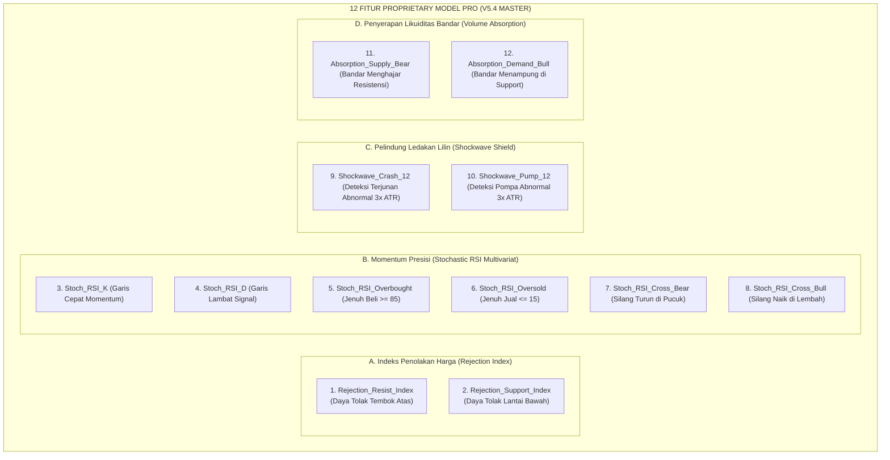

# BEDAH LENGKAP: MATEMATIKA, RUMUS, DAN CARA KERJA 65 FITUR SKRIPSI & 12 FITUR PROPRIETARY PRO

**Dokumen Sumber:** Skripsi S1 Informatika & Dokumen Teknis Paten Komersial  
**Peneliti / Pengembang:** Nouval  
**Tanggal:** 08 Oktober 2026  

---

## BAGIAN 1: BEDAH 12 FITUR PROPRIETARY PRO (TAMBAHAN KHUSUS MODEL V5.4 MASTER)

12 fitur ini adalah **senjata rahasia institusional** yang ditambahkan ke Model PRO di atas 65 fitur dasar Skripsi. Fitur ini dirancang khusus untuk menangkap anomali likuiditas bandar/institusi besar (*smart money traps*) dan memproteksi akun dari ledakan volatilitas berita (*flash crash*).



---

### 1 & 2. Indeks Penolakan Harga Ekstrem (*Rejection Index*)

#### 1. `Rejection_Resist_Index` (Daya Tolak Tembok Atas)
* **Rumus Matematika / Python:**
  $$\text{Rejection\_Resist\_Index} = \frac{(\text{Upper\_Wick\_Ratio})^2}{\text{Dist\_Resistance} + 0.0005}$$
  ```python
  df['Rejection_Resist_Index'] = (df['Upper_Wick_Ratio'] ** 2) / (df['Dist_Resistance'] + 0.0005)
  ```
* **Cara Kerja Teknik:**  
  Mengkuadratkan panjang sumbu atas lilin ($\text{Upper\_Wick\_Ratio}^2$) dan membaginya dengan jarak harga ke resistensi terdekat. Sumbu atas dikuadratkan agar efek penolakannya eksponensial (semakin panjang sumbunya, nilainya melompat berkali-kali lipat). Jika sumbu atas sangat panjang dan posisinya tepat menempel di plafon resistensi ($\text{Dist\_Resistance} \to 0$), nilainya akan meledak tinggi.
* **Bahasa Awam / Analogi:**  
  *Analogi: "Bola dilempar ke atap seng lalu memantul keras ke bawah."*  
  Harga mencoba naik menembus plafon, tetapi ditampar jatuh seketika oleh penjual besar sebelum lilin selesai. Nilai tinggi = sinyal jual (*SELL*) yang sangat kuat.

#### 2. `Rejection_Support_Index` (Daya Tolak Lantai Bawah)
* **Rumus Matematika / Python:**
  $$\text{Rejection\_Support\_Index} = \frac{(\text{Lower\_Wick\_Ratio})^2}{\text{Dist\_Support} + 0.0005}$$
  ```python
  df['Rejection_Support_Index'] = (df['Lower_Wick_Ratio'] ** 2) / (df['Dist_Support'] + 0.0005)
  ```
* **Cara Kerja Teknik:**  
  Mengukur kekuatan bantingan balik harga saat menyentuh lantai support. Semakin panjang jarum sumbu bawah lilin tepat di lantai support, semakin tinggi skornya.
* **Bahasa Awam / Analogi:**  
  *Analogi: "Orang lompat ke atas trampolin di lantai dasar."*  
  Harga sempat jatuh ke lantai, tetapi langsung terpental naik ke atas dalam hitungan menit. Nilai tinggi = sinyal beli (*BUY*) yang sangat kuat.

---

### 3 s/d 8. Mesin Momentum Mikro (*Stochastic RSI Multivariat*)

RSI biasa sering kali lambat berbelok. Stochastic RSI menggabungkan formula Stochastic ke dalam osilator RSI untuk mendeteksi perubahan kecepatan harga pada fraksi mikro M15.

#### 3 & 4. `Stoch_RSI_K` dan `Stoch_RSI_D`
* **Rumus Matematika / Python:**
  $$\text{Stoch\_Raw} = \frac{\text{RSI}_{14} - \min(\text{RSI}_{14}, 14)}{\max(\text{RSI}_{14}, 14) - \min(\text{RSI}_{14}, 14) + \epsilon} \times 100$$
  $$\text{Stoch\_RSI\_K} = \text{SMA}(\text{Stoch\_Raw}, 3)$$
  $$\text{Stoch\_RSI\_D} = \text{SMA}(\text{Stoch\_RSI\_K}, 3)$$
  ```python
  rsi_s = df['RSI_14']
  min_r = rsi_s.rolling(14).min(); max_r = rsi_s.rolling(14).max()
  stoch_raw = (rsi_s - min_r) / (max_r - min_r + 1e-6) * 100.0
  df['Stoch_RSI_K'] = stoch_raw.rolling(3).mean()
  df['Stoch_RSI_D'] = df['Stoch_RSI_K'].rolling(3).mean()
  ```
* **Cara Kerja Teknik:**  
  Mengukur posisi RSI saat ini relatif terhadap rentang tertinggi dan terendahnya selama 14 lilin terakhir, lalu dihaluskan dengan moving average 3 periode. Garis K adalah garis cepat (*leading*), Garis D adalah garis lambat (*lagging signal*).
* **Bahasa Awam:**  
  *Spidometer kecepatan perubahan tenaga pasar.* Garis K menunjukkan tarikan gas saat ini, Garis D menunjukkan kecepatan rata-rata mobil.

#### 5 & 6. `Stoch_RSI_Overbought` dan `Stoch_RSI_Oversold`
* **Rumus:**
  ```python
  df['Stoch_RSI_Overbought'] = (df['Stoch_RSI_K'] >= 85.0).astype(int) # Jenuh Beli
  df['Stoch_RSI_Oversold']   = (df['Stoch_RSI_K'] <= 15.0).astype(int) # Jenuh Jual
  ```
* **Cara Kerja Teknik:**  
  Menghasilkan sinyal biner `1` jika pasar sudah terlalu mahal (ekstrem jenuh beli $\ge 85$) atau terlalu murah (ekstrem jenuh jual $\le 15$).
* **Bahasa Awam:**  
  *Lampu merah peringatan:* Jika nilai `1` di overbought, tandanya pembeli sudah kehabisan napas dan harga siap ambles.

#### 7 & 8. `Stoch_RSI_Cross_Bear` dan `Stoch_RSI_Cross_Bull`
* **Rumus:**
  ```python
  # Cross Bearish di area puncak (K memotong D ke bawah saat K >= 70)
  df['Stoch_RSI_Cross_Bear'] = ((st_k < st_d) & (st_k.shift(1) >= st_d.shift(1)) & (st_k >= 70.0)).astype(int)
  # Cross Bullish di area lembah (K memotong D ke atas saat K <= 30)
  df['Stoch_RSI_Cross_Bull'] = ((st_k > st_d) & (st_k.shift(1) <= st_d.shift(1)) & (st_k <= 30.0)).astype(int)
  ```
* **Cara Kerja Teknik:**  
  Mendeteksi momen presisi saat garis cepat (K) berbalik arah dan menyilang garis lambat (D) saat berada di zona jenuh. Ini adalah pemicu (*trigger*) pembalikan arah paling akurat.
* **Bahasa Awam:**  
  *Momen persis saat bola dilempar ke atas berhenti melayang di udara dan mulai jatuh ke bawah.* Ini adalah titik entri sniper terbaik.

---

### 9 & 10. Perisai Ledakan Lilin Ekstrem (*Shockwave Crash & Pump Shield*)

#### 9. `Shockwave_Crash_12` & 10. `Shockwave_Pump_12`
* **Rumus Matematika / Python:**
  $$\text{Is\_Crash} = (\text{High} - \text{Low} \ge 3.0 \times \text{ATR}_{14}) \land (\text{Close} < \text{Open})$$
  $$\text{Is\_Pump} = (\text{High} - \text{Low} \ge 3.0 \times \text{ATR}_{14}) \land (\text{Close} > \text{Open})$$
  ```python
  c_range = df['high'] - df['low']
  is_crash = (c_range >= 3.0 * df['ATR_14']) & (df['close'] < df['open'])
  is_pump  = (c_range >= 3.0 * df['ATR_14']) & (df['close'] > df['open'])
  df['Shockwave_Crash_12'] = is_crash.rolling(12).max().fillna(0).astype(int)
  df['Shockwave_Pump_12']  = is_pump.rolling(12).max().fillna(0).astype(int)
  ```
* **Cara Kerja Teknik:**  
  Jika sebuah lilin M15 memiliki rentang panjang 3 kali lipat lebih besar dari volatilitas normal ($\ge 3 \times \text{ATR}$), itu adalah anomali (*shockwave*) akibat rilis berita perang atau suku bunga. Fitur ini mengingat kejadian tersebut selama 12 bar (3 jam) ke depan.
* **Bahasa Awam / Analogi:**  
  *Analogi: "Sirine peringatan gempa bumi / tsunami."*  
  Pasar yang baru diterjang lilin raksasa akan penuh dengan slippage dan spread melebar. Fitur ini membekukan eksekusi bot agar tidak masuk ke tengah badai yang membahayakan akun. Inilah rahasia mengapa **Max Drawdown PRO hanya -$17.80 USD**.

---

### 11 & 12. Penyerapan Likuiditas Institusi (*Volume Absorption*)

#### 11. `Absorption_Supply_Bear` (Bandar Menghajar Plafon)
* **Rumus Matematika / Python:**
  ```python
  vol_h = df['Volume_Ratio'] >= 1.6
  df['Absorption_Supply_Bear'] = (vol_h & (df['Upper_Wick_Ratio'] >= 0.25) & (df['Dist_Resistance'] <= 0.0020)).astype(int)
  ```
* **Cara Kerja Teknik:**  
  Mendeteksi 3 syarat simultan: (1) Volume transaksi meledak $\ge 1.6 \times$ rata-rata, (2) Memiliki sumbu atas panjang $\ge 25\%$, (3) Berada dekat resistensi $\le 0.2\%$. Artinya, terjadi transaksi jutaan lot oleh ritel yang dibeli/diserap habis oleh institusi untuk persiapan membanting harga turun.
* **Bahasa Awam:**  
  *Perangkap Bandar:* Banyak orang awam mengira harga mau menembus atap sehingga mereka ikut beli, tapi seluruh barang mereka ditampung oleh bandar besar lalu harganya digembok dan dibanting turun (*SELL*).

#### 12. `Absorption_Demand_Bull` (Bandar Menampung di Lantai)
* **Rumus Matematika / Python:**
  ```python
  df['Absorption_Demand_Bull'] = (vol_h & (df['Lower_Wick_Ratio'] >= 0.25) & (df['Dist_Support'] <= 0.0020)).astype(int)
  ```
* **Cara Kerja Teknik:**  
  Volume raksasa dengan sumbu bawah panjang tepat di lantai support. Institusi menyerap semua aksi *panic selling* orang-orang sebelum menerbangkan harga naik (*BUY*).

---

## BAGIAN 2: BEDAH 65 FITUR DASAR SKRIPSI (MODEL V5.2 KAUSAL MURNI)

Seluruh 65 fitur di bawah ini **100% bebas kebocoran masa depan (*Zero Leakage*)**, mematuhi boundary purging, dan dirancang secara kausal:

### Kelompok 1: Geometri Lilin & Price Action Murni (Fitur 1–3)
1. **`Body_Ratio`**: $\frac{|\text{Close} - \text{Open}|}{\text{High} - \text{Low} + \epsilon}$ $\rightarrow$ Mengukur seberapa padat batang lilin (apakah lilin bertenaga atau lilin ragu-ragu/doji).
2. **`Lower_Wick_Ratio`**: $\frac{\min(\text{Open}, \text{Close}) - \text{Low}}{\text{High} - \text{Low} + \epsilon}$ $\rightarrow$ Mengukur panjang buntut bawah lilin (dorongan beli dari bawah).
3. **`Upper_Wick_Ratio`**: $\frac{\text{High} - \max(\text{Open}, \text{Close})}{\text{High} - \text{Low} + \epsilon}$ $\rightarrow$ Mengukur panjang jarum atas lilin (tekanan jual dari atas).

### Kelompok 2: Smart Money Concepts (SMC) & Struktur Pasar (Fitur 4–15)
4. **`FVG_Bull`**: $(\text{Low}_t > \text{High}_{t-2})$ $\rightarrow$ Celah ketidakseimbangan harga (*Fair Value Gap*) saat pembeli melonjak liar meninggalkan celah kosong.
5. **`FVG_Bear`**: $(\text{High}_t < \text{Low}_{t-2})$ $\rightarrow$ Celah kosong saat penjual membanting harga.
6. **`Dist_Support`**: $\frac{\text{Close} - \min(\text{Low}_{20})}{\text{Close}}$ $\rightarrow$ Jarak relatif harga ke dasar terendah 20 bar terakhir.
7. **`Dist_Resistance`**: $\frac{\max(\text{High}_{20}) - \text{Close}}{\text{Close}}$ $\rightarrow$ Jarak relatif harga ke puncak tertinggi 20 bar terakhir.
8. **`BOS_Bull`**: $(\text{Close} > \max(\text{High}_{20}))$ $\rightarrow$ *Break of Structure Bullish* (harga resmi menembus rekor puncak sebelumnya).
9. **`BOS_Bear`**: $(\text{Close} < \min(\text{Low}_{20}))$ $\rightarrow$ *Break of Structure Bearish* (harga resmi menjebol rekor lembah sebelumnya).
10. **`CHoCH_Bull`**: $(\text{Close} > \max(\text{High}_{20})) \land (\text{Trend}_{20} < 0)$ $\rightarrow$ *Change of Character* (pembalikan arah tren dari turun menjadi naik).
11. **`CHoCH_Bear`**: $(\text{Close} < \min(\text{Low}_{20})) \land (\text{Trend}_{20} > 0)$ $\rightarrow$ Pembalikan arah tren dari naik menjadi turun.
12. **`Liquidity_Sweep_High`**: $(\text{High} > \max(\text{High}_{20})) \land (\text{Close} < \max(\text{High}_{20}))$ $\rightarrow$ Jarum menembus puncak lalu langsung tutup di bawahnya (pembersihan stop-loss ritel oleh bandar).
13. **`Liquidity_Sweep_Low`**: $(\text{Low} < \min(\text{Low}_{20})) \land (\text{Close} > \min(\text{Low}_{20}))$ $\rightarrow$ Jarum menjebol lantai lalu langsung ditarik naik.
14. **`Order_Block_Bull`**: Lilin bearish historis ($t-2$) sebelum ledakan impulsif naik $\ge 1.5 \times$ rata-rata lilin $\rightarrow$ Jejak kaki institusi menumpuk order beli.
15. **`Order_Block_Bear`**: Lilin bullish historis ($t-2$) sebelum ledakan impulsif turun $\rightarrow$ Jejak kaki institusi menumpuk order jual.

### Kelompok 3: Fibonacci Retracement Emas (Fitur 16–19)
16. **`Fibo_Pos_100`**: Posisi harga saat ini dalam rentang 100 lilin terakhir (0 = dasar absolut, 1 = pucuk absolut).
17. **`Fibo_Dist_382`**: Jarak harga ke level rasio emas Fibonacci 38.2%.
18. **`Fibo_Dist_500`**: Jarak harga ke level keseimbangan Fibonacci 50.0% (*Fair Value Equilibrium*).
19. **`Fibo_Dist_618`**: Jarak harga ke zona emas institusi Fibonacci 61.8% (*Golden Pocket*).

### Kelompok 4: Osilator & Volatilitas Teknikal (Fitur 20–31)
20. **`RSI_14`**: *Relative Strength Index* standar Wilder 14 periode.
21. **`BB_Bandwidth`**: Lebar pita Bollinger Bands $\frac{4 \times \sigma_{20}}{\text{SMA}_{20}}$ (mendeteksi kompresi/ledakan volatilitas).
22. **`BB_Pos`**: Posisi harga relatif terhadap pita atas dan bawah Bollinger Bands.
23–25. **`XAU_Return_1`, `Return_3`, `Return_5`**: Laju perubahan persentase harga emas pada 1, 3, dan 5 bar terakhir.
26–27. **`Consecutive_Bull`, `Consecutive_Bear`**: Jumlah lilin hijau atau merah yang berbaris berturut-turut tanpa jeda.
28. **`ATR_14`**: *Average True Range* (rentang rata-rata pergerakan fisik harga emas).
29. **`ADX_14`**: *Average Directional Index* (mengukur kekuatan tren, apakah pasar sedang trending kuat $\ge 25$ atau sedang sideways mati).
30. **`Volume_Ratio`**: Rasio volume transaksi lilin saat ini dibanding rata-rata 20 lilin.
31. **`Swing_High_20`**: Level harga plafon tertinggi dalam 20 bar terakhir.

### Kelompok 5: Integrasi Zona Spasial ke Dalam AI (Fitur 32–37)
*(Menggantikan seluruh aturan if-else manual di luar bot menjadi fitur murni)*
32. **`Zone_A_Bounce_Bull`**: Dekat support ($\le 0.15\%$) dan memiliki sumbu bawah panjang ($\ge 40\%$).
33. **`Zone_A_Bounce_Bear`**: Dekat resistensi ($\le 0.15\%$) dan memiliki sumbu atas panjang ($\ge 40\%$).
34. **`Zone_B_Prox_Bull`**: Sangat dekat dengan lantai pantulan support ($\le 0.10\%$).
35. **`Zone_B_Prox_Bear`**: Sangat dekat dengan atap resistensi ($\le 0.10\%$).
36. **`Zone_Clearance_Safe_Bull`**: Ruang gerak ke resistensi di atasnya masih sangat lega ($\ge 0.35\%$), aman untuk beli tanpa terbentur plafon.
37. **`Zone_Clearance_Safe_Bear`**: Ruang gerak ke support di bawahnya masih sangat lega ($\ge 0.35\%$).

### Kelompok 6: Pita EMA 9/26 Ribbon M15 (Fitur 38–43)
38. **`EMA_9_Cross_26_Bull`**: Persilangan emas (*Golden Cross*) EMA 9 melintas ke atas EMA 26.
39. **`Dist_EMA9_M15`**: Jarak persentase harga ke garis EMA 9.
40. **`Dist_EMA26_M15`**: Jarak persentase harga ke garis EMA 26.
41. **`Spread_EMA_9_26`**: Lebar jarak renggang antara EMA 9 dan EMA 26 (mengukur percepatan tren).
42. **`Pullback_EMA_Bull`**: Tren bullish di mana harga sempat retrace mencium garis EMA 9 lalu memantul naik.
43. **`Pullback_EMA_Bear`**: Tren bearish di mana harga retrace menyentuh EMA 9 lalu terpental turun.

### Kelompok 7: Intermarket Indeks Dolar / DXY & SMT POI (Fitur 44–56)
*(Hubungan Terbalik Emas vs Dolar AS: Jika Dolar Melemah, Emas Terbang)*
44–45. **`DXY_Return_1`, `Return_3`**: Laju perubahan harga Dolar AS.
46. **`DXY_Trend`**: Arah tren Dolar AS ($1$ jika di atas MA20, $-1$ jika di bawah MA20).
47. **`XAU_DXY_Ratio_Return`**: Rasio kekuatan perbandingan Emas terhadap Dolar.
48–49. **`DXY_Dist_Resistance`, `Dist_Support`**: Jarak Dolar ke benteng support dan resistensinya.
50. **`DXY_At_Supply_POI`**: Dolar sedang menabrak dinding penawaran institusi (*Supply POI*), indikasi Dolar akan anjlok $\to$ Emas akan meledak naik (*BUY*).
51. **`DXY_At_Demand_POI`**: Dolar sedang menyentuh lantai permintaan (*Demand POI*), indikasi Dolar akan menguat $\to$ Emas akan turun (*SELL*).
52. **`DXY_RSI_14`**: RSI dari Indeks Dolar.
53–54. **`DXY_BOS_Bull`, `BOS_Bear`**: Penembusan struktur harga pada Indeks Dolar.
55. **`SMT_Divergence_Bull`**: *Smart Money Technique Divergence* (Emas membuat dasar yang lebih rendah, tetapi Dolar gagal membuat puncak baru $\rightarrow$ manipulasi bandar terdeteksi, Emas siap melesat naik!).
56. **`SMT_Divergence_Bear`**: Emas membuat puncak lebih tinggi, tetapi Dolar gagal membuat lembah lebih rendah $\rightarrow$ manipulasi bandar, Emas siap anjlok!

### Kelompok 8: Multi-Timeframe Tren Makro H1 & H4 (Fitur 57–62)
57. **`Trend_H1_Bull`**: Harga berada di atas EMA 50 H1 (Tren 1 Jam Naik).
58. **`Trend_H1_Strong`**: EMA 50 H1 berada di atas EMA 200 H1 (*Golden Cross* tren besar institusi).
59. **`H1_Dist_EMA50`**: Jarak harga ke EMA 50 H1.
60. **`Trend_H4_Bull`**: Harga berada di atas EMA 50 H4 (Tren 4 Jam Naik).
61. **`Trend_H4_Strong`**: EMA 50 H4 berada di atas EMA 200 H4 (Struktur tren harian raksasa).
62. **`H4_Dist_EMA50`**: Jarak harga ke EMA 50 H4.

### Kelompok 9: Kalender Makroekonomi AS (Fitur 63–65)
63. **`Is_NFP_Week`**: Bernilai `1` jika berada di pekan rilis data tenaga kerja Non-Farm Payrolls (Jumat pertama setiap awal bulan).
64. **`Is_CPI_Day`**: Bernilai `1` jika berada di hari rilis inflasi AS (tanggal 10–15 setiap bulan).
65. **`Is_FOMC_Week`**: Bernilai `1` jika berada di pekan pengumuman suku bunga The Fed (Rabu pekan ke-3 setiap bulan).
