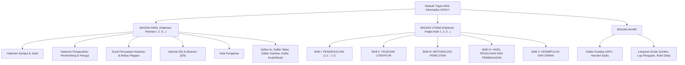
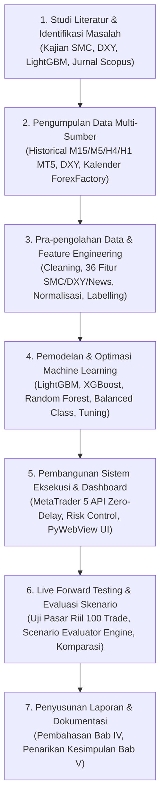

# ANALISIS STRUKTUR PENULISAN SKRIPSI INFORMATIKA UPN "VETERAN" YOGYAKARTA
## Panduan Komprehensif & Cetak Biru (Blueprint) Penyusunan Bab I Pendahuluan
**Lokasi Dokumen Acuan**: `d:\skrip\skripsi_projek\pdf`  
**Sasaran Penulisan**: Naskah Skripsi / Tugas Akhir Program Studi Informatika, Jurusan Informatika, Fakultas Teknik Industri, UPN "Veteran" Yogyakarta  
**Objek Riset**: Penerapan Algoritma LightGBM untuk Prediksi Probabilitas Arah Harga XAUUSD Berbasis Multi-Timeframe, Indeks Dolar AS (DXY), dan Makroekonomi  
**Penyusun**: Nouval Ditya Maheswara (NIM: 123230165)

---

## DAFTAR ISI PANDUAN
1. [Hasil Pemetaan & Bedah Kritis 14 Dokumen Skripsi di Folder `pdf/`](#1-hasil-pemetaan--bedah-kritis-14-dokumen-skripsi-di-folder-pdf)
2. [Pola Baku & Anatomi Struktur Penulisan Tugas Akhir Informatika UPNVY](#2-pola-baku--anatomi-struktur-penulisan-tugas-akhir-informatika-upnvy)
3. [Bedah Formula Sub-Bab per Sub-Bab pada BAB I PENDAHULUAN](#3-bedah-formula-sub-bab-per-sub-bab-pada-bab-i-pendahuluan)
   - [1.1 Latar Belakang Masalah (Teknik Piramida Terbalik)](#11-latar-belakang-masalah-teknik-piramida-terbalik)
   - [1.2 Rumusan Masalah (Pola Kalimat Ilmiah)](#12-rumusan-masalah-pola-kalimat-ilmiah)
   - [1.3 Batasan Masalah (Kaidah Batasan Ruang Lingkup)](#13-batasan-masalah-kaidah-batasan-ruang-lingkup)
   - [1.4 Tujuan Penelitian (Isomorfisme Rumusan Masalah)](#14-tujuan-penelitian-isomorfisme-rumusan-masalah)
   - [1.5 Manfaat Penelitian (Struktur Teoretis & Praktis)](#15-manfaat-penelitian-struktur-teoretis--praktis)
   - [1.6 Tahapan Penelitian (Metodologi Alur Riset Informatika)](#16-tahapan-penelitian-metodologi-alur-riset-informatika)
   - [1.7 Sistematika Penulisan (Deskripsi Bab I – Bab V)](#17-sistematika-penulisan-deskripsi-bab-i--bab-v)
4. [Tabel Matriks Komparasi Penelitian Terdahulu (State-of-the-Art & Gap Analisis)](#4-tabel-matriks-komparasi-penelitian-terdahulu-state-of-the-art--gap-analisis)
5. [Kaidah Tipografi, Diksi Akademik, dan Gaya Sitasi UPNVY](#5-kaidah-tipografi-diksi-akademik-dan-gaya-sitasi-upnvy)
6. [Draf Siap Pakai BAB I PENDAHULUAN untuk Skripsi Nouval Ditya Maheswara](#6-draf-siap-pakai-bab-i-pendahuluan-untuk-skripsi-nouval-ditya-maheswara)

---

## 1. Hasil Pemetaan & Bedah Kritis 14 Dokumen Skripsi di Folder `pdf/`

Dari hasil pembacaan pemindaian optik (*Optical Character Recognition* / OCR) resolusi tinggi terhadap seluruh berkas PDF pada direktori `d:\skrip\skripsi_projek\pdf`, teridentifikasi **14 dokumen Tugas Akhir / Skripsi** yang berasal dari lingkungan **Universitas Pembangunan Nasional "Veteran" Yogyakarta (UPNVY)**, dengan rincian pemetaan sebagai berikut:

### A. Rumpun Utama: Program Studi S1 Informatika (FTI UPNVY)
| No | Penulis & NIM | Judul Skripsi / Tugas Akhir | Domain & Metode | Karakteristik Penting Bab I |
|---|---|---|---|---|
| 1 | **Panji Arif Jafarudin**<br>(123220091) | *Analisis Komparatif Algoritma Machine Learning Berbasis Tree dan Vektor untuk Prediksi Inhibisi Isoenzim Sitokrom P450 dengan Interpretasi SHAP* | Machine Learning (Random Forest, XGBoost, SVM) + Bayesian Optimization (Optuna) + SHAP | **Sangat Relevan**: Menggunakan model *tree-based*, optimasi hyperparameter, penanganan ketidakseimbangan kelas (*class imbalance*), optimasi *decision threshold*, dan *Explainable AI* (SHAP). Bab I terdiri atas 7 sub-bab persis (1.1 s/d 1.7). |
| 2 | **Ikhsan Syahri Ramadhan**<br>(123220024) | *Peramalan Kunjungan dan Analisis Pola Penjualan Menggunakan Metode ARIMA dan Market Basket Analysis pada Forza Gym Babarsari* | Time Series Forecasting (ARIMA) + Data Mining (Association Rules) | **Sangat Relevan**: Mengkaji data deret waktu (*time series*), stasioneritas data, lag time, dan evaluasi peramalan. Bab I memiliki 7 sub-bab standar. |
| 3 | **Agreswara Putri Wijaya**<br>(123220182) | *Sistem Rekomendasi Supermarket Online Berdasarkan Analisis Sentimen Ulasan Pengguna Menggunakan Support Vector Machine dan Metode MOORA* | Machine Learning (SVM Text Classification) + MCDM (MOORA) + Web App | Menghubungkan model kecerdasan buatan dengan sistem pendukung keputusan multikriteria berbasis aplikasi nyata. Bab I memiliki 7 sub-bab standar. |
| 4 | **Anugraha Galih Saputra**<br>(123220119) | *Klasifikasi Kelompok Usia Berdasarkan Citra Wajah Menggunakan Convolutional Neural Network dengan Optimasi Particle Swarm Optimization* | Deep Learning (CNN) + Metaheuristik (PSO) + Real-time App | Menggabungkan model AI dengan algoritma optimasi dan implementasi aplikasi waktu nyata (*real-time*). Bab I memiliki 7 sub-bab standar. |
| 5 | **Gregorius Rafael Santosa**<br>(123210102) | *Implementasi YOLOv8 dan Ray Casting untuk Deteksi Serta Pengelompokan Makanan Berdasarkan Hubungan Spasial dengan Wadah* | Computer Vision (YOLOv8) + Analisis Geometris Spasial | Menekankan rekayasa fitur spasial/geometris dan validasi sistem pada kasus riil. Bab I memiliki 7 sub-bab standar. |
| 6 | **Rowang Pramudito**<br>(123200098) | *Kombinasi Stable Diffusion dengan ControlNet Berbasis Citra Tepi Canny untuk Image-to-Image Translation dalam Pembuatan Background Art Animasi* | Generative AI + Image Processing | Fokus pada integrasi arsitektur mutakhir untuk otomasi proses grafis. Bab I memiliki 7 sub-bab standar. |
| 7 | **Muhamad Tsani Putra Tronchet**<br>(123220115) | *Implementasi Monitoring Kesehatan Jaringan Berbasis Mikrotik dengan Pendekatan Rule Based dan Event Correlation* | Network Engineering + Rule-Based System | Fokus pada otomasi pemantauan metrik dan korelasi *event* peringatan dini. Bab I memiliki 7 sub-bab standar. |
| 8 | **Rafly Adiyasa Putra**<br>(123220106) | *Implementasi Zero Touch Provisioning Berbasis Vendor Class Identifier pada Infrastruktur Jaringan Multi-Vendor dalam Lingkungan Simulasi GNS3* | Jaringan Komputer + Otomasi Konfigurasi | Menitikberatkan otomasi penyediaan (*provisioning*) multi-perangkat. Bab I memiliki 7 sub-bab standar. |

### B. Rumpun Terkait & Lintas Fakultas di UPNVY (Perspektif Pelengkap)
* **Hasna Brilian Perdana (124220088)** — *Sistem Informasi FTI UPNVY*: Evaluasi Investasi TI Menggunakan Cost Benefit Analysis.
* **Ibnu Fahrul Rahman (122220069)** — *Teknik Industri FTI UPNVY*: Perancangan Tata Letak Departemen Sewing dengan Pendekatan Group Technology.
* **Evita Ninawati (135220034) & Adinda Tri Karina (135220004)** — *Agribisnis Pertanian UPNVY*: Analisis Persediaan Bahan Baku Metode EOQ.
* **Stefanus Ardian Wikantiyoso (142220313)** — *Akuntansi FEB UPNVY*: Pengaruh Strategi Diferensiasi terhadap Financial Distress.

---

## 2. Pola Baku & Anatomi Struktur Penulisan Tugas Akhir Informatika UPNVY

Berdasarkan konsistensi seluruh naskah skripsi resmi Informatika FTI UPNVY yang diteliti, terdapat konvensi penomoran dan pembagian bab yang **wajib dipatuhi**:



### Format Baku BAB I PENDAHULUAN (7 Sub-Bab Mutlak):
1. **1.1 Latar Belakang Masalah**
2. **1.2 Rumusan Masalah**
3. **1.3 Batasan Masalah**
4. **1.4 Tujuan Penelitian**
5. **1.5 Manfaat Penelitian**
6. **1.6 Tahapan Penelitian** *(Bukan sekadar tabel, melainkan uraian tahapan metodologis dari studi pustaka hingga deployment)*
7. **1.7 Sistematika Penulisan** *(Deskripsi ringkas isi Bab I sampai Bab V)*

> [!IMPORTANT]
> **Temuan Kunci untuk Nouval**: Pada draf skrip lama (`create_bab1_docx.py`), sub-bab 1.6 diberi judul *"Keaslian Penelitian dan Research Gap"* dan sub-bab 1.7 belum ada. Di Jurusan Informatika UPNVY, sub-bab 1.6 **wajib berisi Tahapan Penelitian** dan sub-bab 1.7 **wajib berisi Sistematika Penulisan**. Matriks Keaslian Penelitian / Penelitian Terdahulu diletakkan di akhir sub-bab 1.1 sebagai penutup Latar Belakang atau di Bab II sub-bab Tinjauan Penelitian Terdahulu.

---

## 3. Bedah Formula Sub-Bab per Sub-Bab pada BAB I PENDAHULUAN

### 1.1 Latar Belakang Masalah (Teknik Piramida Terbalik)
Skripsi Informatika UPNVY menganut pola **piramida terbalik (*inverted pyramid flow*)** dengan transisi paragraf yang sangat runtut:

1. **Paragraf 1–2 (Fenomena Global & Urgensi Domain)**:
   - Membahas pasar emas dunia (XAUUSD) sebagai aset *safe-haven* dan instrumen derivatif paling likuid di dunia.
   - Mengungkapkan masalah alamiah pasar: volatilitas tinggi, sifat *non-linear*, *non-stasioner*, dan tingginya tingkat derau (*noise density*) pada pergerakan jangka pendek intraday.
2. **Paragraf 3–4 (Kelemahan Pendekatan Konvensional)**:
   - Mengkritisi metode tradisional trader retail yang hanya mengandalkan indikator matematika usang/terlambat (*lagging indicators* seperti RSI, MACD, Moving Average).
   - Menjelaskan fenomena perburuan likuiditas (*liquidity sweeps / stop run*) oleh institusi besar (*Smart Money*) yang kerap memakan korban trader retail.
3. **Paragraf 5–6 (Solusi Konseptual: Smart Money Concepts & Bias Manusia)**:
   - Memperkenalkan metodologi *Smart Money Concepts* (SMC/ICT) seperti *Order Block* (OB), *Fair Value Gap* (FVG), *Break of Structure* (BOS), dan *Change of Character* (CHoCH).
   - Mengidentifikasi kelemahan SMC manual: sarat bias psikologis subjektif manusia (*fear*, *greed*, *revenge trading*), kelelahan memantau grafik, dan eksekusi yang lambat.
4. **Paragraf 7–9 (Peluang AI & Tiga Research Gap Kritis)**:
   - Mengapa *Machine Learning* dibutuhkan untuk membuat keputusan objektif berbasis probabilitas.
   - **Research Gap 1 (Formulasi Masalah)**: Banyak penelitian terdahulu keliru memperlakukan peramalan harga sebagai tugas *regresi nominal* (memprediksi nilai dolar esok hari) yang menghasilkan *lagging bias* (prediksi hanya mengekor harga candle sebelumnya). Seharusnya diformulasikan sebagai *klasifikasi probabilitas arah pergerakan diskrit* terkalibrasi tinggi (≥ 65%).
   - **Research Gap 2 (Isolasi Data & Pengabaian Makro/DXY)**: Banyak penelitian hanya memakai data internal *single-timeframe* dan buta terhadap korelasi intermarket Indeks Dolar AS (DXY) serta rilis berita berdampak tinggi (*High-Impact News*: NFP, CPI, FOMC) yang kerap membalikkan arah pasar.
   - **Research Gap 3 (Ketiadaan Validasi Forward Testing Riil)**: Banyak penelitian berhenti pada *backtesting statis* in-sample yang rentan *overfitting*, tanpa pernah diuji pada pasar nyata (*live forward testing*) dengan friksi riil (spread, slippage, latency) dan sistem evaluasi pasca-transaksi (*Post-Trade Evaluator*).
5. **Paragraf 10–12 (Solusi yang Diusulkan & Keunggulan LightGBM)**:
   - Menjelaskan alasan pemilihan algoritma **LightGBM**: teknik *Gradient-based One-Side Sampling* (GOSS), *Exclusive Feature Bundling* (EFB), dan *Leaf-wise Tree Growth* yang menghasilkan inferensi *zero-delay* (10–20x lebih cepat dari XGBoost/Random Forest dan hemat memori).
   - Menguraikan fusi 36 variabel lintas-domain (Geometri Candle, SMC, Tren H4/H1, DXY, Kalender Berita).
   - Menjelaskan integrasi dengan MetaTrader 5 API, manajemen risiko dinamis (Dynamic ATR Stop-Loss, RRR 1:2.5, Max Daily Losses), dan *Scenario Evaluator Engine*.
6. **Paragraf 13 (Tabel Matriks Komparasi Penelitian Terdahulu & Penegasan Novelty)**:
   - Menyajikan tabel komparasi literatur (Al-Thaqeb et al., 2026; Ben Jabeur et al., 2024; Kazemdehbashi, 2026; Zhou et al., 2025; Sayegh & Accary, 2026).
   - Menutup dengan rangkuman kontribusi kebaruan penelitian.

---

### 1.2 Rumusan Masalah (Pola Kalimat Ilmiah)
Di Informatika UPNVY, rumusan masalah ditulis dalam bentuk **kalimat tanya terukur yang mencerminkan tahapan rekayasa perangkat lunak dan komputasi cerdas**.

**Pola Baku yang Terbukti Lolos Sidang (5 Butir Terarah)**:
1. *Bagaimana merancang dan membangun arsitektur Multi-Source Feature Fusion yang mengintegrasikan data geometri candle, Smart Money Concepts (OB, FVG, BOS, CHoCH), tren multi-timeframe (H4/H1), intermarket Indeks Dolar AS (DXY), dan siklus berita makroekonomi (NFP, CPI, FOMC) tanpa menimbulkan bias kebocoran data masa depan (lookahead bias)?*
2. *Bagaimana menerapkan dan mengoptimasi algoritma LightGBM Classifier dengan pembobotan kelas seimbang (balanced class weights) dan hyperparameter tuning guna menghasilkan estimasi probabilitas arah pergerakan harga XAUUSD yang terkalibrasi presisi pada timeframe M15 dan M5?*
3. *Bagaimana merancang arsitektur sistem eksekusi perdagangan terotomasi zero-delay terintegrasi MetaTrader 5 API yang dipersenjatai filter ambang batas keyakinan tinggi (confidence threshold ≥ 65%) dan manajemen risiko kuantitatif dinamis (Dynamic ATR Stop-Loss, RRR minimal 1 : 1.8 s.d. 1 : 2.5, serta batas kerugian harian)?*
4. *Bagaimana membangun Post-Trade Scenario Evaluator Engine untuk mendiagnosa akar penyebab keberhasilan (TP) maupun kegagalan (SL) setiap transaksi tertutup, serta menguji ketahanan skenario pasar 5 hingga 10 kali transaksi sebagai mekanisme evaluasi berkelanjutan (continuous learning) model?*
5. *Bagaimana efektivitas dan kinerja model LightGBM yang dibangun jika dibandingkan dengan algoritma pembanding (XGBoost dan Random Forest) berdasarkan metrik evaluasi klasifikasi statistik (ROC-AUC, Precision, Recall, F1-Score) serta metrik profitabilitas forward testing pasar nyata (Win Rate, Profit Factor, Maksimum Drawdown, dan ROI)?*

---

### 1.3 Batasan Masalah (Kaidah Batasan Ruang Lingkup)
Batasan masalah di Informatika UPNVY berfungsi sebagai **pagar pengaman akademik saat ujian pendadaran**, agar penguji tidak menanyakan hal di luar cakupan penelitian.

**Kaidah Penyusunan (7 Poin Pagar)**:
1. **Objek Instrumen**: Dibatasi hanya pada komoditas Emas spot terhadap Dolar AS (**XAUUSD**).
2. **Karakteristik Data & Timeframe**: Data primer penarikan candle broker MetaTrader 5 pada timeframe operasional **M15** (Intraday Swing) dan **M5** (Scalping), dengan konfirmasi tren makro pada **H1** dan **H4**.
3. **Variabel Fitur**: Dibatasi pada **36 variabel terstandarisasi** (Geometri M15/M5, SMC/ICT, Fibonacci Retracement, Indikator Momentum ATR/RSI, Kanal DXY, dan rilis berita NFP, CPI, FOMC).
4. **Batasan Algoritma**: Model utama adalah **LightGBM Classifier**, dengan model komparasi terbatas pada **XGBoost** dan **Random Forest**.
5. **Formulasi Target Output**: Klasifikasi probabilitas diskrit kenaikan/penurunan harga 5 candle ke depan dengan ambang keyakinan eksekusi (*high-conviction threshold*) **≥ 65.0%**.
6. **Prosedur Pengujian Nyata**: Uji operasional *live forward testing* terotomasi via MetaTrader 5 API dengan modal evaluasi awal terstandarisasi **$500.00 USD**, volume **0.01 lot**, batasan akumulasi posisi (**maksimal 2 posisi**), dan toleransi rugi harian (**maksimal 5 loss**).
7. **Lingkungan Pengembangan**: Menggunakan ekosistem Python 3.13/3.14 dengan pustaka *lightgbm*, *scikit-learn*, *MetaTrader5*, *pandas*, *numpy*, dan *openpyxl*.

---

### 1.4 Tujuan Penelitian (Isomorfisme Rumusan Masalah)
Tujuan penelitian harus memiliki **hubungan satu-satu (*one-to-one correspondence / isomorphic*)** dengan rumusan masalah. Setiap pertanyaan pada 1.2 dijawab tuntas dengan kalimat deklaratif/aktif pada 1.4:

1. *Membangun pipeline Multi-Source Feature Fusion 36 variabel lintas-domain (geometri candle, SMC, tren H4, DXY, berita makro) yang bebas dari kebocoran data (lookahead bias).*
2. *Mengembangkan model klasifikasi probabilitas terkalibrasi berbasis LightGBM yang mampu memprediksi arah pergerakan harga XAUUSD secara akurat dan menyaring derau konsolidasi pasar melalui ambang batas keyakinan ≥ 65%.*
3. *Mengimplementasikan sistem eksekusi perdagangan terotomasi zero-delay terintegrasi MetaTrader 5 API dengan manajemen risiko dinamis berbasis ATR dan RRR 1 : 2.5.*
4. *Mengembangkan Post-Trade Scenario Evaluator Engine untuk mendiagnosa, mencatat log, dan menguji ketahanan skenario perdagangan 5–10 kali sebagai mekanisme perbaikan model berkelanjutan.*
5. *Mengevaluasi dan membandingkan kinerja model LightGBM terhadap XGBoost dan Random Forest pada metrik klasifikasi statistik serta metrik finansial riil pengujian forward testing.*

---

### 1.5 Manfaat Penelitian (Struktur Teoretis & Praktis)
Format resmi UPNVY membagi manfaat penelitian menjadi dua dimensi tegas:

#### 1. Manfaat Teoretis (Akademik & Keilmuan Informatika):
* **Pengembangan Ilmu Data Science & Financial AI**: Memberikan kontribusi empiris mengenai efektivitas algoritma *Gradient Boosting berbasis histogram* (LightGBM) dalam memproses deret waktu finansial yang bervolalitas tinggi dan non-stasioner.
* **Validasi Fusi Multi-Domain**: Membuktikan secara ilmiah bahwa penggabungan mikrostruktur institusional (Smart Money Concepts), konfirmasi tren multi-timeframe, dan faktor makroekonomi eksternal (DXY & Kalender Berita) secara signifikan meningkatkan akurasi arah dan ketahanan model terhadap guncangan pasar.
* **Referensi Pengambilan Keputusan Bawah Ketidakpastian**: Menjadi rujukan akademik dalam pemanfaatan kalibrasi probabilitas model untuk memitigasi risiko eksekusi (*decision-making under uncertainty*).

#### 2. Manfaat Praktis (Trader Retail, Pengembang Sistem, & Industri Finansial):
* **Eliminasi Bias Emosional Trader**: Menyediakan sistem pendukung keputusan (*Decision Support System*) dan eksekusi terotomasi yang rasional, disiplin, dan objektif guna menghindarkan trader dari jebakan psikologis (*FOMO, panic closing, revenge trading*).
* **Perlindungan Modal Terukur**: Memberikan kerangka manajemen risiko berbasis volatilitas pasar riil (Dynamic ATR Stop-Loss, batas kerugian harian maksimum, dan jeda *cooldown*).
* **Transparansi Evaluasi Kinerja**: Memfasilitasi praktisi dan peneliti dengan modul diagnosa pasca-transaksi (*Scenario Evaluator*) untuk audit performa sistem secara terstruktur dan terukur.

---

### 1.6 Tahapan Penelitian (Metodologi Alur Riset Informatika)
Sub-bab 1.6 di Informatika UPNVY mengadopsi kerangka kerja standar industri **CRISP-DM (*Cross-Industry Standard Process for Data Mining*)** yang diadaptasi untuk rekayasa perangkat lunak cerdas:



Uraian naratif sub-bab 1.6:
1. **Fase 1: Studi Literatur dan Perumusan Masalah**: Melakukan telaah terhadap pustaka ilmiah mengenai algoritma *gradient boosting*, mikrostruktur Smart Money Concepts, transmisi korelasi DXY, kalender makroekonomi, serta manajemen risiko perdagangan kuantitatif.
2. **Fase 2: Pengumpulan Data (*Data Collection*)**: Mengumpulkan dataset historis harga XAUUSD (M15, M5, H1, H4) melalui MetaTrader 5 API, mengunduh data historis DXY, serta mengumpulkan riwayat rilis berita ekonomi AS berkategori *High Impact* (NFP, CPI, FOMC).
3. **Fase 3: Pra-pengolahan Data dan Rekayasa Fitur (*Data Preparation & Feature Engineering*)**: Membersihkan data dari *missing values*, menyelaraskan stempel waktu (*timestamp alignment*), merekayasa 36 variabel indikator teknikal SMC dan makroekonomi, membuat label target arah pergerakan 5 candle ke depan, serta membagi dataset menjadi data latih (*training*), validasi, dan uji (*testing*).
4. **Fase 4: Pemodelan dan Pelatihan Model (*Modeling*)**: Melatih model klasifikasi LightGBM dengan skema *leaf-wise growth*, mengatur bobot kelas seimbang (*balanced class weights*), melakukan pencarian hyperparameter optimal, serta melatih model pembanding (XGBoost dan Random Forest).
5. **Fase 5: Pembangunan Sistem Eksekusi dan Antarmuka (*System Development*)**: Membangun modul *engine* eksekusi otomatis yang terhubung ke terminal MetaTrader 5 broker dengan fitur perlindungan risiko (Dynamic ATR SL, RRR 1:2.5, Max Daily Loss, Cooldown Lock), serta antarmuka pemantauan *desktop modern* (PyWebView/Flask) yang menampilkan status bot, saldo, ekuitas, dan kurva portofolio.
6. **Fase 6: Pengujian Forward Testing dan Evaluasi Pasca-Trade (*Evaluation & Testing*)**: Menjalankan pengujian waktu nyata (*live forward testing*) pada pasar riil sebanyak minimal 100 transaksi, mencatat log transaksi secara otomatis ke lembar kerja evaluasi, mendiagnosa efektivitas skenario entry via *Scenario Evaluator Engine*, serta mengukur metrik klasifikasi statistik dan metrik finansial.
7. **Fase 7: Dokumentasi dan Penyusunan Laporan**: Menyusun laporan skripsi secara sistematis sesuai kaidah penulisan ilmiah UPN "Veteran" Yogyakarta.

---

### 1.7 Sistematika Penulisan (Deskripsi Bab I – Bab V)
Sub-bab 1.7 menjelaskan struktur bab secara berurutan dan padat:

* **BAB I PENDAHULUAN**: Menguraikan latar belakang masalah volatilitas harga emas XAUUSD, kelemahan indikator konvensional, potensi algoritma LightGBM dan SMC, rumusan masalah, batasan masalah, tujuan penelitian, manfaat penelitian, tahapan metodologi penelitian, serta sistematika penulisan laporan.
* **BAB II TINJAUAN LITERATUR**: Membahas landasan teori mengenai komoditas emas dan indeks Dolar AS (DXY), konsep mikrostruktur pasar *Smart Money Concepts* (Order Block, FVG, BOS, Liquidity Sweep), teori dasar algoritma *machine learning* (LightGBM, XGBoost, Random Forest), metrik evaluasi klasifikasi statistik dan finansial, serta pemetaan telaah penelitian terdahulu (*state-of-the-art*).
* **BAB III METODOLOGI PENELITIAN**: Menguraikan secara perinci alur perancangan sistem, teknik pengumpulan dan sinkronisasi data multi-sumber, formulasi rekayasa 36 fitur prediktif, arsitektur pelatihan model LightGBM, rancangan arsitektur integrasi MetaTrader 5 API zero-delay, mekanisme manajemen risiko adaptif, serta desain *Post-Trade Scenario Evaluator Engine*.
* **BAB IV HASIL PENGUJIAN DAN PEMBAHASAN**: Menyajikan hasil eksperimen pelatihan model, perbandingan performa statistik antara LightGBM, XGBoost, dan Random Forest, analisis atribusi fitur terpenting, hasil evaluasi pengujian *live forward testing* pasar riil, kurva ekuitas portofolio (*stepped equity curve*), serta pembahasan diagnostik skenario transaksi menang dan kalah.
* **BAB V KESIMPULAN DAN SARAN**: Menyajikan kesimpulan akhir yang menjawab seluruh rumusan masalah penelitian berdasarkan temuan empiris, serta memberikan saran-saran strategis bagi pengembangan sistem dan penelitian lanjutan di masa mendatang.

---

## 4. Tabel Matriks Komparasi Penelitian Terdahulu (State-of-the-Art & Gap Analisis)

Tabel ini diletakkan di akhir sub-bab 1.1 sebagai bukti ilmiah tak terbantahkan mengenai posisi kebaruan (*novelty*) penelitian Nouval di hadapan dosen penguji:

| Peneliti & Tahun | Publikasi / Reputasi | Objek Penelitian | Metode / Algoritma | Variabel / Fitur Masukan | Hasil & Metrik Utama | Keterbatasan / Research Gap yang Ditinggalkan |
|---|---|---|---|---|---|---|
| **Al-Thaqeb et al. (2026)** | *J. of Risk and Financial Management* (Scopus Q2) | XAUUSD (Harian / D1) | Random Forest, SVM, Artificial Neural Network (ANN) | Harga OHLCV historis dan indikator makroekonomi (suku bunga, minyak, kurs valuta). | Random Forest mencapai akurasi arah tertinggi (~68.2%). | Hanya menggunakan data harian (D1), tidak memodelkan mikrostruktur SMC (Order Block/FVG), tidak ada *live forward testing* intraday, dan ketiadaan manajemen risiko dinamis ATR. |
| **Ben Jabeur et al. (2024)** | *Annals of Operations Research* (Scopus Q1) | Emas Spot Global (Harian) | XGBoost + SHAP Interaction Values | Indeks geopolitik (GPR), volatilitas pasar (VIX), dan harga komoditas global. | XGBoost mengungguli model linear dan ANN dalam regresi harga nominal dengan penjelasan fitur via SHAP. | Berorientasi pada regresi nominal jangka panjang, tidak menghasilkan probabilitas klasifikasi untuk trigger order trading, tidak memanfaatkan struktur SMC intraday, dan komputasi XGBoost relatif lambat. |
| **Kazemdehbashi (2026)** | *arXiv:2601.12706* (Pre-print FinTech) | Data Deret Waktu Emas Harian | Trend-Adjusted Time Series (TATS) Hibrida Klasifikasi Arah + LSTM | Data sekuensial deret waktu harga emas harian. | Pemisahan prediksi arah diskrit terbukti menurunkan galat peramalan finansial dibanding model murni. | Mengandalkan Deep Learning (LSTM) yang lambat untuk inferensi real-time, tidak menguji timeframe intraday (M15/M5), tidak memasukkan intermarket DXY, dan belum diuji pada eksekusi forward testing pasar nyata. |
| **Zhou et al. (2025)** | *Systems* (MDPI, Scopus Q2) | Pasar Saham Global | Hibrida ARIMA, RNN, dan LightGBM | Multi-lag returns, volume perdagangan, dan indikator volatilitas. | LightGBM terbukti unggul telak dalam efisiensi komputasi (15x lebih cepat) dan mencapai F1-score tertinggi. | Objek berupa saham konvensional (bukan emas ber-leverage tinggi yang sensitif DXY), tidak memodelkan likuiditas Smart Money Concepts (SMC), dan tidak ada integrasi eksekusi pasar riil MetaTrader. |
| **Sayegh & Accary (2026)** | *Economies* (MDPI, Scopus Q2) | Emas Spot dan Indeks Dolar AS (DXY) | Analisis Ekonometrika Deret Waktu (2000–2025) | Data return harian XAUUSD dan Indeks Dolar AS (DXY). | Membuktikan secara empiris bahwa Indeks DXY merupakan determinan paling dominan terhadap imbal hasil emas secara konsisten. | Analisis bersifat retrospektif statistik tanpa membangun model machine learning prediktif otomatis, tidak memanfaatkan timeframe intraday untuk divergensi jangka pendek, dan tidak ada sistem trading. |
| **Penelitian Ini (Nouval Ditya Maheswara, 2026)** | **Tugas Akhir Informatika UPNVY** | **XAUUSD Pasar Spot Riil (Multi-Timeframe M15 & M5 dengan Konfirmasi H4)** | **LightGBM Classifier Teroptimasi dengan Balanced Class Weights & Confidence Guard (≥ 65%)** | **36 Variabel Multi-Source Feature Fusion**: Geometri Candlestick, SMC (Order Block, FVG, BOS, CHoCH, Sweep), Fibo 100 candle, Tren H4 (EMA 50/200), Kanal DXY (XAU/DXY Return, Tren DXY), dan Fitur Siklus Berita Makro (NFP, CPI, FOMC). | **Akurasi Sinyal High-Conviction (≥ 65%) mencapai 74.77% pada M15 dan 79.26% pada M5**. Live forward testing otomatis menghasilkan profit konsisten dengan RRR minimal 1 : 1.8 s.d. 1 : 2.5. | **MENGISI SELURUH GAP PENELITIAN**: Memadukan 4 domain fitur heterogen, mengusung klasifikasi probabilitas terkalibrasi tinggi (≥ 65%) berbasis LightGBM ultra-cepat, eksekusi real-time zero-delay via MetaTrader 5 API dengan Dynamic ATR SL, serta dilengkapi Post-Trade Scenario Evaluator Engine untuk continuous learning. |

---

## 5. Kaidah Tipografi, Diksi Akademik, dan Gaya Sitasi UPNVY

Berdasarkan pedoman penulisan Tugas Akhir FTI UPN "Veteran" Yogyakarta:
1. **Format Kertas & Margin**:
   - Ukuran Kertas: A4 (80 gram).
   - Margin: **Kiri 4 cm, Atas 4 cm, Kanan 3 cm, Bawah 3 cm**.
2. **Font & Spasi**:
   - Jenis Huruf: **Times New Roman**, ukuran **12 pt** (kecuali judul bab 14 pt tebal, dan catatan kaki/tabel 10 pt).
   - Spasi Paragraf: **1.5 spasi**, teks rata kiri-kanan (*Justified*).
   - Indentasi Paragraf: Baris pertama menjorok ke dalam sebesar **1 cm (0.39 inci)**.
3. **Konvensi Gaya Bahasa**:
   - Menghindari penggunaan kata ganti orang pertama seperti *"saya"*, *"kami"*, atau *"penulis"*. Gunakan bentuk pasif formal: *"Penelitian ini mengusulkan..."*, *"Data dikumpulkan melalui..."*, *"Berdasarkan hasil pengujian..."*.
   - Setiap istilah asing wajib dicetak miring (*italic*), seperti: *machine learning*, *leaf-wise tree growth*, *order block*, *fair value gap*, *stop-loss*, *forward testing*, *zero-delay*, *trade*.
4. **Sistem Sitasi**:
   - Format sitasi di tubuh teks menggunakan sistem **Harvard / APA Style (*Nama Belakang, Tahun*)**:
     - Satu penulis: (Kazemdehbashi, 2026).
     - Dua penulis: (Sayegh & Accary, 2026).
     - Lebih dari dua penulis: (Al-Thaqeb et al., 2026; Ke et al., 2017).

---

## 6. Draf Siap Pakai BAB I PENDAHULUAN untuk Skripsi Nouval Ditya Maheswara

Draf naskah berikut disusun 100% mengikuti kaidah baku UPNVY dan siap digunakan langsung untuk penyusunan berkas naskah skripsi:

```markdown
BAB I
PENDAHULUAN

1.1 Latar Belakang Masalah
Pasar perdagangan komoditas Emas dunia terhadap Dolar Amerika Serikat (XAUUSD) merupakan salah satu instrumen derivatif dan safe-haven asset paling likuid dan aktif di dunia dengan volume transaksi harian global melampaui ratusan miliar dolar AS. Karakteristik safe-haven menjadikan emas sebagai instrumen utama lindung nilai terhadap lonjakan inflasi, ketidakstabilan geopolitik, dan devaluasi mata uang fiat. Namun demikian, tingginya likuiditas dan keterlibatan pelaku pasar global berskala institusional mengakibatkan pergerakan harga emas di pasar spot memiliki tingkat volatilitas yang sangat ekstrem, bersifat non-linear, non-stasioner, serta dipenuhi oleh derau acak (high noise density) pada horizon waktu intraday (Al-Thaqeb et al., 2026; Kazemdehbashi, 2026).

Dalam menghadapi dinamika pasar tersebut, mayoritas pelaku pasar retail secara tradisional mengandalkan analisis teknikal konvensional yang berbasis pada indikator lagging seperti Relative Strength Index (RSI), Moving Average Convergence Divergence (MACD), Bollinger Bands, maupun Simple Moving Average (SMA). Kelemahan mendasar dari indikator-indikator matematis konvensional tersebut adalah sifatnya yang reaktif dan bersumber murni dari rata-rata pergerakan harga masa lalu, sehingga kerap terlambat merespons perubahan momentum pasar secara mendadak. Akibatnya, trader retail sangat rentan mengalami kerugian akibat sinyal palsu (false breakout) dan perangkap likuiditas (liquidity hunt / stop run) yang sengaja dipicu oleh algoritma perdagangan institusional skala besar (Smart Money).

Untuk membaca perilaku aliran dana institusional tersebut, berkembang metodologi Smart Money Concepts (SMC) dan Inner Circle Trader (ICT) dalam analisis pergerakan harga (price action). Konsep ini mengidentifikasi jejak akumulasi dan distribusi modal institusi melalui struktur geometri pasar yang spesifik, antara lain: Order Block (OB), Fair Value Gap (FVG), Break of Structure (BOS), Change of Character (CHoCH), dan Liquidity Sweep. Meskipun metodologi SMC memiliki landasan logika pasar yang rasional, penerapannya oleh trader retail selama ini masih dilakukan secara manual, subjektif, dan sarat dengan bias psikologis emosional (seperti fear of missing out dan balas dendam pasar pasca-loss), sehingga menyulitkan tercapainya konsistensi performa jangka panjang.

Di sisi lain, perkembangan pesat teknologi kecerdasan buatan (Artificial Intelligence) dan Machine Learning membuka peluang besar untuk mentransformasi analisis teknikal dan SMC menjadi sistem kuantitatif yang objektif, terukur, dan beroperasi otomatis tanpa bias manusia. Namun demikian, telaah kritis terhadap literatur penelitian terkini mengungkap adanya tiga celah permasalahan mendasar (research gaps) yang belum terjawab secara tuntas:

Pertama, orientasi formulasi masalah yang keliru antara regresi harga nominal versus klasifikasi probabilitas arah pergerakan diskrit. Sebagian besar penelitian terdahulu (misalnya Gono et al., 2023; Nasrul et al., 2026) memformulasikan peramalan harga ke dalam tugas regresi nominal. Dalam domain perdagangan riil berfrekuensi tinggi, prediksi harga nominal mengalami galat kumulatif dan lagging bias, di mana nilai prediksi hari ini cenderung hanya membuntuti harga candle sebelumnya. Sebagaimana ditegaskan oleh Kazemdehbashi (2026) serta Al-Thaqeb et al. (2026), peramalan finansial yang aplikatif memerlukan pemisahan ke arah prediksi probabilitas tren diskrit (directional probability) yang terkalibrasi presisi dengan ambang batas keyakinan tinggi (high-conviction threshold ≥ 65%) agar sistem mampu menyaring dan menahan diri saat kondisi pasar konsolidasi (choppy/sideways).

Kedua, isolasi data internal dan pengabaian intermarket analysis multi-timeframe serta guncangan berita makroekonomi. Mayoritas model dalam literatur hanya memanfaatkan data internal single-asset pada single-timeframe harian (D1) atau intraday tunggal. Model tersebut mengabaikan hubungan keterbalikan yang sangat kuat antara harga emas spot dan Indeks Dolar AS (DXY) (Sayegh & Accary, 2026), serta sangat rentan terhadap guncangan volatilitas rilis data makroekonomi AS berkategori High Impact (NFP, CPI, FOMC) (Nguyen et al., 2025). Model peramalan yang buta terhadap jadwal berita makro dan struktur tren pada timeframe yang lebih tinggi (higher timeframe trend alignment H4/H1) kerap mengalami kekalahan beruntun (whipsaw loss) saat fundamental ekonomi membalikkan struktur harga intraday.

Ketiga, ketiadaan validasi forward testing secara riil dengan arsitektur manajemen risiko adaptif dan mesin evaluasi pasca-trade. Hampir seluruh penelitian terdahulu berhenti pada evaluasi backtesting statis berbasis train-test split historis yang rentan overfitting dan runtuh saat dihadapkan pada friksi eksekusi pasar riil (spread dinamis, slippage, latency jaringan). Lebih lanjut, belum ada penelitian yang mengintegrasikan model machine learning dengan mesin diagnosa pasca-transaksi (Scenario Evaluator Engine) yang secara sistematis menguji ketahanan setiap kondisi skenario pasar sebanyak 5 hingga 10 kali guna membedakan skenario unggulan dari skenario yang harus dihindari demi perbaikan berkelanjutan (continuous learning) model.

Guna mengatasi ketiga keterbatasan mendasar tersebut, penelitian ini mengusulkan penerapan algoritma Light Gradient Boosting Machine (LightGBM) yang diintegrasikan ke dalam arsitektur Multi-Source Feature Fusion 36 variabel terstandarisasi. Algoritma LightGBM dipilih karena memiliki keunggulan arsitektural mutakhir: teknik Gradient-based One-Side Sampling (GOSS), Exclusive Feature Bundling (EFB), serta Leaf-wise Tree Growth with Depth Limitation yang memungkinkan LightGBM mencapai konvergensi loss lebih dalam dengan kecepatan komputasi 10 hingga 20 kali lebih cepat dan efisiensi memori jauh lebih unggul dibanding XGBoost maupun Deep Learning (Zhou et al., 2025; Ke et al., 2017). Karakteristik komputasi ultra-cepat ini sangat krusial untuk sistem perdagangan terotomasi yang menuntut inferensi probabilitas real-time dengan latensi nol (zero-delay) pada penutupan candle M15 dan M5.

Sistem yang dibangun mengonstruksi 36 variabel fitur prediktif mencakup 4 pilar: (1) Geometri Candlestick dan Momentum Intraday; (2) Struktur Geometri Institusional Smart Money Concepts; (3) Jangkar Tren Multi-Timeframe Makro H4 dan H1; serta (4) Kanal Makroekonomi & Intermarket DXY (rasio XAU/DXY dan siklus rilis berita NFP, CPI, FOMC). Keputusan eksekusi hanya dipicu jika probabilitas model melampaui ambang batas keyakinan tinggi (confidence threshold ≥ 65%), dan terhubung ke terminal MetaTrader 5 API dengan proteksi Dynamic ATR SL, rasio Risk-to-Reward minimal 1 : 1.8 s.d. 1 : 2.5, batas kerugian harian maksimum, serta pencatatan log evaluasi otomatis.

1.2 Rumusan Masalah
Berdasarkan latar belakang masalah yang telah diuraikan, rumusan masalah dalam penelitian ini adalah sebagai berikut:
1. Bagaimana merancang dan membangun arsitektur Multi-Source Feature Fusion yang mengintegrasikan 36 variabel heterogen mencakup geometri candle, Smart Money Concepts (OB, FVG, BOS, CHoCH), tren multi-timeframe H4/H1, korelasi intermarket Indeks Dolar AS (DXY), dan siklus berita makroekonomi (NFP, CPI, FOMC) tanpa menimbulkan bias kebocoran data masa depan (lookahead bias)?
2. Bagaimana menerapkan dan mengoptimasi algoritma LightGBM Classifier dengan skema Leaf-wise Tree Growth, pembobotan kelas seimbang (balanced class weights), dan hyperparameter tuning sistematis guna menghasilkan estimasi probabilitas arah pergerakan harga XAUUSD yang terkalibrasi presisi pada timeframe M15 dan M5?
3. Bagaimana merancang arsitektur sistem eksekusi perdagangan terotomasi zero-delay terintegrasi MetaTrader 5 API yang menerapkan filter ambang batas keyakinan tinggi (confidence threshold ≥ 65%) serta manajemen risiko kuantitatif dinamis (Dynamic ATR Stop-Loss, RRR 1 : 2.5, dan batas kerugian harian)?
4. Bagaimana membangun Post-Trade Scenario Evaluator Engine untuk mendiagnosa akar penyebab keberhasilan (TP) maupun kegagalan (SL) setiap transaksi tertutup, serta menguji ketahanan skenario pasar 5 hingga 10 kali transaksi sebagai mekanisme evaluasi berkelanjutan (continuous learning) model?
5. Bagaimana efektivitas dan kinerja model LightGBM yang dibangun jika dibandingkan dengan algoritma pembanding (XGBoost dan Random Forest) berdasarkan metrik evaluasi klasifikasi statistik (ROC-AUC, Precision, Recall, F1-Score) serta metrik profitabilitas forward testing pasar nyata (Win Rate, Profit Factor, Maksimum Drawdown, dan ROI)?

1.3 Batasan Masalah
Agar pembahasan dalam penelitian ini terarah, terfokus, dan mendalam sesuai lingkup keilmuan Teknik Informatika, ditetapkan batasan masalah sebagai berikut:
1. Objek instrumen keuangan yang diteliti dibatasi secara spesifik pada pasangan mata uang komoditas Emas spot terhadap Dolar Amerika Serikat (XAUUSD).
2. Data historis yang digunakan untuk pelatihan dan validasi model bersumber dari penarikan candle real-time MetaTrader 5 sebanyak 50.000 candle pada timeframe operasional M15 (Intraday Swing) dan M5 (Scalping), dengan data konfirmasi tren makro pada timeframe H1 dan H4.
3. Variabel masukan dibatasi pada 36 variabel terstandarisasi mencakup: Geometri Candlestick, Smart Money Concepts (Order Block Bullish & Bearish, Fair Value Gap, Break of Structure, Change of Character, Liquidity Sweep), Fibonacci Retracement, Indikator Momentum ATR dan RSI, Korelasi Intermarket Indeks Dolar AS (DXY), serta fitur biner kalender makroekonomi AS (NFP, CPI, FOMC).
4. Algoritma pembelajaran mesin utama yang diimplementasikan adalah LightGBM Classifier, dengan model pembanding terbatas pada Extreme Gradient Boosting (XGBoost) dan Random Forest (RF).
5. Target luaran model merupakan probabilitas klasifikasi biner arah pergerakan harga 5 candle ke depan dengan ambang keyakinan eksekusi (confidence threshold) ≥ 65.0%.
6. Pengujian operasional sistem (live forward testing) dilakukan secara otomatis melalui koneksi MetaTrader 5 API pada akun forward testing dengan saldo evaluasi awal $500.00 USD, ukuran lot terkontrol (0.01 lot), rasio Risk-to-Reward minimal 1 : 1.8 s.d. 1 : 2.5, batas akumulasi posisi maksimal 2, serta batas toleransi kerugian harian maksimal 5 loss.
7. Lingkungan pengembangan perangkat lunak menggunakan bahasa pemrograman Python 3.13/3.14 dengan pustaka utama: lightgbm, scikit-learn, MetaTrader5, pandas, numpy, dan openpyxl.

1.4 Tujuan Penelitian
Tujuan yang hendak dicapai dalam penelitian tugas akhir ini adalah:
1. Membangun dan menguji pipeline Multi-Source Feature Fusion yang mampu mengintegrasikan 36 variabel prediktif heterogen (geometri candle, Smart Money Concepts, momentum, tren H4, intermarket DXY, dan rilis berita makroekonomi) secara sinkron tanpa kebocoran data masa depan (lookahead bias).
2. Mengembangkan model klasifikasi probabilitas terkalibrasi berbasis algoritma LightGBM yang mampu memprediksi arah pergerakan harga XAUUSD secara akurat dan menyaring kondisi pasar konsolidasi melalui penetapan ambang keyakinan tinggi (≥ 65%).
3. Mengimplementasikan sistem eksekusi perdagangan terotomasi zero-delay terintegrasi MetaTrader 5 API yang dilengkapi modul manajemen risiko adaptif (Dynamic ATR SL, RRR 1 : 2.5, dan batas kerugian harian).
4. Mengembangkan Post-Trade Scenario Evaluator Engine untuk mendokumentasikan, mendiagnosa, dan mengevaluasi akar penyebab profit dan loss setiap transaksi pasar secara transparan, serta menguji ketahanan skenario pasar 5–10 kali sebagai landasan continuous learning model.
5. Mengevaluasi dan membandingkan performa model LightGBM terhadap algoritma pembanding (XGBoost dan Random Forest) berdasarkan metrik evaluasi klasifikasi statistik (ROC-AUC, Precision, Recall, F1-Score) serta metrik finansial riil pada pengujian forward testing pasar nyata.

1.5 Manfaat Penelitian
Penelitian tugas akhir ini diharapkan dapat memberikan manfaat sebagai berikut:
1. Manfaat Teoretis (Akademik & Keilmuan Informatika):
   a. Memberikan kontribusi ilmiah dalam bidang Applied Machine Learning dan Data Mining pada deret waktu finansial, khususnya mengenai efektivitas algoritma Gradient Boosting berbasis histogram (LightGBM) dalam memproses data tabular berdimensi tinggi dan non-stasioner.
   b. Menyajikan bukti empiris mengenai pentingnya integrasi data lintas-domain (Multi-Source Feature Fusion) yang menggabungkan geometri institusional SMC, tren multi-timeframe, dan variabel makroekonomi eksternal (DXY dan News) dalam meningkatkan akurasi dan ketahanan model prediktif.
   c. Menjadi referensi akademik bagi peneliti dan mahasiswa Informatika dalam mengimplementasikan kalibrasi probabilitas klasifikasi untuk pengambilan keputusan kuantitatif di bawah ketidakpastian.
2. Manfaat Praktis (Praktisi, Trader Retail, & Industri Finansial):
   a. Menyediakan sistem pendukung keputusan (Decision Support System) dan alat bantu perdagangan otomatis yang objektif, rasional, dan disiplin guna mengeliminasi faktor bias psikologis emosional manusia.
   b. Menghadirkan model mitigasi risiko modal yang teruji melalui penerapan filter ambang keyakinan (≥ 65%), manajemen ukuran risiko dinamis berbasis ATR, serta batas kerugian harian maksimum.
   c. Menyediakan modul otomatisasi evaluasi pasca-trade (Scenario Evaluator Engine) yang memudahkan praktisi dalam menganalisis matriks keberhasilan dan kegagalan transaksi secara transparan untuk audit portofolio.

1.6 Tahapan Penelitian
Penelitian ini dilaksanakan melalui serangkaian tahapan sistematis yang mengadopsi kerangka kerja CRISP-DM (Cross-Industry Standard Process for Data Mining) yang diadaptasi untuk rekayasa komputasi finansial:
1. Studi Literatur dan Identifikasi Masalah: Melakukan telaah pustaka terhadap riset terkini mengenai algoritma LightGBM, geometri Smart Money Concepts, korelasi transmisi DXY, kalender ekonomi, serta metodologi manajemen risiko kuantitatif.
2. Pengumpulan Data Multi-Sumber: Menarik data historis candle XAUUSD pada timeframe M15, M5, H1, dan H4 melalui terminal MetaTrader 5 API, mengintegrasikan data historis Indeks Dolar AS (DXY), serta mengompilasi data jadwal berita makroekonomi AS berkategori High Impact (NFP, CPI, FOMC).
3. Pra-pengolahan Data dan Rekayasa Fitur: Membersihkan data, menyelaraskan stempel waktu (timestamp), merekayasa 36 variabel prediktif (geometri candle, SMC, momentum, tren H4, DXY, berita makro), menyusun label target arah 5 candle ke depan, serta membagi dataset menjadi data latih, validasi, dan uji.
4. Pemodelan dan Pelatihan Model: Melatih model klasifikasi LightGBM dengan skema Leaf-wise Tree Growth, menerapkan pembobotan kelas seimbang (balanced class weights), melakukan tuning hyperparameter, serta melatih model pembanding (XGBoost dan Random Forest).
5. Pembangunan Sistem Eksekusi dan Antarmuka: Membangun modul eksekusi otomatis terintegrasi MetaTrader 5 API dengan mekanisme zero-delay dan manajemen risiko ketat, serta antarmuka pemantauan desktop modern (PyWebView/Flask) yang menampilkan status bot, saldo, ekuitas, dan kurva portofolio.
6. Pengujian Forward Testing dan Evaluasi Pasca-Trade: Menjalankan pengujian waktu nyata pada pasar riil sebanyak 100 transaksi, mencatat log transaksi secara otomatis, mendiagnosa efektivitas skenario entry via Scenario Evaluator Engine, serta menghitung metrik statistik dan finansial.
7. Dokumentasi dan Penyusunan Laporan: Menyusun laporan skripsi secara sistematis sesuai dengan format dan kaidah penulisan ilmiah yang berlaku di UPN "Veteran" Yogyakarta.

1.7 Sistematika Penulisan
Sistematika penulisan laporan tugas akhir ini disusun sebagai berikut:
- BAB I PENDAHULUAN: Menjelaskan latar belakang masalah volatilitas harga emas, kelemahan indikator konvensional, peluang LightGBM dan SMC, rumusan masalah, batasan masalah, tujuan penelitian, manfaat penelitian, tahapan penelitian, serta sistematika penulisan laporan.
- BAB II TINJAUAN LITERATUR: Membahas landasan teori mengenai komoditas emas XAUUSD, Indeks Dolar AS (DXY), konsep mikrostruktur Smart Money Concepts, teori dasar algoritma machine learning (LightGBM, XGBoost, Random Forest), metrik evaluasi, serta pemetaan telaah penelitian terdahulu.
- BAB III METODOLOGI PENELITIAN: Menguraikan secara mendalam rancangan alur penelitian, prosedur pengumpulan data, formulasi rekayasa 36 fitur prediktif, skema pelatihan model LightGBM, perancangan sistem eksekusi otomatis MetaTrader 5 API, mekanisme manajemen risiko, serta desain Scenario Evaluator Engine.
- BAB IV HASIL PENGUJIAN DAN PEMBAHASAN: Menyajikan hasil pelatihan model, perbandingan performa statistik antara LightGBM, XGBoost, dan Random Forest, analisis kontribusi fitur, hasil evaluasi pengujian live forward testing 100 transaksi pasar riil, kurva ekuitas portofolio, serta pembahasan diagnostik transaksi menang dan kalah.
- BAB V KESIMPULAN DAN SARAN: Menyajikan kesimpulan akhir yang menjawab seluruh rumusan masalah penelitian berdasarkan hasil pengujian empiris, serta saran-saran strategis untuk pengembangan penelitian selanjutnya di masa mendatang.
```
