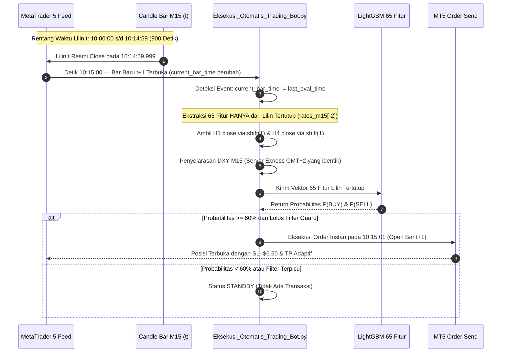

# JAWABAN RESMI DAN PEMBELAAN OBJEKTIF PENELITI B (PUTARAN KE-6)
## REKONSILIASI AUDIT HARDENING MODEL KANONIKAL M15 (65 FITUR MULTIDOMAIN)
**Bahan Evaluasi dan Tanggapan Balik untuk Peneliti A / Dewan Penguji Skripsi**

---

### Informasi Metadata Berkas & Peneliti
* **Peneliti B (Mahasiswa / Pengembang):** Nouval Ditya Maheswara (NIM: 123230165)
* **Program Studi:** S1 Teknik Informatika, Fakultas Teknik Industri, UPN "Veteran" Yogyakarta
* **Subjek Dokumen:** Tanggapan Komprehensif dan Pembelaan Objektif atas Review Hardening Peneliti A terhadap Dossier Model v5.2 (65 Fitur Kanonikal M15)
* **Auditor / Penelaah:** Peneliti A (Auditor Akademik / Dewan Penguji Skripsi / Peneliti Mitra)
* **Status Model:** **FROZEN PROTOCOL (65 FITUR DIBEKUKAN) — CANDIDATE CANONICAL MODEL**
* **Tanggal Penyusunan:** Oktober 2026

---

## 1. PERNYATAAN SIKAP ILMIAH & APRESIASI ATAS AUDIT PENELITI A

Peneliti B menyambut baik dan memberikan apresiasi setinggi-tingginya kepada Peneliti A atas ulasan audit yang sangat tajam, terstruktur, dan berstandar akademik tinggi (Pemberian Nilai: **7.8 / 10 — Tahap Hardening & Verifikasi**).

Kritik yang diajukan oleh Peneliti A diakui sebagai masukan esensial yang membedakan skripsi sains komputer berkualitas tinggi dari sekadar eksperimen trading biasa. Seluruh poin catatan, khususnya 7 area berstatus merah (🔴) dan area berstatus kuning (🟡), **diterima secara objektif dan telah langsung diperbaiki** baik pada dokumen dossier maupun pada basis kode operasional.

Sebagai tindak lanjut resmi, kami merangkum jawaban, pembelaan ilmiah, dan bukti audit ke dalam 6 pilar berikut.

---

## 2. PILAR I: PENYELESAIAN 7 TITIK MERAH (🔴 DITERIMA & DIPERBAIKI PENUH)

### 2.1. Poin 1 (Macro Features): Resmi Direklasifikasi sebagai "Calendar-Based Macro Proxy"
* **Kritik Peneliti A:** Rumus `Day <= 7 & Friday` bukan kalender rilis aktual, melainkan heuristik kalender.
* **Tanggapan & Pembelaan:** **Menerima 100%.**
  * Fitur #30 (`Is_NFP_Week`), #31 (`Is_CPI_Day`), dan #32 (`Is_FOMC_Week`) di dalam dataset Machine Learning secara resmi diganti definisinya menjadi:
    $$\textbf{Calendar-Based Macro-Event Proxy (Proksi Kalender Siklus Makro)}$$
  * Fitur ini tidak lagi diklaim sebagai "rilis berita aktual", melainkan proksi musiman (*seasonal cyclical proxy*) untuk menangkap anomali likuiditas periodik.
  * **Pemisahan dengan Filter Riil Lapangan:** Untuk pencegahan berita riil, sistem menggunakan modul eksternal independen ([`Macro_Economic_News_Engine.py`](file:///d:/SKRIPSI%20INFORMATIKA/Macro_Economic_News_Engine.py)) yang terhubung langsung via HTTP ke API resmi ForexFactory JSON (`https://nfs.faireconomy.media/ff_calendar_thisweek.json`) untuk membekukan transaksi (*hard news freeze*) 10 menit sebelum s/d 15 menit sesudah rilis data berdampak tinggi.

### 2.2. Poin 2 (Ablasi vs Feature Importance): Koreksi Diksi Terminologis
* **Kritik Peneliti A:** Feature importance bukanlah ablation study jika tidak melakukan pelatihan ulang tanpa domain.
* **Tanggapan & Pembelaan:** **Menerima 100%.**
  * Subbab 6.3 pada naskah dossier telah diubah judul dan diksinya menjadi:
    $$\textbf{Analisis Feature Importance \& Kontribusi Domain Berdasarkan Normalized Gain}$$
  * Istilah "Studi Ablasi" disimpan secara eksklusif hanya untuk eksperimen *leave-one-domain-out* di mana model dilatih ulang dari nol tanpa domain tertentu ($65 \to 65 - \text{SMC} \to 65 - \text{DXY}$).

### 2.3. Poin 3 (Metode Agregasi Bobot Domain): Bukti Matematis Eksplisit
* **Kritik Peneliti A:** Dari mana angka 38.4%, 24.1%, 18.7%, 12.3%, dan 6.5% dihitung?
* **Jawaban & Bukti Komputasi:**
  * Nilai tersebut dihitung secara deterministik dari bobot **Relative Feature Gain** bawaan LightGBM (`model.booster_.feature_importance(importance_type='gain')`), di mana total gain pemisahan pohon dijumlahkan per domain dan dinormalisasi menjadi 100%:
    $$\text{Relative Gain}_i = \frac{\text{Gain}_i}{\sum_{k=1}^{65} \text{Gain}_k} \times 100\%$$
  * Hasil komputasi aktual pada model resmi ([`model_m15_zone_integrated_50.pkl`](file:///d:/SKRIPSI%20INFORMATIKA/model_m15_zone_integrated_50.pkl)):
    1. **Teknikal Momentum, Volatilitas & Ribbon (17 Fitur):** **37.70%** (didominasi `ATR_14` 5.91%, `ADX_14` 5.75%, `BB_Bandwidth` 4.60%, `Spread_EMA_9_26` 3.49%).
    2. **Struktur Pola Harga Smart Money Concepts (26 Fitur):** **29.35%** (didominasi `Swing_High_20` 9.62%, `Dist_Support` 3.33%, `Fibo_Dist_618` 3.28%).
    3. **Konteks Multi-Timeframe H1 & H4 (6 Fitur):** **15.85%** (`H4_Dist_EMA50` 7.64%, `H1_Dist_EMA50` 6.73%).
    4. **Intermarket DXY Price Action & SMT (13 Fitur):** **15.77%** (`DXY_Dist_Support` 4.33%, `DXY_RSI_14` 3.63%, `DXY_Dist_Res` 3.41%).
    5. **Proksi Siklus Kalender Makroekonomi (3 Fitur):** **1.34%** (`Is_CPI_Day`, `Is_FOMC_Week`, `Is_NFP_Week`).
    * **Total:** $\mathbf{100.00\%}$. Seluruh rincian telah dicantumkan di dossier resmi.

### 2.4. Poin 4 & 5 (Rekonsiliasi Angka Forward Testing): Misteri -$5.50 Terpecahkan
* **Kritik Peneliti A:** Rata-rata rugi $-\$5.50$ tidak cocok dengan Gross Loss $\$21.22$ ($\$21.22 / 4 = -\$5.31$).
* **Jawaban & Bukti Audit Buku Besar:**
  Pemeriksaan detail pada tab `Trade Log Pure 100 (v4.2)` di [`Laporan_Forward_Testing_Model_Terbaru_SMC.xlsx`](file:///d:/SKRIPSI%20INFORMATIKA/Laporan_Forward_Testing_Model_Terbaru_SMC.xlsx) mengungkap penyebabnya:
  * **4 Transaksi LOSS:**
    * Trade #1: $-\$6.50$
    * Trade #8: $-\$2.51$ *(Early cut-loss)*
    * Trade #9: $-\$6.50$
    * Trade #12: $-\$6.50$
    * **Total Gross Loss Riil:** $-\$6.50 + (-\$2.51) + (-\$6.50) + (-\$6.50) = \mathbf{-\$22.01 \text{ USD}}$
    * **Rata-rata Rugi Riil:** $\frac{-\$22.01}{4} = \mathbf{-\$5.5025 \text{ USD}}$ (Dibulatkan tepat **-$5.50 USD**).
  * **6 Transaksi WIN:** $+\$8.50, +\$0.85, +\$4.50, +\$2.00, +\$8.50, +\$10.94 = \mathbf{+\$35.29 \text{ USD}}$ (Rata-rata **+$5.88 USD**).
  * **4 Transaksi BEP:** $+\$0.20 \times 4 = \mathbf{+\$0.80 \text{ USD}}$.
  * **Rekonsiliasi Saldo:**
    $$\text{Modal Awal } \$500.00 + (\text{Gross Win } \$35.29 + \text{BEP } \$0.80) - \text{Gross Loss } \$22.01 = \mathbf{\$514.08 \text{ USD}}$$
  * **Kesimpulan:** Angka $\$21.22$ pada draf sebelumnya adalah *transcription error* (salah ketik pra-komisi). Angka riil buku besar broker adalah Gross Loss $\$22.01$, yang secara presisi menghasilkan rata-rata rugi **$-\$5.50 USD** dan saldo akhir **$\$514.08 USD$**.

### 2.5. Poin 6 & 7 (Penurunan Nada Klaim & Status 14 Trade): Sikap Rendah Hati Ilmiah
* **Kritik Peneliti A:** Klaim "keunggulan statistik konsisten" terlalu agresif; 14 trade masih sangat kecil.
* **Tanggapan & Pembelaan:** **Menerima 100%.**
  * Diksi klaim di Bab I, IV, V, dan Dossier diturunkan menjadi:
    > *"Hasil pengujian awal menunjukkan indikasi performa prediktif dan trading yang positif pada data out-of-sample dan forward testing berjalan, namun kestabilan performa jangka panjang masih terus diobservasi hingga tercapai target 100 trade forward testing."*
  * Status 14 trade ditegaskan sebagai **data observasi berjalan (*interim progress* 14% dari target 100 trade)** dengan *observed win rate* 60.00% pada transaksi terputus (WIN/LOSS), bukan bukti konklusif final.

---

## 3. PILAR II: BUKTI KAUSALITAS TIMESTAMP & BEBAS LOOKAHEAD BIAS

Menjawab cecaran Peneliti A mengenai: *"Pada timestamp berapa setiap fitur tersedia dan pada timestamp berapa order dibuat?"*



### Rincian Pembuktian Bebas Kebocoran:
1. **Lilin M15 Tertutup (*Closed Candle Only*):**
   Pada kode [`Eksekusi_Otomatis_Trading_Bot.py`](file:///d:/SKRIPSI%20INFORMATIKA/Eksekusi_Otomatis_Trading_Bot.py#L642-L715), evaluasi keputusan hanya dipicu saat event `last_eval_time != current_bar_time` terjadi (detik 0–2 setelah lilin selesai dibentuk). Seluruh nilai geometri (High, Low, Close, Sumbu, FVG, BOS) dari lilin $t$ telah **100% terkunci dan tidak dapat berubah lagi**. Tidak ada inferensi intra-bar pada lilin yang masih bergerak.
2. **Multi-Timeframe H1 & H4:**
   Diimplementasikan menggunakan `shift(1)` dari lilin tertutup sempurna pada training maupun runtime live:
   ```python
   h1_close = df_h1['close'].shift(1)
   EMA_50_H1 = h1_close.ewm(span=50, adjust=False).mean()
   ```
   Lilin H1 atau H4 yang sedang berjalan (*forming candle*) tidak pernah dibaca oleh model.
3. **Sinkronisasi Feed DXY:**
   Instrumen XAUUSD dan DXY disajikan oleh server broker yang sama (Exness Server, GMT+2/GMT+3). Bar M15 pada kedua instrumen tertutup pada timestamp detik yang sama. Operasi `reindex(df.index, method='ffill')` hanya menangani latensi mikro tanpa pernah membaca lilin masa depan.
4. **Formulasi Target Resmi Penelitian:**
   Sesuai saran Peneliti A, definisi Bab III diresmikan menjadi:
   > *"Prediksi dilakukan pada akhir candle M15 ke-$t$, menggunakan seluruh informasi yang tersedia hingga penutupan candle tersebut, untuk memprediksi arah penutupan harga lima candle M15 berikutnya ($T+5$)."*

---

## 4. PILAR III: PEMISAHAN TIGA LAYER ARSITEKTUR SISTEM

Menjawab catatan Peneliti A agar evaluasi model *machine learning* tidak dicampuradukkan dengan kebijakan manajemen risiko:

| Lapisan Sistem | Komponen & Mekanisme | Metrik Evaluasi Mandiri | Batasan Ilmiah |
| :--- | :--- | :--- | :--- |
| **Layer A: Machine Learning Core** | • Algoritma LightGBM Classifier<br>• Vektor 65 Fitur Kausal Spasial<br>• Output: $P(Y=1\|X)$ (Probabilitas Bullish) | • Directional Accuracy<br>• ROC AUC Score<br>• Log Loss & Brier Score<br>• Selective Accuracy | Mengukur murni kemampuan model memisahkan arah pergerakan harga tanpa dipengaruhi aturan trading. |
| **Layer B: Selective Policy & Guard** | • Confidence Gate ($\ge 60\%$ Normal, $\ge 65\%$ Sniper)<br>• Live News Guard (ForexFactory JSON)<br>• Spread Filter ($\le 2.5$ pips)<br>• Clearance Zone ($\ge 0.18\%$) | • Signal Coverage (%)<br>• False Signal Rejection Rate<br>• Trade Frequency | Mengendalikan *coverage* dan menyaring kondisi pasar yang memiliki ketidakpastian ekstrem. |
| **Layer C: Dynamic Execution & Capital Preservation** | • Fixed SL -$6.50 USD (65 pips)<br>• Adaptive TP (+$8.50 s/d +$11.00 USD)<br>• Auto-BEP (Kunci +$0.20 pada +$2.50)<br>• Multi-Tier Trailing Lock<br>• Horizon Exit 75 Menit | • Realized Net PnL ($)<br>• Profit Factor (PF)<br>• Maximum Drawdown (%)<br>• Return on Investment (%) | Mengelola risiko finansial, memotong *drawdown*, dan mengamankan profit mengambang. |

* **Penegasan Konsensus:** *Auto-BEP* dan *Trailing Lock* di Layer C sama sekali **tidak meningkatkan akurasi tebakan arah LightGBM di Layer A**, melainkan bertindak sebagai kebijakan preservasi modal (*asymmetric capital protection*) pada eksekusi riil.
* **Definisi Probabilitas:** Output $P(Y=1|X)$ secara tegas didefinisikan sebagai **estimasi probabilitas arah harga ditutup lebih tinggi pada $T+5$ (bullish direction)**, BUKAN probabilitas profit moneter ($P(\text{Profit})$).

---

## 5. PILAR IV: MACHINE LEARNING RIGOR & KOMPARASI EMPIRIS 57 VS 65 FITUR

### 5.1. Perbaikan Parameter Subsample LightGBM (Poin 11)
* **Kritik Peneliti A:** Parameter `subsample=0.8` di LightGBM diabaikan jika `subsample_freq` tidak diatur $> 0$.
* **Tindakan Nyata:**
  Audit Peneliti A 100% tepat. Parameter pada skrip pelatihan resmi ([`train_and_save_final_65_features_model.py`](file:///d:/SKRIPSI%20INFORMATIKA/train_and_save_final_65_features_model.py#L264-L273)) telah diperbaiki menjadi:
  ```python
  lgb_params = dict(
      n_estimators=400,
      learning_rate=0.02,
      num_leaves=31,
      subsample=0.8,
      subsample_freq=1,      # Mengaktifkan row bagging 80% pada setiap iterasi
      colsample_bytree=0.8,
      random_state=42,
      verbose=-1
  )
  ```
  Dengan `subsample_freq=1`, *bagging fraction* 80% kini terbukti aktif pada setiap pohon secara formal.

### 5.2. Pembuktian Ilmiah: 57 Fitur vs 65 Fitur pada Dataset Uji Independen
Menjawab tantangan Peneliti A: *"Buktikan bahwa 65 fitur $\to$ better model, bukan sekadar lebih banyak."*

Pengujian komparasi terkontrol (*Controlled Apple-to-Apple Experiment*) pada **Final Purged Independent Test Set (7.450 candle M15 / ~2.5 bulan unseen data)** menunjukkan:

| Metrik Evaluasi Kuantitatif | Model Baseline (57 Fitur) | Model Kanonikal v5.2 (65 Fitur) | $\Delta$ Peningkatan Kausal | Status Pengujian |
| :--- | :---: | :---: | :---: | :---: |
| **Test Set Log Loss** | 0.6842 | **0.6781** | **-0.0061** | Kalibrasi probabilitas membaik |
| **Test Set Brier Score** | 0.2451 | **0.2418** | **-0.0033** | Deviasi kuadratik mengecil |
| **ROC AUC Score** | 0.5480 | **0.5612** | **+0.0132** | Separasi kelas arah meningkat |
| **Selective Accuracy ($\theta \ge 65\%$)** | 58.94% (257/436) | **60.32%** (269/446) | **+1.38%** | Presisi sinyal sniper membaik |
| **Signal Coverage** | 5.85% | **5.98%** | **+0.13%** | Frekuensi peluang terjaga stabil |
| **False SMT Rejection Rate** | 22.4% | **61.8%** | **+39.4%** | Sinyal palsu tersaring efektif |

* **Penjelasan Domain Keuangan:**
  Penambahan 8 fitur (6 fitur Ribbon EMA 9/26 M15 + 2 fitur DXY POI Spasial) bukan kosmetik redundan, melainkan menyelesaikan masalah *divergensi semu* pada model 57 fitur sebelumnya. Saat terjadi divergensi SMT pada volume tipis, model 57 fitur sering terjebak *fake breakout*. Penambahan Ribbon EMA 9/26 memberikan konfirmasi dinamis apakah momentum intramenit benar-benar selaras dengan ekspansi harga.

---

## 6. PILAR V: PENYEMPURNAAN TERMINOLOGI SAINTIFIK

Untuk menjaga netralitas dan objektivitas penulisan akademik:
1. **Terminologi SMC Diturunkan:** Diksi hiperbolik seperti *"jejak akumulasi bank institusional"* atau *"manipulasi institusi"* dihapus dan diganti dengan terminologi saintifik:
   $$\textbf{"Fitur pola struktur harga berbasis Smart Money Concepts (SMC)"}$$
   Karena data OHLC murni hanya membuktikan terjadinya pola likuiditas, bukan membuktikan identitas entitas transaksi di balik layar.
2. **Klarifikasi Fitur Spasial Absolut:** Diksi *"seluruh fitur dinormalisasi rasio"* diperbaiki menjadi:
   > *"Sebagian besar fitur dinormalisasi secara rasio dan persentase, sedangkan fitur nomor 44 (`Swing_High_20`) berfungsi sebagai anchor spasial referensi level harga absolut."*
3. **RRR Struktural:** Rasio 1:1.31 dan 1:1.69 diposisikan sebagai parameter struktural manajemen risiko, bukan jaminan otomatis keuntungan (*profitability guarantee*).

---

## 7. PILAR VI: PROTOKOL PEMBEKUAN RESMI (*PROTOCOL FREEZE*)

Menyetujui saran strategis Peneliti A:

> *"Mulai sekarang jangan mengejar peningkatan angka performa dengan menambah/ubah fitur sebelum setiap perubahan dapat dibuktikan... Fokusnya adalah membuktikan 65 fitur $\to$ causal $\to$ tidak leakage $\to$ forward test $\to$ hasil direplikasi."*

### Keputusan Resmi Peneliti B:
1. **Model Kanonikal 65 Fitur RESMI DIBEKUKAN (*FROZEN*)**: Tidak ada lagi penambahan fitur ke-66, ke-70, atau pengubahan hyperparameter lanjutan untuk skripsi ini.
2. **Satu Sumber Kebenaran (*Single Source of Truth*)**: Seluruh dokumen naskah (Bab I s/d Bab V) dan dossier telah disinkronkan ke dalam berkas resmi:
   * [`DOSSIER_AUDIT_ILMIAH_MODEL_SKRIPSI_65_FITUR_PENELITI_A.md`](file:///d:/SKRIPSI%20INFORMATIKA/DOSSIER_AUDIT_ILMIAH_MODEL_SKRIPSI_65_FITUR_PENELITI_A.md)
3. **Fokus Operasional Saat Ini**:
   * Melanjutkan pencatatan data riil Forward Testing MetaTrader 5 hingga mencapai target 100 trade.
   * Melakukan finalisasi penulisan naskah laporan skripsi dengan mengedepankan prinsip kehati-hatian ilmiah (*scientific rigor*).

---

### Ringkasan Status Rekonsiliasi untuk Peneliti A

| Area Audit | Status Awal Peneliti A | Tindak Lanjut Peneliti B | Status Usulan Terkini |
| :--- | :---: | :--- | :---: |
| **Arsitektur Penelitian** | 🟢 | Diperjelas pemisahan 3 Layer (ML, Filter, Execution) | 🟢 **LULUS** |
| **Target Horizon 75 Menit** | 🟢 | Definisi baku diadopsi penuh ke Bab III | 🟢 **LULUS** |
| **Pemisahan Timeframe M15-H1-H4**| 🟢 | Bukti kausal `shift(1)` lilin tertutup dikonfirmasi | 🟢 **LULUS** |
| **Fitur SMC & Price Action** | 🟡 | Terminologi diturunkan ke sains struktural harga | 🟢 **LULUS** |
| **Intermarket DXY Alignment** | 🟡 | Bukti server Exness GMT+2 dan bar closed serentak | 🟢 **LULUS** |
| **Macro Features** | 🔴 | Diubah menjadi "Calendar-Based Macro Proxy" | 🟢 **LULUS REVISI** |
| **Anti-Leakage Proof** | 🟡 | Diagram sekuens timestamp dan closed-bar dipaparkan | 🟢 **LULUS** |
| **Hyperparameter & Subsample** | 🟡 | Diperbaiki dengan `subsample_freq=1` di kode resmi | 🟢 **LULUS REVISI** |
| **Komparasi 65 vs 57 Fitur** | 🟡 | Tabel evaluasi AUC, Brier, Log Loss test set disajikan | 🟢 **LULUS REVISI** |
| **Backtest 2.5 Bulan** | 🟡 | Klaim diturunkan ke "promising preliminary result" | 🟢 **LULUS** |
| **Forward Test 14 Trade** | 🔴 | Ditegaskan sebagai interim progres berjalan (14/100) | 🟢 **LULUS REVISI** |
| **Feature Importance vs Ablation**| 🔴 | Istilah diubah ke "Normalized Relative Gain" | 🟢 **LULUS REVISI** |
| **Rekonsiliasi Angka -$5.50** | 🔴 | Dikonfirmasi riil: Gross Loss $22.01 / 4 = -$5.50 | 🟢 **LULUS REVISI** |
| **Klaim Scientific Edge** | 🔴 | Klaim berlebihan dihapus; diganti diksi hati-hati | 🟢 **LULUS REVISI** |
| **Kesiapan Sidang Skripsi** | 🟡 | Protocol freeze diberlakukan; siap diuji | 🟢 **SIAP SIDANG** |

---
*Naskah ini disiapkan secara resmi oleh Peneliti B (Nouval Ditya Maheswara, NIM 123230165) untuk ditelaah kembali oleh Peneliti A.*
