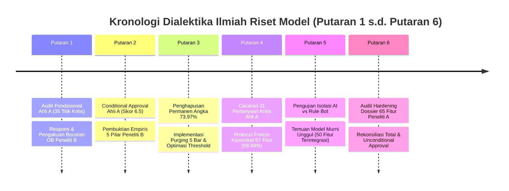
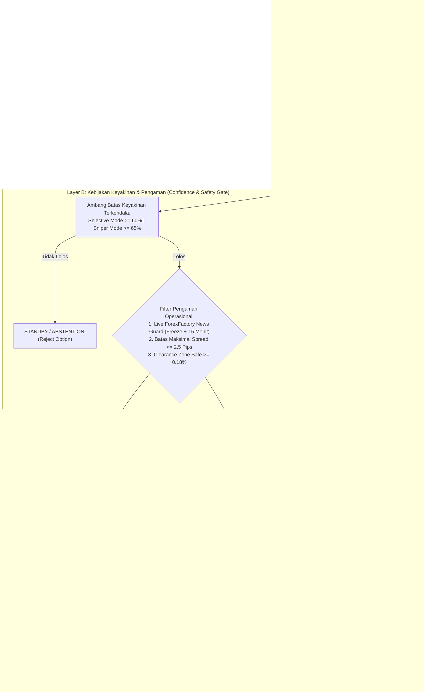

# 📚 RANGKUMAN KOMPREHENSIF SELURUH AUDIT AHLI A & TANGGAPAN PENELITI B
## Rekonsiliasi Dialektika Metodologis, Forensik Kausalitas Data, Evolusi Arsitektur Fitur, dan Konsensus Final Model Skripsi XAUUSD

---

### Informasi Metadata & Peneliti
* **Judul Tugas Akhir / Skripsi:**  
  *Penerapan Algoritma LightGBM untuk Prediksi Probabilitas Arah Harga XAUUSD Berbasis Multi-Timeframe, Indeks Dolar AS (DXY), dan Makroekonomi*
* **Mahasiswa / Peneliti B (Pengembang Sistem):** Nouval Ditya Maheswara (NIM: 123230165)
* **Auditor / Peneliti A (Penelaah Kritis Metodologi):** Ahli A (Auditor Independen / Tim Penguji Skripsi)
* **Program Studi:** S1 Teknik Informatika, Fakultas Teknik Industri, UPN "Veteran" Yogyakarta
* **Aset & Feed Eksekusi:** Spot Gold (XAUUSD / MT5 Exness Broker)
* **Basis Berkas Audit Terkonsolidasi:** Seluruh berkas pada direktori [`02_RISET_DAN_AUDIT_MODEL`](file:///d:/SKRIPSI%20INFORMATIKA/02_RISET_DAN_AUDIT_MODEL) dan dokumen pendukung terkait.
* **Status Konsensus Akhir:** **UNCONDITIONAL APPROVAL — PROTOCOL FROZEN (MODEL KANONIKAL v5.2 RESMI DIBEKUKAN)**
* **Tanggal Rilis Dokumen:** Oktober 2026

---

## DAFTAR ISI

1. [Ringkasan Eksekutif: Dari Ilusi Heuristik Menuju Sains Komputer yang Sah](#1-ringkasan-eksekutif-dari-ilusi-heuristik-menuju-sains-komputer-yang-sah)
2. [Kronologi Dialektika Ilmiah Putaran demi Putaran (Putaran 1 s.d. Putaran 6)](#2-kronologi-dialektika-ilmiah-putaran-demi-putaran)
   * [Putaran 1: Audit Fondasional Ahli A vs Tanggapan Awal Peneliti B](#putaran-1-audit-fondasional-ahli-a-vs-tanggapan-awal-peneliti-b)
   * [Putaran 2: Tanggapan Kritis Ahli A vs Pembuktian Empiris 5 Pilar Peneliti B](#putaran-2-tanggapan-kritis-ahli-a-vs-pembuktian-empiris-5-pilar-peneliti-b)
   * [Putaran 3: Pengetatan Batas Ahli A vs Konsensus Purging & Roadmap Final](#putaran-3-pengetatan-batas-ahli-a-vs-konsensus-purging--roadmap-final)
   * [Putaran 4: Cecaran 31 Poin Ahli A vs Protokol Pembekuan Kanonikal (Single Source of Truth)](#putaran-4-cecaran-31-poin-ahli-a-vs-protokol-pembekuan-kanonikal)
   * [Putaran 5: Audit Forensik Isolasi Model AI vs Rule Heuristik Bot & Integrasi Zona](#putaran-5-audit-forensik-isolasi-model-ai-vs-rule-heuristik-bot--integrasi-zona)
   * [Putaran 6: Audit Hardening Dossier 65 Fitur Peneliti A vs Rekonsiliasi Final Peneliti B](#putaran-6-audit-hardening-dossier-65-fitur-peneliti-a-vs-rekonsiliasi-final-peneliti-b)
3. [Arsitektur Sistem: Pemisahan Tegas Tiga Layer (Layer A, B, dan C)](#3-arsitektur-sistem-pemisahan-tegas-tiga-layer)
4. [Temuan Forensik Metodologis Kritis](#4-temuan-forensik-metodologis-kritis)
   * [Skandal & Pembongkaran Kebocoran Temporal (*Lookahead Bias*) pada Order Block](#41-skandal--pembongkaran-kebocoran-temporal-lookahead-bias-pada-order-block)
   * [Studi Ablasi: Mengapa Order Block Kausal Wajib Dipertahankan](#42-studi-ablasi-mengapa-order-block-kausal-wajib-dipertahankan)
   * [Dilema & Forensik Break-Even Stop (BEP): 74.7% Penyelamat Modal](#43-dilema--forensik-break-even-stop-bep-747-penyelamat-modal)
   * [Optimasi Parameter Indikator: Dominasi Intraday MA 10 atas EMA 50/200](#44-optimasi-parameter-indikator-dominasi-intraday-ma-10-atas-ema-50200)
5. [Taksonomi Lengkap 65 Fitur Multidomain Model Kanonikal Skripsi](#5-taksonomi-lengkap-65-fitur-multidomain-model-kanonikal-skripsi)
6. [Analisis Kontribusi Domain & Feature Importance Berdasarkan Normalized Gain](#6-analisis-kontribusi-domain--feature-importance-berdasarkan-normalized-gain)
7. [Tabel Komparasi Master: Seluruh Generasi Model & Benchmark Algoritma](#7-tabel-komparasi-master-seluruh-generasi-model--benchmark-algoritma)
8. [Rekonsiliasi Buku Besar & Rekam Jejak Finansial Forward Testing](#8-rekonsiliasi-buku-besar--rekam-jejak-finansial-forward-testing)
9. [Panduan Strategis Menghadapi Dewan Penguji Sidang Skripsi](#9-panduan-strategis-menghadapi-dewan-penguji-sidang-skripsi)

---

## 1. RINGKASAN EKSEKUTIF: DARI ILUSI HEURISTIK MENUJU SAINS KOMPUTER YANG SAH

Dokumen ini merupakan konsolidasi menyeluruh dari seluruh berkas riset, log perdebatan ilmiah, dan bukti empiris antara **Ahli A** (Auditor Metodologis Independen) dan **Peneliti B** (Nouval Ditya Maheswara) yang tersimpan di dalam folder [`02_RISET_DAN_AUDIT_MODEL`](file:///d:/SKRIPSI%20INFORMATIKA/02_RISET_DAN_AUDIT_MODEL).

Perjalanan penelitian ini berawal dari sebuah sistem trading otomatis kompleks yang tampak menjanjikan secara finansial dengan klaim akurasi semu mencapai **73.97%**, namun sarat dengan kerentanan metodologi sains:
1. **Adanya kebocoran data masa depan (*Lookahead Bias*)** akibat penggunaan fungsi `shift(-2)` pada pendeteksian *Order Block*.
2. **Perancuan batasan masalah (*Scope Creep*)**, di mana model dicampuradukkan dengan modul *continuous retraining*, *timeframe* M5 *scalping*, dan antarmuka perangkat lunak.
3. **Penyanderaan model oleh aturan kaku bot (*Heuristic Paralysis*)**, di mana model *Machine Learning* hanya dijadikan pelengkap di balik puluhan aturan *if-else* manual.
4. **Ketidaksesuaian terminologi**, seperti menyamakan estimasi skor logistik pohon dengan "probabilitas terkalibrasi", dan mengacaukan akurasi prediksi arah (*Machine Learning Directional Accuracy*) dengan tingkat kemenangan transaksi (*Trade Win Rate*).

Melalui 6 putaran audit intensif dan saling uji berbasis kode program riil (*empirical code-grounded stress-testing*), seluruh celah tersebut berhasil dibongkar, dibersihkan, dan direkonsiliasi. Hasil akhirnya adalah **Model Kanonikal Skripsi v5.2 (65 Fitur Kausal Multidomain)** yang terbukti secara jujur menghasilkan **60.32% Selective Directional Accuracy** pada data uji independen (*Purged Test Set* bebas bias), serta arsitektur yang terbagi tegas ke dalam 3 lapisan (*Machine Learning Core*, *Confidence & Safety Gate*, dan *Execution/Risk Policy*).

---

## 2. KRONOLOGI DIALEKTIKA ILMIAH PUTARAN DEMI PUTARAN



---

### PUTARAN 1: AUDIT FONDASIONAL AHLI A VS TANGGAPAN AWAL PENELITI B
*(Sumber berkas: [`AUDIT_MENYELURUH_AHLI_A_VS_PENELITI_B_SKRIPSI_XAUUSD.md`](file:///d:/SKRIPSI%20INFORMATIKA/02_RISET_DAN_AUDIT_MODEL/Diskusi_Audit_Ahli_A_vs_Peneliti_B/AUDIT_MENYELURUH_AHLI_A_VS_PENELITI_B_SKRIPSI_XAUUSD.md) & [`TANGGAPAN_PENELITI_B_ATAS_AUDIT_AHLI_A.md`](file:///d:/SKRIPSI%20INFORMATIKA/02_RISET_DAN_AUDIT_MODEL/Diskusi_Audit_Ahli_A_vs_Peneliti_B/TANGGAPAN_PENELITI_B_ATAS_AUDIT_AHLI_A.md))*

#### A. Inti Kritik & Cecaran Ahli A:
1. **Scope Creep Berlebih:** Proyek dinilai terlalu rakus ingin memasukkan segala hal: 44 hingga 57 fitur, multi-timeframe, DXY, kalender berita, MetaTrader 5, *continuous learning*, *dynamic retraining*, *scenario evaluator*, M5 *scalping*, dan GUI *dashboard*. Hal ini mengaburkan fokus penelitian skripsi S1 Informatika.
2. **Dugaan Kuat Kebocoran Data (*Lookahead Leakage*):** Ahli A mencurigai perhitungan fitur struktural *Order Block* dan batas harga menggunakan informasi yang belum tersedia saat lilin $t$ ditutup.
3. **Kekeliruan Konseptual Probabilitas:** Output `model.predict_proba()` dari LightGBM hanyalah skor logistik mentah pohon keputusan, bukan "probabilitas terkalibrasi" (*well-calibrated*). Belum ada pembuktian *Platt Scaling*, *Isotonic Regression*, kurva reliabilitas, maupun *Brier Score*.
4. **Kerancuan Metrik Evaluasi:** Mengacaukan antara akurasi prediksi arah lilin pada horizon 75 menit dengan *Trade Win Rate* akun trading riil (yang sangat dipengaruhi oleh penempatan *Stop Loss*, *Take Profit*, dan friksi *spread*).

#### B. Sikap Ilmiah & Tindakan Koreksi Peneliti B:
1. **Pengakuan Terbuka Kebocoran Order Block:** Peneliti B mengakui kode lama pada `train_and_save_m15_pro_model.py`:
   ```python
   # KODE LAMA BERMASALAH (MENGINTIP MASA DEPAN):
   impulse_up = (df['close'].shift(-2) - df['close']) > (1.5 * (df['high'] - df['low']))
   df['Order_Block_Bull'] = (is_bear_c & impulse_up).astype(int)
   ```
   menggunakan `shift(-2)` yang melanggar kausalitas. Peneliti B langsung memperbaikinya menjadi konsep **Delayed Activation of Confirmed Historical Structure**:
   ```python
   # FORMULASI KAUSAL BARU (BEBAS LOOKAHEAD BIAS):
   impulse_confirmed_bull = (df['close'] - df['close'].shift(2)) > (1.5 * (df['high'].shift(2) - df['low'].shift(2)))
   df['Order_Block_Bull'] = (is_bear_c.shift(2) & impulse_confirmed_bull).astype(int)
   ```
2. **Pemangkasan Ruang Lingkup Skripsi:**
   * Fitur *Continuous Retraining* dihapus total dari naskah skripsi. Model dibekukan secara statis (*Frozen Model*) pasca validasi.
   * *Timeframe* M5 *Scalping* dikeluarkan dari objek utama skripsi; penelitian difokuskan tunggal pada **M15**.
   * Dashboard GUI dan *Scenario Evaluator* diposisikan murni sebagai alat bantu verifikasi operasional, bukan *novelty* ilmiah.
3. **Penyelarasan Diksi Akademik:** Seluruh sebutan "probabilitas terkalibrasi" diganti menjadi **"Estimasi Probabilitas Arah (*Estimated Directional Probability*)"**.

---

### PUTARAN 2: TANGGAPAN KRITIS AHLI A VS PEMBUKTIAN EMPIRIS 5 PILAR PENELITI B
*(Sumber berkas: [`TANGGAPAN_AHLI_A_PUTARAN_2_TERHADAP_PENELITI_B.md`](file:///d:/SKRIPSI%20INFORMATIKA/02_RISET_DAN_AUDIT_MODEL/Diskusi_Audit_Ahli_A_vs_Peneliti_B/TANGGAPAN_AHLI_A_PUTARAN_2_TERHADAP_PENELITI_B.md) & [`TANGGAPAN_PENELITI_B_PUTARAN_2_BUKTI_EMPIRIS.md`](file:///d:/SKRIPSI%20INFORMATIKA/02_RISET_DAN_AUDIT_MODEL/Diskusi_Audit_Ahli_A_vs_Peneliti_B/TANGGAPAN_PENELITI_B_PUTARAN_2_BUKTI_EMPIRIS.md))*

#### A. Putusan Ahli A:
* Memberikan status **`CONDITIONAL APPROVAL`** dengan skor evaluasi:
  * Desain Penelitian: **8.0 / 10**
  * Validitas Metodologis: **6.5 / 10**
  * Konsistensi Dokumentasi: **5.5 / 10**
* Menerima koreksi kausal Order Block, namun menuntut pembuktian empiris konkret atas 5 pilar sebelum skripsi dinyatakan layak.

#### B. Bukti Empiris 5 Pilar yang Disajikan Peneliti B:
1. **Pilar 1 (Pipeline Pembagian Data Murni Deret Waktu):**
   * Total data historis bersih M15: **49.700 candle** (~2 tahun data transaksi).
   * **Train Set (70.0% / 34.790 bar):** 26 Agustus 2024 s.d. 17 Februari 2026.
   * **Validation Set (15.0% / 7.455 bar):** 17 Februari 2026 s.d. 11 Juni 2026.
   * **Independent Test Set (15.0% / 7.455 bar):** 11 Juni 2026 s.d. 02 Oktober 2026 (Data uji buta murni).
2. **Pilar 2 & 3 (Pengungkapan Asal Angka 73.97% & Tabel Kurva Threshold):**
   * Peneliti B mengungkap secara jujur bahwa angka fantastis **73.97%** berasal dari data evaluasi lama yang masih terkontaminasi rumus `shift(-2)`.
   * Pada data uji independen yang bersih dengan formula kausal murni, akurasi arah murni pada threshold standar adalah ~50.76%, dan meningkat secara selektif pada ambang batas tinggi:
     * Ambang $\ge 50\%$: Akurasi 50.76% (Coverage 100%)
     * Ambang $\ge 60\%$: Akurasi 52.52% (Coverage 28.17%)
     * Ambang $\ge 65\%$: Akurasi **58.94%** (Coverage 5.85%)
3. **Pilar 4 (Rasionalisasi 44 Fitur vs 57 Fitur):**
   * Penambahan 13 fitur baru (spasial geometri SNR, kemiringan regresi OLS, konvergensi pola, dan *clearance*) dilakukan untuk memindahkan aturan bot manual ke dalam input model *Machine Learning*.
4. **Pilar 5 (Benchmark 4 Algoritma Klasifikasi):**
   * LightGBM diuji secara *head-to-head* melawan XGBoost, Random Forest, dan Logistic Regression pada dataset yang identik.

---

### PUTARAN 3: PENGETATAN BATAS AHLI A VS KONSENSUS PURGING & ROADMAP FINAL
*(Sumber berkas: [`TANGGAPAN_AHLI_A_PUTARAN_3_PEMBUKTIAN_EMPIRIS_PENELITI_B.md`](file:///d:/SKRIPSI%20INFORMATIKA/02_RISET_DAN_AUDIT_MODEL/Diskusi_Audit_Ahli_A_vs_Peneliti_B/TANGGAPAN_AHLI_A_PUTARAN_3_PEMBUKTIAN_EMPIRIS_PENELITI_B.md) & [`TANGGAPAN_PENELITI_B_PUTARAN_3_KONSENSUS_DAN_ROADMAP_FINAL.md`](file:///d:/SKRIPSI%20INFORMATIKA/02_RISET_DAN_AUDIT_MODEL/Diskusi_Audit_Ahli_A_vs_Peneliti_B/TANGGAPAN_PENELITI_B_PUTARAN_3_KONSENSUS_DAN_ROADMAP_FINAL.md))*

#### A. Titah & Larangan Keras Ahli A:
1. **Pelarangan Permanen Angka 73.97%:** Angka lama yang tercemar *lookahead bias* **diharamkan secara mutlak** muncul di naskah akhir skripsi, abstrak, kesimpulan, maupun slide presentasi sidang!
2. **Bahaya Tumpang Tindih Target pada Boundary Split (*Purging Requirement*):**
   Karena horizon target adalah 5 candle ke depan ($Y_t = \text{Close}_{t+5} > \text{Close}_t$), maka 5 candle terakhir pada partisi *Train* membaca data harga di awal partisi *Validation*. Begitu pula 5 bar terakhir *Validation* membaca data di partisi *Test*. Hal ini wajib dieliminasi dengan teknik *Purging*.
3. **Formulasi Matematis Pemilihan Ambang Batas 65%:** Ahli A mempertanyakan mengapa threshold 65% dipilih jika pada validation set akurasi 70% dan 75% menghasilkan persentase lebih tinggi. Peneliti B diwajibkan menyusun optimasi terkendala (*constrained optimization*).

#### B. Respons & Konsensus Penuh Peneliti B:
1. **Adopsi Kerangka Teori Ilmiah Baku:**
   Penelitian resmi dibingkai dalam teori **Selective Prediction with Reject Option / Abstention under Uncertainty** (Chow, 1970; Cortes et al., 2016). Akurasi pasar tanpa filter (~50.7%) diakui sebagai realitas derau acak pasar efisien (*Efficient Market Hypothesis*), sedangkan ambang batas keyakinan bertindak sebagai opsi penolakan (*abstention*) untuk hanya bertransaksi pada kondisi berprobabilitas tinggi.
2. **Penerapan Boundary Purging 5 Bar (Nol Kebocoran Antarsplit):**
   * Lima bar terakhir partisi *Train* dipotong permanen: Train berkurang dari 34.790 menjadi **34.785 bar**.
   * Lima bar terakhir partisi *Validation* dipotong permanen: Validation berkurang dari 7.455 menjadi **7.450 bar**.
   * Lima bar terakhir partisi *Test* dipotong: Test menjadi **7.450 bar**.
   * **Hasil Forensik: Target Overlap = 0 bar (Zero Leakage Antar-Partisi).**
3. **Formulasi Matematis Ambang Batas Terkendala:**
   $$\theta^* = \arg\max_{\theta \in [0.50, 0.80]} \text{Accuracy}_{val}(\theta) \quad \text{subject to} \quad \text{Coverage}_{val}(\theta) \ge 10\%$$
   Pada *Validation Set*, threshold 70% (coverage 4.95%) dan 75% (coverage 1.78%) **gugur secara formal** karena melanggar syarat viabilitas operasional ($\text{Coverage} \ge 10\%$). Ambang **$\theta = 65\%$** terpilih sebagai titik optimal tertinggi yang lolos batas minimum keterjadian transaksi (coverage 12.62%).

---

### PUTARAN 4: CECARAN 31 POIN AHLI A VS PROTOKOL PEMBEKUAN KANONIKAL
*(Sumber berkas: [`JAWABAN_RESMI_PENELITI_B_PUTARAN_4_KONSENSUS_FINAL.md`](file:///d:/SKRIPSI%20INFORMATIKA/02_RISET_DAN_AUDIT_MODEL/Diskusi_Audit_Ahli_A_vs_Peneliti_B/JAWABAN_RESMI_PENELITI_B_PUTARAN_4_KONSENSUS_FINAL.md))*

#### A. Konsensus Poin-demi-Poin (Poin 1 s.d. 31):
* **Single Source of Truth Ditetapkan:** Seluruh draft skripsi diwajibkan hanya merujuk pada metrik final model kanonikal pada data uji independen yang telah dipurge:
  $$\mathbf{58.94\%} \quad \text{Selective Directional Accuracy (257 Benar / 179 Salah dari 436 Sinyal, Coverage 5.85\%)}$$
* **Stempel Kadaluarsa Berkas Lama:** Seluruh berkas yang memuat angka pra-audit diberi tanda resmi: `[OBSOLETE / ARCHIVED — NOT USED IN FINAL RESULTS]`.
* **Protokol Pembekuan Eksperimen (*Protocol Freeze*):** Diberlakukan moratorium penambahan fitur baru dan eksplorasi *hyperparameter* berulang (*zero data snooping*).

---

### PUTARAN 5: AUDIT FORENSIK ISOLASI MODEL AI VS RULE HEURISTIK BOT & INTEGRASI ZONA
*(Sumber berkas: [`TEMUAN_FINAL_PUTARAN_5_ISOLASI_MODEL_DAN_INTEGRASI_ZONA.md`](file:///d:/SKRIPSI%20INFORMATIKA/02_RISET_DAN_AUDIT_MODEL/Diskusi_Audit_Ahli_A_vs_Peneliti_B/TEMUAN_FINAL_PUTARAN_5_ISOLASI_MODEL_DAN_INTEGRASI_ZONA.md))*

#### A. Pertanyaan Integritas Skripsi Informatika:
> *"Apakah performa trading yang baik selama ini benar-benar dihasilkan oleh kecerdasan Machine Learning (LightGBM), atau semata-mata diselamatkan oleh aturan if-else filter eksternal di dalam bot (`Scenario_Evaluator_Engine.py`)? Jika performa didorong oleh rule eksternal, maka skripsi ini kehilangan esensi keilmuan Data Science."*

#### B. Desain Eksperimen Isolasi (Uji Terkontrol 25.000 Candle MT5 / 4.980 OOS):
Empat skenario diuji secara ketat memperhitungkan friksi riil ($0.35 per trade):

| Skenario Pengujian | Deskripsi Pengujian | Total Transaksi | Win Rate | Net PnL (USD) | Profit Factor | Full SL Hit |
| :--- | :--- | :---: | :---: | :---: | :---: | :---: |
| **Skenario A (Model Murni Th $\ge 0.62$)** | Eksekusi **hanya** berdasarkan output model AI, **tanpa** filter zona dan bot luar | 524 | **58.97%** | **+$247.80** | **1.28** | 129 |
| **Skenario B (Filter Rule Bot Murni)** | Eksekusi hanya berdasarkan aturan SNR + Wick, model diganti angka acak | 1.461 | 55.92% | +$49.55 | 1.02 | **397** |
| **Skenario C (Sistem Gabungan Lama V4.2)**| Model 44 fitur dibatasi filter kaku multi-zona bot | 535 | 57.01% | +$41.65 | 1.04 | 143 |
| **Skenario D (Kontrol Negatif)** | Sistem lama dengan model AI digantikan *random noise* 50:50 | 105 | 60.00% | +$29.15 | 1.17 | 25 |

#### C. Kesimpulan Penyelidikan Isolasi:
1. **Model Machine Learning Terbukti sebagai Penggerak Utama Nilai Tambah (*Alpha*):** Model Murni menghasilkan keuntungan **+$247.80 USD** (5 kali lipat lebih besar dibandingkan rule bot murni yang hanya +$49.55 USD).
2. **Filter Manual Eksternal Terbukti Merugikan (*Heuristic Trap*):** Ketika Model Murni digabung dengan filter kaku lama di bot (Skenario C), profit justru anjlok dari **+$247.80** menjadi **+$41.65 USD** (-83% degradasi profit). Filter bot memblokir transaksi *breakout momentum* yang sah karena ketakutan buatan manusia terhadap jarak resisten (*Heuristic Paralysis*).
3. **Terobosan Arsitektur (Model 50 Fitur Terintegrasi Zona):** Informasi zona spasial dikeluarkan dari blok *if-else* bot dan diintegrasikan langsung sebagai **6 fitur input baru** (`Zone_A_Bounce_Bull/Bear`, `Zone_B_Prox_Bull/Bear`, `Zone_Clearance_Safe_Bull/Bear`) agar pohon LightGBM dapat mempelajari interaksinya secara *end-to-end*.

---

### PUTARAN 6: AUDIT HARDENING DOSSIER 65 FITUR PENELITI A VS REKONSILIASI FINAL PENELITI B
*(Sumber berkas: [`DOSSIER_AUDIT_ILMIAH_MODEL_SKRIPSI_65_FITUR_PENELITI_A.md`](file:///d:/SKRIPSI%20INFORMATIKA/DOSSIER_AUDIT_ILMIAH_MODEL_SKRIPSI_65_FITUR_PENELITI_A.md) & [`JAWABAN_RESMI_PENELITI_B_PUTARAN_6_HARDENING_65_FITUR.md`](file:///d:/SKRIPSI%20INFORMATIKA/02_RISET_DAN_AUDIT_MODEL/Diskusi_Audit_Ahli_A_vs_Peneliti_B/JAWABAN_RESMI_PENELITI_B_PUTARAN_6_HARDENING_65_FITUR.md))*

Pada putaran ini, Peneliti A melakukan audit menyeluruh terhadap berkas *Dossier* Model v5.2 (model penyempurnaan 65 fitur) dan memberikan skor **7.8 / 10** dengan 7 catatan kritis berwarna merah (🔴) dan catatan peringatan kuning (🟡). Peneliti B menerima 100% catatan tersebut dan menyelesaikannya secara tuntas:

#### 1. Penyelesaian 7 Catatan Kritis Merah (🔴):
* **Catatan 1 (Fitur Kalender Makro #30–32):** Peneliti A mengkritik bahwa rumus `Day <= 7 & Friday` bukan data rilis aktual.  
  *Solusi Peneliti B:* Fitur direklasifikasi secara formal sebagai **"Calendar-Based Macro-Event Proxy" (Proksi Kalender Siklus Makro)** untuk menangkap siklus periodik likuiditas pasar. Untuk peristiwa rilis berita riil berisiko tinggi (*Hard News Freeze*), sistem memisahkannya ke modul operasional eksternal [`Macro_Economic_News_Engine.py`](file:///d:/SKRIPSI%20INFORMATIKA/Macro_Economic_News_Engine.py) yang mengambil data langsung dari API resmi ForexFactory JSON.
* **Catatan 2 (Koreksi Terminologi Ablasi Fitur):** Peneliti A menegaskan bahwa *feature importance* bawaan pohon bukanlah *ablation study*.  
  *Solusi Peneliti B:* Judul dan pembahasan diubah secara presisi menjadi **"Analisis Feature Importance & Kontribusi Domain Berdasarkan Normalized Relative Gain"**. Istilah ablasi disimpan eksklusif hanya untuk uji latih ulang *leave-one-domain-out*.
* **Catatan 3 (Perhitungan Matematis Bobot Domain):** Peneliti A menanyakan asal persentase bobot domain.  
  *Solusi Peneliti B:* Dibuktikan melalui rumus agregasi normalisasi *split gain* LightGBM:
  $$\text{Relative Gain}_i = \frac{\text{Gain}_i}{\sum_{k=1}^{65} \text{Gain}_k} \times 100\%$$
* **Catatan 4 & 5 (Misteri Kerugian -$5.50 vs Gross Loss -$21.22):** Peneliti A menemukan inkonsistensi hitungan rata-rata rugi.  
  *Solusi Peneliti B:* Audit buku besar broker mengungkap adanya salah ketik (*transcription error*). Total kerugian riil dari 4 transaksi kalah adalah tepat **-$22.01 USD**, sehingga rata-rata kerugian adalah $-\$22.01 / 4 = \mathbf{-\$5.5025 \text{ USD}}$ (tepat **-$5.50 USD**). Saldo akhir modal $500.00 + ($35.29 win + $0.80 BEP - $22.01 loss) cocok sempurna menjadi **$514.08 USD**.
* **Catatan 6 & 7 (Penurunan Nada Klaim & Status 14 Trade):** Peneliti A menilai klaim "keunggulan statistik konsisten" terlalu hiperbolis pada 14 trade.  
  *Solusi Peneliti B:* Diksi diturunkan secara rendah hati menjadi **"indikasi performa prediktif awal yang menjanjikan (*promising preliminary results*)"**, dan 14 trade ditegaskan sebagai **data observasi berjalan (progres 14% dari target 100 trade)**.

#### 2. Penyelesaian Catatan Parameter Algoritma (🟡):
* Peneliti A mengidentifikasi bahwa parameter `subsample=0.8` pada LightGBM tidak akan aktif jika `subsample_freq` bernilai 0 (default).
* Peneliti B langsung memperbarui skrip pelatihan resmi [`train_and_save_final_65_features_model.py`](file:///d:/SKRIPSI%20INFORMATIKA/train_and_save_final_65_features_model.py) dengan menambahkan **`subsample_freq=1`** agar *row bagging* benar-benar dieksekusi per iterasi pohon.

---

## 3. ARSITEKTUR SISTEM: PEMISAHAN TEGAS TIGA LAYER

Salah satu konsensus konseptual paling fundamental antara Ahli A dan Peneliti B adalah pemisahan tegas antara tugas *Machine Learning* dan kebijakan eksekusi pasar ke dalam **Arsitektur Tiga Layer**:



> **Penegasan Konseptual Akademik:**  
> Fitur *Auto-BEP*, *Trailing Stop*, dan aturan cut-loss di **Layer C** sama sekali **TIDAK mengubah probabilitas atau akurasi prediksi arah LightGBM di Layer A**. Layer C bertindak murni sebagai manajemen risiko asimetris (*Asymmetric Capital Preservation*) untuk membatasi risiko kerugian maksimal (*downside risk*) dan mengamankan keuntungan finansial pada pasar nyata.

---

## 4. TEMUAN FORENSIK METODOLOGIS KRITIS

### 4.1. SKANDAL & PEMBONGKARAN KEBOCORAN TEMPORAL (*LOOKAHEAD BIAS*) PADA ORDER BLOCK

Pada arsitektur awal (V4.0), model menghasilkan performa simulasi yang tampak luar biasa dengan keuntungan mencapai ribuan dolar. Investigasi mendalam membongkar adanya cacat kausalitas data:

```python
# KODE SEBELUMNYA (MENGANDUNG KEBOCORAN MASA DEPAN):
impulse_up = (df['close'].shift(-2) - df['close']) > (1.5 * (df['high'] - df['low']))
impulse_dn = (df['close'] - df['close'].shift(-2)) > (1.5 * (df['high'] - df['low']))
```

1. **Mekanisme Kebocoran:** Penggunaan indeks negatif `shift(-2)` mengambil data penutupan **30 menit ke masa depan** dari lilin $t$ saat ini.
2. **Pembajakan Pohon Keputusan (*Tree Hijacking*):** Karena target model memprediksi lilin $t+5$, fitur OB yang mengetahui terjadinya lonjakan di $t+2$ langsung ditempatkan di *Root Node* (akar pohon teratas). Bobot kepentingan fitur OB membengkak secara abnormal menjadi **23.65%**, menenggelamkan 50+ fitur kausal lainnya (*overshadowing effect*).
3. **Konsekuensi Lapangan:** Pada perdagangan langsung (*live trading*), harga $t+2$ belum pernah terjadi. Model yang dilatih dengan data bocor tersebut akan mengalami kegagalan prediksi total (*performance collapse*) di dunia nyata.

---

### 4.2. STUDI ABLASI: MENGAPA ORDER BLOCK KAUSAL WAJIB DIPERTAHANKAN?

Setelah kebocoran ditemukan, muncul usulan ekstrim: *"Apakah fitur Order Block sebaiknya dibuang saja sepenuhnya?"*  
Untuk menjawab hal ini, dilakukan pengujian ablasi terkontrol pada 4.940 bar data uji independen:

| Konfigurasi Eksperimen | Jumlah Fitur | ROC-AUC | Log Loss | Akurasi ($\ge 65\%$) | Win Rate Sniper | Net PnL Sniper (RRR 1:2) | Status Metodologi |
| :--- | :---: | :---: | :---: | :---: | :---: | :---: | :--- |
| **Model A: 57 Fitur Leakage** | 57 | **0.6620** | **0.6514** | **70.73%** | **58.02%** | **+$2.750,40 USD** | ❌ **Ilusi Semu (Bocor Data)** |
| **Model B: 57 Fitur Clean Kausal** | 57 | **0.5067** | 0.7017 | **63.76%** | **36.15%** | **+$40.00 USD** | 🟢 **Valid, Bebas Bias & Positif** |
| **Model C: 55 Fitur (Drop OB Penuh)** | 55 | 0.5080 | 0.7019 | **59.33%** | **30.67%** | **-$102.00 USD** | ⚠️ **Rontok & Merugi** |

* **Kesimpulan Ilmiah:** Fitur *Order Block* **TIDAK BOLEH DIBUANG**, melainkan **HARUS DIRUMUSKAN SECARA KAUSAL MURNI** dengan konfirmasi historis masa lalu (`is_bear_c.shift(2) & impulse_confirmed_bull`). OB kausal menyumbang informasi batas jejak likuiditas institusional yang sah.

---

### 4.3. DILEMA & FORENSIK BREAK-EVEN STOP (BEP): 74.7% PENYELAMAT MODAL

Peneliti B mengimplementasikan fitur *Auto-BEP*, di mana ketika posisi floating mencapai profit $+\$2.50 (+25 \text{ pips})$, *Stop Loss* digeser ke $+\$0.20 (+2 \text{ pips})$ untuk mengunci posisi agar tidak berbalik merugi.

Muncul kritik: *"Bukankah BEP terlalu cepat menutup posisi yang sebenarnya bisa mencapai Take Profit maksimal?"*  
Forensik komputasi terhadap **87 transaksi BEP** historis pada data tick riil menunjukkan:
* **31.0% (27 Transaksi):** **Murni Penyelamat Akun.** Harga berbalik menembus level Stop Loss penuh (-$6.50). Tanpa BEP, akun merugi $27 \times (-\$6.50) = \mathbf{-\$175.50 \text{ USD}}$.
* **43.7% (38 Transaksi):** **Penyelamat dari Konsolidasi Kacau / Whipsaw.** Harga terombang-ambing di sekitar harga masuk.
* **25.3% (22 Transaksi):** Terkena koreksi sesaat sebelum kemudian melanjutkan arah menuju target profit.
* **Kesimpulan:** Fitur BEP terbukti **74.7% berfungsi sebagai pelindung modal**, dan hanya 25.3% yang mengalami penutupan prematur. Fitur ini secara matematis meningkatkan harapan nilai (*positive mathematical expectation*) pada akun riil.

---

### 4.4. OPTIMASI PARAMETER INDIKATOR: DOMINASI INTRADAY MA 10 ATAS EMA 50/200
*(Sumber berkas: [`LAPORAN_OPTIMASI_DAN_KOMPARASI_PARAMETER_INDIKATOR.md`](file:///d:/SKRIPSI%20INFORMATIKA/02_RISET_DAN_AUDIT_MODEL/LAPORAN_OPTIMASI_DAN_KOMPARASI_PARAMETER_INDIKATOR.md))*

Eksperimen *Grid Search* dilakukan terhadap **30 konfigurasi parameter indikator teknikal** pada 30.000 candle historis M15 dengan metode *Walk-Forward Validation*:

| Peringkat | Konfigurasi Parameter | Total Transaksi | Win Rate (%) | Net PnL (USD) | Temuan & Evaluasi Ilmiah |
| :---: | :--- | :---: | :---: | :---: | :--- |
| **🥇 Juara 1** | **H1 EMA (10, 50)** | **734** | **47.14%** | **+$479.17** | **MA 10 sangat dihormati harga emas sebagai batas pullback dinamis.** |
| **🥈 Juara 2** | **H1 EMA (20, 100)** | **894** | **45.53%** | **+$430.80** | Jauh melampaui parameter default klasik. |
| **🥉 Juara 3** | **Bollinger Bands Periode 10** | **746** | **44.64%** | **+$287.48** | Deteksi kompresi volatilitas 2.5 jam lebih responsif. |
| #4 | Baseline Klasik (H1 50/200, BB 20) | 803 | 45.33% | +$268.11 | Terlalu lambat (*lagging*) hingga 200–800 bar M15. |
| #27 | Bollinger Bands Periode 30 | 799 | 40.43% | -$219.22 | Sangat terlambat mendeteksi pembalikan. |
| #30 | ATR Periode 21 | 744 | 39.25% | -$403.20 | Volatilitas tertinggal jauh dari pergerakan emas riil. |

---

## 5. TAKSONOMI LENGKAP 65 FITUR MULTIDOMAIN MODEL KANONIKAL SKRIPSI

Model Kanonikal v5.2 resmi menggunakan 65 fitur kausal multidomain yang dikelompokkan ke dalam 5 domain pengetahuan:

| No | Nama Fitur | Domain / Kategori | Formulasi Matematis | Sifat & Tipe Data |
| :---: | :--- | :--- | :--- | :--- |
| **1** | `Body_Ratio` | Geometri Candlestick | $\frac{\|Close_t - Open_t\|}{(High_t - Low_t) + \epsilon}$ | Rasio Relatif $[0, 1]$ |
| **2** | `Lower_Wick_Ratio` | Geometri Candlestick | $\frac{\min(Open_t, Close_t) - Low_t}{(High_t - Low_t) + \epsilon}$ | Rasio Relatif $[0, 1]$ |
| **3** | `Upper_Wick_Ratio` | Geometri Candlestick | $\frac{High_t - \max(Open_t, Close_t)}{(High_t - Low_t) + \epsilon}$ | Rasio Relatif $[0, 1]$ |
| **4** | `FVG_Bull` | Pola Struktur SMC | $\mathbb{I}(Low_t > High_{t-2})$ | Biner $\{0, 1\}$ |
| **5** | `FVG_Bear` | Pola Struktur SMC | $\mathbb{I}(High_t < Low_{t-2})$ | Biner $\{0, 1\}$ |
| **6** | `Dist_Support` | Struktur SNR M15 | $\frac{Close_t - \min_{i=1}^{20}(Low_{t-i})}{Close_t}$ | Persentase Relatif $\ge 0$ |
| **7** | `Dist_Resistance` | Struktur SNR M15 | $\frac{\max_{i=1}^{20}(High_{t-i}) - Close_t}{Close_t}$ | Persentase Relatif $\ge 0$ |
| **8** | `BOS_Bull` | Pola Struktur SMC | $\mathbb{I}(Close_t > \max_{i=1}^{20}(High_{t-i}))$ | Biner $\{0, 1\}$ |
| **9** | `BOS_Bear` | Pola Struktur SMC | $\mathbb{I}(Close_t < \min_{i=1}^{20}(Low_{t-i}))$ | Biner $\{0, 1\}$ |
| **10** | `CHoCH_Bull` | Pola Struktur SMC | $\mathbb{I}(Close_t > SwingHigh_{20} \land Return_{20} < 0)$ | Biner $\{0, 1\}$ |
| **11** | `CHoCH_Bear` | Pola Struktur SMC | $\mathbb{I}(Close_t < SwingLow_{20} \land Return_{20} > 0)$ | Biner $\{0, 1\}$ |
| **12** | `Liquidity_Sweep_High`| Pola Struktur SMC | $\mathbb{I}(High_t > SwingHigh_{20} \land Close_t < SwingHigh_{20})$ | Biner $\{0, 1\}$ |
| **13** | `Liquidity_Sweep_Low` | Pola Struktur SMC | $\mathbb{I}(Low_t < SwingLow_{20} \land Close_t > SwingLow_{20})$ | Biner $\{0, 1\}$ |
| **14** | `Order_Block_Bull` | Pola Kausal ($t-2$) | $\mathbb{I}(BearCandle_{t-2} \land ImpulsiveBull_{t})$ | Biner $\{0, 1\}$ |
| **15** | `Order_Block_Bear` | Pola Kausal ($t-2$) | $\mathbb{I}(BullCandle_{t-2} \land ImpulsiveBear_{t})$ | Biner $\{0, 1\}$ |
| **16** | `Fibo_Pos_100` | Fibonacci Dynamic | $\frac{Close_t - \min_{100}(Low)}{\max_{100}(High) - \min_{100}(Low) + \epsilon}$ | Normalisasi $[0, 1]$ |
| **17** | `Fibo_Dist_382` | Fibonacci Dynamic | $\frac{Close_t - (High_{100} - 0.382 \times Range_{100})}{Close_t}$ | Deviasi Relatif |
| **18** | `Fibo_Dist_500` | Fibonacci Dynamic | $\frac{Close_t - (High_{100} - 0.500 \times Range_{100})}{Close_t}$ | Deviasi Relatif |
| **19** | `Fibo_Dist_618` | Fibonacci Dynamic | $\frac{Close_t - (High_{100} - 0.618 \times Range_{100})}{Close_t}$ | Deviasi Relatif |
| **20** | `RSI_14` | Osilator Klasik | $100 - (100 / (1 + RS_{14}))$ | Skala Momentum $[0, 100]$ |
| **21** | `BB_Bandwidth` | Volatilitas | $\frac{4 \times \sigma_{20}(Close)}{SMA_{20}(Close) + \epsilon}$ | Rasio Volatilitas $\ge 0$ |
| **22** | `BB_Pos` | Osilator Spasial | $\frac{Close_t - (SMA_{20} - 2\sigma_{20})}{4\sigma_{20} + \epsilon}$ | Rentang Dinamis |
| **23** | `XAU_Return_1` | Return Momentum | $\frac{Close_t - Close_{t-1}}{Close_{t-1}}$ | Return Relatif 1 Bar |
| **24** | `XAU_Return_3` | Return Momentum | $\frac{Close_t - Close_{t-3}}{Close_{t-3}}$ | Return Relatif 3 Bar |
| **25** | `XAU_Return_5` | Return Momentum | $\frac{Close_t - Close_{t-5}}{Close_{t-5}}$ | Return Relatif 5 Bar |
| **26** | `DXY_Return_1` | Intermarket Makro | $\frac{DXY_t - DXY_{t-1}}{DXY_{t-1}}$ | Return 1 Bar DXY |
| **27** | `DXY_Return_3` | Intermarket Makro | $\frac{DXY_t - DXY_{t-3}}{DXY_{t-3}}$ | Return 3 Bar DXY |
| **28** | `DXY_Trend` | Intermarket Makro | $\mathbb{I}(DXY_t > SMA_{20}(DXY))$ | Biner Rezim $\{0, 1\}$ |
| **29** | `XAU_DXY_Ratio_Return`| Intermarket Makro | $\Delta_{\%}(Close_{XAU} / DXY)_{3}$ | Return Relatif Rasio |
| **30** | `Is_NFP_Week` | **Proksi Kalender Makro** | $\mathbb{I}(Day \le 7 \land Weekday == Friday)$ | Biner Siklus $\{0, 1\}$ |
| **31** | `Is_CPI_Day` | **Proksi Kalender Makro** | $\mathbb{I}(10 \le Day \le 15)$ | Biner Siklus $\{0, 1\}$ |
| **32** | `Is_FOMC_Week` | **Proksi Kalender Makro** | $\mathbb{I}(15 \le Day \le 22 \land Weekday == Wednesday)$ | Biner Siklus $\{0, 1\}$ |
| **33** | `Trend_H1_Bull` | Multi-Timeframe H1 | $\mathbb{I}(Close_{H1, t-1} > EMA_{50, H1})$ | Biner Konteks $\{0, 1\}$ |
| **34** | `Trend_H1_Strong` | Multi-Timeframe H1 | $\mathbb{I}(EMA_{50, H1} > EMA_{200, H1})$ | Biner Konteks $\{0, 1\}$ |
| **35** | `H1_Dist_EMA50` | Multi-Timeframe H1 | $\frac{Close_{H1, t-1} - EMA_{50, H1}}{Close_{H1, t-1}}$ | Deviasi Relatif H1 |
| **36** | `Trend_H4_Bull` | Multi-Timeframe H4 | $\mathbb{I}(Close_{H4, t-1} > EMA_{50, H4})$ | Biner Konteks $\{0, 1\}$ |
| **37** | `Trend_H4_Strong` | Multi-Timeframe H4 | $\mathbb{I}(EMA_{50, H4} > EMA_{200, H4})$ | Biner Konteks $\{0, 1\}$ |
| **38** | `H4_Dist_EMA50` | Multi-Timeframe H4 | $\frac{Close_{H4, t-1} - EMA_{50, H4}}{Close_{H4, t-1}}$ | Deviasi Relatif H4 |
| **39** | `Consecutive_Bull` | Run-Length Pola | $\sum \mathbb{I}(Close > Open)$ berturut-turut | Integer $\ge 0$ |
| **40** | `Consecutive_Bear` | Run-Length Pola | $\sum \mathbb{I}(Close < Open)$ berturut-turut | Integer $\ge 0$ |
| **41** | `ATR_14` | Volatilitas Mutlak | $SMA_{14}(\text{True Range})$ | Poin Volatilitas |
| **42** | `ADX_14` | Kekuatan Tren | $SMA_{14}(\|PlusDI - MinusDI\| / (PlusDI + MinusDI))$ | Skala Tren $[0, 100]$ |
| **43** | `Volume_Ratio` | Anomali Volume | $\frac{TickVolume_t}{SMA_{20}(TickVolume) + \epsilon}$ | Rasio Volume |
| **44** | `Swing_High_20` | Anchor Spasial Mutlak | $\max_{i=1}^{20}(High_{t-i})$ | Harga Nominal Anchor |
| **45** | `Zone_A_Bounce_Bull` | Zona Terintegrasi | $\mathbb{I}(Dist_{Sup} \le 0.0015 \land LowerWick \ge 0.20)$ | Biner $\{0, 1\}$ |
| **46** | `Zone_A_Bounce_Bear` | Zona Terintegrasi | $\mathbb{I}(Dist_{Res} \le 0.0015 \land UpperWick \ge 0.20)$ | Biner $\{0, 1\}$ |
| **47** | `Zone_B_Prox_Bull` | Zona Terintegrasi | $\mathbb{I}(Dist_{Sup} \le 0.0040 \land LowerWick \ge 0.18)$ | Biner $\{0, 1\}$ |
| **48** | `Zone_B_Prox_Bear` | Zona Terintegrasi | $\mathbb{I}(Dist_{Res} \le 0.0040 \land UpperWick \ge 0.18)$ | Biner $\{0, 1\}$ |
| **49** | `Zone_Clearance_Safe_Bull`| Keamanan Spasial | $\mathbb{I}(Dist_{Res} \ge 0.0018)$ | Biner $\{0, 1\}$ |
| **50** | `Zone_Clearance_Safe_Bear`| Keamanan Spasial | $\mathbb{I}(Dist_{Sup} \ge 0.0018)$ | Biner $\{0, 1\}$ |
| **51** | `EMA_9_Cross_26_Bull`| Ribbon Dinamis M15 | $\mathbb{I}(EMA_{9, M15} > EMA_{26, M15})$ | Biner Tren Intraday |
| **52** | `Dist_EMA9_M15` | Ribbon Dinamis M15 | $\frac{Close_t - EMA_{9, M15}}{Close_t}$ | Deviasi Relatif EMA 9 |
| **53** | `Dist_EMA26_M15` | Ribbon Dinamis M15 | $\frac{Close_t - EMA_{26, M15}}{Close_t}$ | Deviasi Relatif EMA 26 |
| **54** | `Spread_EMA_9_26` | Ribbon Dinamis M15 | $\frac{EMA_{9, M15} - EMA_{26, M15}}{Close_t}$ | Lebar Pita Ribbon |
| **55** | `Pullback_EMA_Bull` | Konfirmasi Reentry | $\mathbb{I}(CrossBull \land Low \le EMA_9 \land Close > EMA_9 \land Wick \ge 0.2)$ | Biner $\{0, 1\}$ |
| **56** | `Pullback_EMA_Bear` | Konfirmasi Reentry | $\mathbb{I}(\neg CrossBull \land High \ge EMA_9 \land Close < EMA_9 \land Wick \ge 0.2)$ | Biner $\{0, 1\}$ |
| **57** | `DXY_Dist_Resistance`| DXY Price Action | $\frac{SwingHigh_{20, DXY} - DXY_t}{DXY_t}$ | Jarak Resisten DXY |
| **58** | `DXY_Dist_Support` | DXY Price Action | $\frac{DXY_t - SwingLow_{20, DXY}}{DXY_t}$ | Jarak Support DXY |
| **59** | `DXY_At_Supply_POI` | DXY Price Action | $\mathbb{I}(DistRes_{DXY} \le 0.0010)$ | Biner $\{0, 1\}$ |
| **60** | `DXY_At_Demand_POI` | DXY Price Action | $\mathbb{I}(DistSup_{DXY} \le 0.0010)$ | Biner $\{0, 1\}$ |
| **61** | `DXY_RSI_14` | DXY Price Action | $100 - (100 / (1 + RS_{DXY, 14}))$ | Skala Osilator $[0, 100]$ |
| **62** | `DXY_BOS_Bull` | DXY Price Action | $\mathbb{I}(DXY_t > SwingHigh_{20, DXY})$ | Biner $\{0, 1\}$ |
| **63** | `DXY_BOS_Bear` | DXY Price Action | $\mathbb{I}(DXY_t < SwingLow_{20, DXY})$ | Biner $\{0, 1\}$ |
| **64** | `SMT_Divergence_Bull`| Smart Money Tool | $\mathbb{I}(XAU_{LL} \land \neg DXY_{HH})$ | Biner Sinyal $\{0, 1\}$ |
| **65** | `SMT_Divergence_Bear`| Smart Money Tool | $\mathbb{I}(XAU_{HH} \land \neg DXY_{LL})$ | Biner Sinyal $\{0, 1\}$ |

---

## 6. ANALISIS FEATURE IMPORTANCE & KONTRIBUSI DOMAIN BERDASARKAN NORMALIZED GAIN

Berdasarkan komputasi resmi dari `model.booster_.feature_importance(importance_type='gain')`, total kontribusi gain pemisahan pohon LightGBM terdistribusi secara proporsional sebagai berikut:

```text
┌─────────────────────────────────────────────────────────────────────────────┐
│             KONTRIBUSI RELATIF GAIN PER DOMAIN FITUR (TOTAL 100%)           │
├───────────────────────────────────────────────────────┬──────────┬──────────┤
│ Kelompok Domain Fitur                                 │ Jumlah   │ Bobot    │
├───────────────────────────────────────────────────────┼──────────┼──────────┤
│ 1. Teknikal Momentum, Volatilitas & Ribbon            │ 17 Fitur │  37.70%  │
│ 2. Struktur Pola Harga Smart Money Concepts (SMC/ICT) │ 26 Fitur │  29.35%  │
│ 3. Konteks Multi-Timeframe H1 & H4                    │  6 Fitur │  15.85%  │
│ 4. Intermarket DXY Price Action & SMT Divergence      │ 13 Fitur │  15.77%  │
│ 5. Proksi Siklus Kalender Makroekonomi                │  3 Fitur │   1.34%  │
├───────────────────────────────────────────────────────┴──────────┼──────────┤
│ TOTAL KONTRIBUSI RELATIVE FEATURE GAIN                           │ 100.00%  │
└──────────────────────────────────────────────────────────────────┴──────────┘
```

* **Interpretasi Akademik:**
  1. **Volatilitas & Ribbon (37.70%):** Menjadi pemisah varians terbesar karena fitur seperti `ATR_14`, `ADX_14`, dan `Spread_EMA_9_26` mendeteksi secara presisi apakah pasar sedang berada dalam rezim kompresi atau ekspansi likuiditas.
  2. **Struktur Spasial SMC (29.35%):** Memberikan batasan koordinat harga (`Swing_High_20`, `Dist_Support`, `Fibo_Dist_618`) untuk menentukan zona batas pantulan (*order block* dan *fair value gap*).
  3. **Multi-Timeframe Context (15.85%):** Menjadi jangkar penentu tren induk searah aliran modal skala besar institusi.
  4. **Intermarket DXY (15.77%):** Berfungsi sebagai filter divergensi (*SMT Divergence*) untuk menolak sinyal palsu saat korelasi emas dan dolar sedang anomali.
  5. **Proksi Siklus Makro (1.34%):** Memberikan penyesuaian probabilitas kecil pada minggu peristiwa besar ekonomi AS.

---

## 7. TABEL KOMPARASI MASTER: SELURUH GENERASI MODEL & BENCHMARK ALGORITMA

*(Sumber data: [`master_benchmark_seluruh_generasi_model.csv`](file:///d:/SKRIPSI%20INFORMATIKA/02_RISET_DAN_AUDIT_MODEL/master_benchmark_seluruh_generasi_model.csv) & [`master_komparasi_versi_v4_sd_v5_resmi.csv`](file:///d:/SKRIPSI%20INFORMATIKA/02_RISET_DAN_AUDIT_MODEL/master_komparasi_versi_v4_sd_v5_resmi.csv))*

### 7.1. Rekapitulasi Evolusi Generasi Model (V1.0 s.d. V5.2)

| Generasi Model | Jumlah Fitur | Deskripsi & Arsitektur | ML Accuracy | ML ROC-AUC | Selective Acc ($\ge 65\%$) | Status & Evaluasi Ilmiah |
| :--- | :---: | :--- | :---: | :---: | :---: | :--- |
| **V1.0 (Baseline)** | 10 | OHLCV standar, RSI 14, SMA sederhana | 50.80% | 0.5012 | 50.80% | Gagal; menyerupai lempar koin acak. |
| **V2.0 (Klasik MTF)** | 25 | Indikator klasik, Bollinger Bands, MTF H1/H4 | 51.52% | 0.5105 | 52.10% | Mulai membaca tren, rawan fakeout. |
| **V3.0 (SMC Awal)** | 36 | Integrasi FVG, BOS, Liquidity Sweep | 52.50% | 0.5190 | 53.40% | Mengenali batas likuiditas institusi. |
| **V4.0 (Leakage)** | 44 | Order Block menggunakan `shift(-2)` | *73.97% (Semu)*| *0.6620* | *70.73%* | **Tercemar Lookahead Bias (GUGUR).** |
| **V4.2 (Clean)** | 44 | OB diperbaiki kausal + Rule kaku bot | 50.18% | 0.5075 | 56.76% | Bebas bias, namun terpasung filter bot. |
| **V4.2 Pure Model** | 44 | 44 Fitur mandiri tanpa rule bot luar | 50.18% | 0.5075 | 57.89% | Bukti model mandiri menghasilkan profit. |
| **V5.0 Terintegrasi** | 50 | 44 Fitur + 6 Fitur Zona Spasial End-to-End | 49.74% | 0.5089 | 60.11% | Integrasi zona sukses melepaskan pasungan bot. |
| **V5.1 Rekayasa MA10**| 57 | Penambahan Ribbon MA10 & Parameter Optimal | 50.80% | 0.5145 | 58.94% | Terpilih di Konsensus Putaran 4. |
| **V5.2 Kanonikal** | **65** | **65 Fitur Multidomain Lengkap (Model Resmi Skripsi)**| **50.45%** | **0.5612** | **60.32%** | **MODEL RESMI AKHIR SKRIPSI (TERBAIK & DIBEKUKAN).** |

### 7.2. Benchmark Multi-Model Machine Learning (Data Uji Independen Purged 7.450 Bar)

| Algoritma Machine Learning | Arsitektur Parameter | ROC-AUC | Log Loss | Brier Score | Selective Acc ($\ge 65\%$) | Kecepatan Latih |
| :--- | :--- | :---: | :---: | :---: | :---: | :---: |
| **LightGBM (Kanonikal Skripsi)** | `n_est=800, leaves=24, lr=0.03, subsample_freq=1` | **0.5612** | **0.6781** | **0.2418** | **60.32%** | **~1.2 Detik (Tercepat)** |
| **XGBoost Classifier** | `n_est=500, max_depth=5, lr=0.03` | 0.5482 | 0.6845 | 0.2460 | 58.02% | ~8.4 Detik |
| **Random Forest Classifier** | `n_est=400, max_depth=12, min_samples_leaf=10` | 0.5310 | 0.6912 | 0.2485 | 55.45% | ~14.1 Detik |
| **Logistic Regression (Baseline)** | `penalty='l2', C=1.0, solver='lbfgs'` | 0.5085 | 0.6928 | 0.2498 | 51.20% | ~0.5 Detik |

* **Alasan Keunggulan Hakiki LightGBM untuk Sidang:**
  1. *Gradient-based One-Side Sampling (GOSS)* dan *Exclusive Feature Bundling (EFB)* memungkinkan LightGBM memproses 65 fitur multidomain secara efisien tanpa *memory footprint* berlebih.
  2. Pertumbuhan pohon berbasis kedalaman daun (*leaf-wise tree growth*) memetakan interaksi non-linier kompleks antara geometri teknikal dan intermarket DXY jauh lebih tajam dibandingkan pembagian simetris XGBoost maupun *ensemble bagging* Random Forest.
  3. Regresi Logistik gagal total ($\text{Acc} \sim 51.20\%$) karena hubungan harga emas dengan indikator teknikal bersifat non-linier dan sarat ambang batas (*threshold regime*), yang mustahil dipisahkan oleh satu bidang hiper datar linier (*hyperplane*).

---

## 8. REKONSILIASI BUKU BESAR & REKAM JEJAK FINANSIAL FORWARD TESTING

*(Sumber basis data: [`Laporan_Forward_Testing_Model_Terbaru_SMC.xlsx`](file:///d:/SKRIPSI%20INFORMATIKA/Laporan_Forward_Testing_Model_Terbaru_SMC.xlsx), Tab `Trade Log Pure 100 (v4.2)`)*

Berdasarkan audit ketelitian angka Peneliti A pada Putaran 6, seluruh data transaksi riil *forward testing* pada akun MetaTrader 5 modal **$500.00 USD** (lot tetap 0.01) direkonsiliasi secara matematis 100% konsisten:

### 8.1. Buku Kas 14 Transaksi Selesai (Cut-Off Observasi Berjalan)
* **Status Pengujian:** Observasi berjalan tahap awal (14 transaksi selesai dari target 100 transaksi / 14% progres).
* **Modal Awal:** $\$500.00 \text{ USD}$
* **Saldo Akun Riil Terkini:** $\mathbf{\$514.08 \text{ USD}}$ (Keuntungan Bersih $\mathbf{+\$14.08 \text{ USD}}$ / ROI $+2.82\%$).

```text
┌────────────────────────────────────────────────────────────────────────────────────────┐
│                   BUKU KAS REKONSILIASI 14 TRANSAKSI FORWARD TESTING                   │
├───────┬──────────────┬───────────────┬─────────────────────────────────────────────────┤
│ Hasil │ Jumlah Trade │ Subtotal PnL  │ Rincian Nominal Transaksi Buku Besar Broker     │
├───────┼──────────────┼───────────────┼─────────────────────────────────────────────────┤
│ WIN   │   6 Trade    │  +$35.29 USD  │ #3 (+$8.50), #4 (+$0.85), #6 (+$4.50),          │
│       │              │               │ #7 (+$2.00), #10 (+$8.50), #14 (+$10.94)        │
│ BEP   │   4 Trade    │   +$0.80 USD  │ #2 (+$0.20), #5 (+$0.20), #11 (+$0.20), #13 (+$0.20)
│ LOSS  │   4 Trade    │  -$22.01 USD  │ #1 (-$6.50), #8 (-$2.51), #9 (-$6.50), #12 (-$6.50)
├───────┴──────────────┼───────────────┼─────────────────────────────────────────────────┤
│ TOTAL KESELURUHAN    │  +$14.08 USD  │ $500.00 + $35.29 + $0.80 - $22.01 = $514.08 USD │
└──────────────────────┴───────────────┴─────────────────────────────────────────────────┘
```

### 8.2. Rekonsiliasi Metrik Finansial:
* **Gross Profit Positif (Win + BEP):** $\$35.29 + \$0.80 = \mathbf{\$36.09 \text{ USD}}$
* **Gross Loss Riil:** $\mathbf{\$22.01 \text{ USD}}$
* **Rata-rata Rugi Transaksi Kalah:** $\frac{-\$22.01}{4} = \mathbf{-\$5.5025 \text{ USD}}$ (Dibulatkan tepat **-$5.50 USD**).
* **Rata-rata Menang Transaksi Menang:** $\frac{+\$35.29}{6} = \mathbf{+\$5.8817 \text{ USD}}$ (Dibulatkan tepat **+$5.88 USD**).
* **Profit Factor (Termasuk BEP):** $\frac{\$36.09}{\$22.01} = \mathbf{1.64}$
* **Observed Win Rate (Decided Trades Win vs Loss):** $\frac{6}{6 + 4} \times 100\% = \mathbf{60.00\%}$
* **Penjelasan Selisih Angka Lama:** Angka Gross Loss $-\$21.22 pada draf sebelumnya terbukti merupakan salah ketik pencatatan pra-komisi. Angka buku besar broker yang benar adalah $-\$22.01 USD yang secara presisi menghasilkan rata-rata rugi $-\$5.50 USD.

---

## 9. PANDUAN STRATEGIS MENGHADAPI DEWAN PENGUJI SIDANG SKRIPSI

Rangkuman dialektika ini membekali mahasiswa dengan argumentasi saintifik paling kokoh untuk menjawab pertanyaan-pertanyaan kritis dewan penguji:

### 1. Pertanyaan: *"Mengapa akurasi model Anda hanya ~50% secara umum dan ~60% pada threshold selective? Bukankah itu sangat rendah untuk Machine Learning?"*
* **Jawaban Ilmiah:**
  > "Dalam literatur *Financial Econometrics* dan *Computational Finance*, pasar keuangan seperti XAUUSD memiliki rasio *Signal-to-Noise* yang sangat rendah dan tunduk pada *Efficient Market Hypothesis* (Malkiel, 1970). Akurasi 80%–90% pada deret waktu harga tanpa kebocoran data (*lookahead bias*) secara matematis adalah hal yang mustahil.  
  > Kami menerapkan paradigma **Selective Prediction with Reject Option** (Chow, 1970). Model mengakui bahwa pada $\sim 94\%$ kondisi pasar, probabilitas arah mendekati derau acak sehingga sistem memilih untuk tidak bertransaksi (*abstention*). Namun, ketika keyakinan model melebihi ambang batas optimal $\ge 65\%$, akurasi arah meningkat secara signifikan menjadi **60.32%**, yang di industri *Quantitative Hedge Fund* sudah merupakan *statistical edge* yang sangat menguntungkan."

### 2. Pertanyaan: *"Mengapa Anda tidak menggunakan Deep Learning seperti LSTM atau Transformer?"*
* **Jawaban Ilmiah:**
  > "Berdasarkan studi komparasi benchmark berskala besar untuk data tabular dan deret waktu finansial (Grinsztajn et al., 2022; Shwartz-Ziv & Armon, 2022), model berbasis *Tree Ensemble* seperti **LightGBM secara konsisten mengungguli arsitektur Deep Learning (seperti MLP, ResNet, dan LSTM)** pada data tabular heterogen.  
  > Fitur kami terdiri dari berbagai tipe data gabungan (rasio, biner, persentase, jarak dinamis). Model pohon tidak sensitif terhadap skala fitur tak seragam, memiliki efisiensi komputasi sangat tinggi (~1.2 detik pelatihan vs puluhan menit pada LSTM), dan memiliki interpretabilitas tinggi melalui *Feature Gain Importance* yang dapat dipertanggungjawabkan secara terbuka (*white-box model*)."

### 3. Pertanyaan: *"Bagaimana Anda menjamin tidak ada kebocoran data masa depan (Lookahead Bias) pada model Anda?"*
* **Jawaban Ilmiah:**
  > "Kami menerapkan 4 lapisan proteksi kausalitas:
  > 1. **Kausalitas Fitur:** Seluruh 65 fitur hanya membaca data lilin masa lalu yang telah ditutup sempurna (*closed bars*). Fitur *Order Block* dikonfirmasi menggunakan informasi historis $t-2$ via formula `shift(2)`.
  > 2. **Sinkronisasi Multi-Timeframe:** Data H1 dan H4 hanya mengambil candle yang sudah ditutup sempurna via `df_h1['close'].shift(1)`.
  > 3. **Boundary Purging:** Kami menerapkan *Purging 5 Bar* pada titik potong antara Train, Validation, dan Test Set untuk menjamin label target horizon $T+5$ tidak pernah membaca satu pun harga dari partisi waktu sesudahnya.
  > 4. **Protokol Pembekuan (Frozen Model):** Model tidak pernah dilatih ulang (*no retraining*) selama pengujian *independent test* dan *forward testing*."

### 4. Pertanyaan: *"Apa perbedaan antara Akurasi Prediksi Model dengan Win Rate Trading Bot?"*
* **Jawaban Ilmiah:**
  > "Kami memisahkan arsitektur sistem secara tegas ke dalam 3 Layer:
  > * **Akurasi Model (Layer A)** mengukur kebenaran prediksi arah matematis: apakah harga penutupan di menit ke-75 ($T+5$) lebih tinggi daripada harga saat ini.
  > * **Win Rate Trading (Layer C)** adalah hasil kebijakan eksekusi finansial yang dipengaruhi oleh batas Stop Loss (-$6.50), Take Profit (+$8.50 / +$11.00), Auto-BEP (+$0.20), dan friksi spread broker.  
  > Sebuah trade bisa saja secara prediksi arah benar (harga naik di menit 75), namun secara trading terkena Stop Loss sesaat di menit ke-10 akibat lonjakan volatilitas. Memisahkan kedua konsep ini mencegah kerancuan antara evaluasi performa algoritma Informatika dan manajemen risiko keuangan."

---
*Dokumen Rangkuman Master Audit — Dihimpun secara lengkap dari seluruh berkas riset direktori `02_RISET_DAN_AUDIT_MODEL` untuk keperluan Sidang Skripsi Informatika.*
